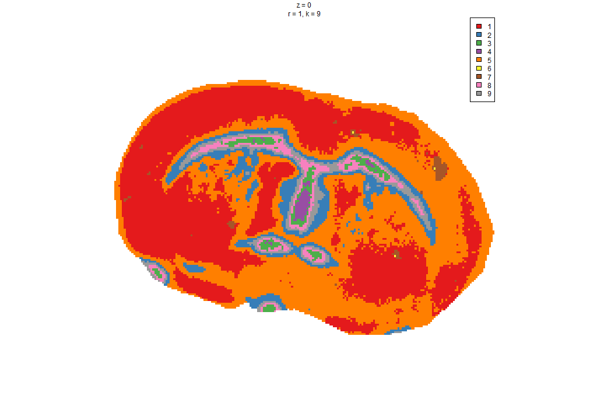
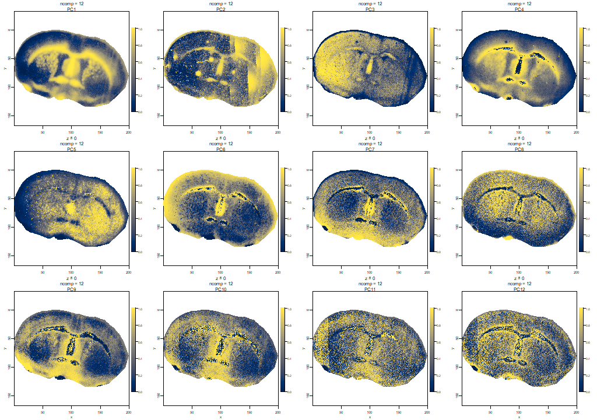
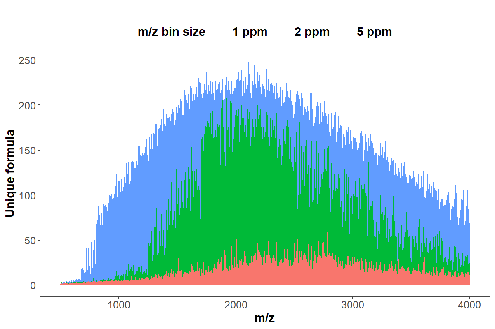
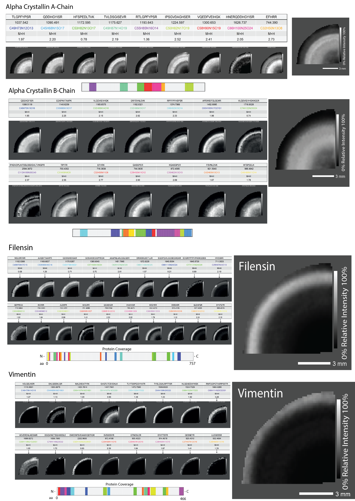
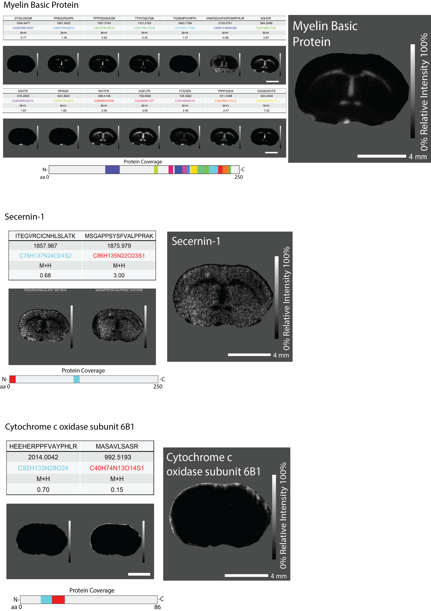

```{r setup, echo=FALSE, message=FALSE}
knitr::opts_chunk$set(cache = T)
```

-- An R package of High-resolution Informatics Toolbox for Maldi-imaging
Proteomics

Find our published research article on *Nature Communications*:

<https://doi.org/10.1038/s41467-021-23461-w>


 
 Maintainer: George Guo <george.guo@auckland.ac.nz>
  
 About us: 
  
 [Mass Spectrometry Hub | University of Auckland](https://mash.auckland.ac.nz/) 
  
 [Cancer research theme | Garvan Institute of Medical Research](https://www.garvan.org.au/)
 
 [MSRC Schey lab | Vanderbilt University](https://lab.vanderbilt.edu/msrc-schey-lab/)
 
# Package installation

This is a tutorial for the use of HiTMaP (An R package of
High-resolution Informatics Toolbox for Maldi-imaging Proteomics).
User's may run HiTMaP using Docker, or through R console, however Docker is
recommended to avoid issues with package dependency.

## Installation of docker image

HiTMaP has been encapsulated into a docker image. After a proper installation and configuration of Docker engine ([Docker documentation](https://docker-docs.netlify.app/install/overview/)),
user's can download the latest version of HiT-MaP by using the bash code as below.
 

```{bash eval=FALSE, include=T}
docker pull mashuoa/hitmap
```

Tags of available docker images: 
 
1. **mashuoa/hitmap:latest** contains the stable build release (built from the Dockerfile at MASHUOA/hitmap_docker with the effort from John Reeves <j.reeves@garvan.org.au>). 
 
2. **mashuoa/hitmap:natcomms** contains the original version when this project been accepted (minor changes applied to enhance the multi-files cluster image rendering). 
 
3. **mashuoa/hitmap:gui_latest** contains the developing graphical user interface of HiTMaP. Please map the 3838 port to the container and access the GUI via http://localhost:3838/. We are happy to hear your voice regarding the High-RES IMS pre-processing, segmentation and annotation as well as their corresponding GUI configurations.
 
4. We are able to supply a singularity template to the users who want to deploy the HiTMaP on an HPC server. This scripts also are available at the MASHUOA/hitmap/dockerfiles.
 


Setting up and running the docker container:

```{bash eval=FALSE, include=T}
# For windows user's, run the image with a local user\Documents\expdata folder mapped to the docker container:
docker run --name hitmap -v %userprofile%\Documents\expdata:/root/expdata -a stdin -a stdout -i -t mashuoa/hitmap /bin/bash 
# For linux or mac user's, run the image with a local user/expdata folder mapped to the docker container:
docker run --name hitmap -v ~/expdata:/root/expdata -a stdin -a stdout -i -t mashuoa/hitmap /bin/bash 

#Run the R console
R

```

Revoke Docker terminal:

```{bash eval=FALSE, include=T}
#use ctrl+d to exit the docker container shell 

#Restart the container and connect to the shell 
docker restart hitmap
docker container exec -it hitmap /bin/bash
```

Stop/remove docker container (warning: if no local disk is mapped to
"\~/expdata", please backup your existing result files from the
container before you remove it):

```{bash eval=FALSE, include=T}
docker stop hitmap
docker rm hitmap
```

If you are using docker GUI, pull the docker image using the codes above
and follow the image as below to setup the container. if you are using **mashuoa/hitmap:shiny_server**, please also map local host:3838 to the container (Ports -> local hosts -> 3838).


## Installation code for R console installation

The code below is used for an experienced R user to build a local
R/HiTMaP running environment. Major dependencies to note:

-   R base
-   java running library (for linux, additional configuration is needed:
    *R CMD javareconf*)
-   orca for plotly
    (<https://github.com/plotly/orca/releases/tag/v1.3.1>)
-   magick++ (for Linux, additional configuration is needed to expand
    the pixel limitation)

```{r Install the package, eval=FALSE, message=FALSE, warning=FALSE, include=TRUE}
#install the git package
install.packages("remotes")
install.packages("devtools")
#library(devtools)
library(remotes)
Sys.setenv("R_REMOTES_NO_ERRORS_FROM_WARNINGS" = "true")
remotes::install_github("MASHUOA/HiTMaP",force=T)
remotes::install_github("kuwisdelu/Cardinal",force=T)
3
no
#Update all dependencies
BiocManager::install(ask = F)
yes
library(HiTMaP)
```

For windows users, Rtools
([*https://cran.r-project.org/bin/windows/Rtools/*](https://cran.r-project.org/bin/windows/Rtools/))
is required.

## Codes for Linux OS building enviornment

Run the codes as below to enable the required components in Linux
console.

```{bash eval=FALSE, include=T}
sudo apt-get install tcl-dev tk-dev
sudo apt-get install r-cran-ncdf4
sudo apt-get install libz-dev
sudo apt install libxml2-dev
sudo apt install libssl-dev
sudo apt install libcurl4-openssl-dev
sudo apt-get install libnss-winbind winbind
sudo apt install dirmngr gnupg apt-transport-https ca-certificates software-properties-common

sudo add-apt-repository ppa:webupd8team/y-ppa-manager
sudo apt-get update
sudo apt-get install y-ppa-manager
sudo y-ppa-manager

sudo apt-key adv --keyserver keyserver.ubuntu.com --recv-keys
sudo add-apt-repository 'deb https://cloud.r-project.org/bin/linux/ubuntu focal-cran40/'
sudo apt-cache policy r-base
sudo apt-get purge r-base
sudo apt-get install r-base-core="4.0.2-1.2004.0"
sudo apt-get install libmagick++-dev

sudo apt-get install libfftw3-dev
sudo apt-get install r-base-dev texlive-full
sudo apt-get install libudunits2-dev
sudo apt-get install libgdal-dev
```

## Codes for Mac OS building enviornment (optional)

The following code is for a local GUI purpose. Hitmap now has been built
on the shiny server system. You can skip this step in the later version.
You may need to update the Xcode. Go to your Mac OS terminal and input:

```{bash eval=FALSE, include=T}
xcode-select --install
```

You'll then receive: *xcode-select: note: install requested for command
line developer tools* You will be prompted at this point in a window to
update Xcode Command Line tools.

You may also need to install the X11.app and tcl/tk support for Mac
system:

-   X11.app: <https://www.xquartz.org/>

-   Use the following link to download and install the correct tcltk
    package for your OS version.
    <https://cran.r-project.org/bin/macosx/tools/>

# Example data and source code

The HitMaP comes with a series of maldi-imaging datasets acquired by
FT-ICR mass spectromety. With the following code, you can download these
raw data set into a local folder.

You can download the example data manually through this link:
"<https://github.com/MASHUOA/HiTMaP/releases/download/1.0.1/Data.tar.gz>"

Or download the files in a R console:

```{r eval=FALSE, message=FALSE, warning=FALSE, include=TRUE}
if(!require(piggyback)) install.packages("piggyback")
library(piggyback)

#made sure that this folder has enough space
wd="~/expdata/"
dir.create(wd)
setwd(wd)

pb_download("HiTMaP-master.zip", repo = "MASHUOA/HiTMaP", dest = ".",show_progress = F, tag="1.0.1")

pb_download("Data.tar.gz", repo = "MASHUOA/HiTMaP", dest = ".")

untar('Data.tar.gz',exdir =".",  tar="tar")

#unlink('Data.tar.gz')
list.dirs()
```

The example data contains three folders for three individual IMS
datasets, which each contain a configuration file, and the fasta
database, respectively: *"./Bovinlens_Trypsin_FT"*
*"./MouseBrain_Trypsin_FT"* *"./Peptide_calibrants_FT"*

An Tiny version of data set is also available by using the code below:
```{r eval=FALSE, message=FALSE, warning=FALSE, include=TRUE}
if(!require(piggyback)) install.packages("piggyback")
library(piggyback)

#made sure that this folder has enough space
wd="~/expdata/"
dir.create(wd)
setwd(wd)
pb_download("Data_tiny.tar.gz", repo = "MASHUOA/HiTMaP", dest = ".")
untar('Data_tiny.tar.gz',exdir =".",  tar="tar")

#unlink('Data.tar.gz')
list.dirs()
```
The tiny version dataset was generated from the Bovinlens and MouseBrain original data:

1. m/z range: 700 - 1400

2. pixel range: 

x <= 20%, y >= 80% (Bovinlens)

x <= 30%, y <= 20% (MouseBrain)

# Proteomics identification on maldi-imaging dataset

To perform false-discovery rate controlled peptide and protein
annotation, run the following script below in your R session:

```{r imaging_identification, eval=FALSE, message=FALSE, warning=FALSE, include=TRUE}
#create candidate list
library(HiTMaP)
#set project folder that contains imzML, .ibd and fasta files
#wd=paste0(file.path(path.package(package="HiTMaP")),"/data/")
#set a series of imzML files to be processed
datafile=c("Bovinlens_Trypsin_FT/Bovin_lens.imzML")
wd="~/expdata/"


imaging_identification(
#==============Choose the imzml raw data file(s) to process  make sure the fasta file in the same folder
               datafile=paste0(wd,datafile),
               threshold=0.005, 
               ppm=5,
               FDR_cutoff = 0.05,
#==============specify the digestion enzyme specificity
               Digestion_site="trypsin",
#==============specify the range of missed Cleavages
               missedCleavages=0:1,
#==============Set the target fasta file
               Fastadatabase="uniprot-bovin.fasta",
#==============Set the possible adducts and fixed modifications
               adducts=c("M+H"),
               Modifications=list(fixed=NULL,fixmod_position=NULL,variable=NULL,varmod_position=NULL),
#==============The decoy mode: could be one of the "adducts", "elements" or "isotope"
               Decoy_mode = "isotope",
               use_previous_candidates=F,
               output_candidatelist=T,
#==============The pre-processing param
               preprocess=list(force_preprocess=TRUE,
                               use_preprocessRDS=TRUE,
                               smoothSignal=list(method="Disable"),
                               reduceBaseline=list(method="Disable"),
                               peakPick=list(method="adaptive"),
                               peakAlign=list(tolerance=5, units="ppm"),
                               normalize=list(method=c("Disable","rms","tic","reference")[1],mz=1)),
#==============Set the parameters for image segmentation
               spectra_segments_per_file=4,
               Segmentation="spatialKMeans",
               Smooth_range=1,
               Virtual_segmentation=FALSE,
               Virtual_segmentation_rankfile=NULL,
#==============Set the Score method for hi-resolution isotopic pattern matching
               score_method="SQRTP",
               peptide_ID_filter=2,
#==============Summarise the protein and peptide features across the project the result can be found at the summary folder
               Protein_feature_summary=TRUE,
               Peptide_feature_summary=TRUE,
               Region_feature_summary=TRUE,
#==============The parameters for Cluster imaging. Specify the annotations of interest, the program will perform a case-insensitive search on the result file, extract the protein(s) of interest and plot them in the cluster imaging mode
               plot_cluster_image_grid=FALSE,
               ClusterID_colname="Protein",
               componentID_colname="Peptide",
               Protein_desc_of_interest=c("Crystallin","Actin"),
               Rotate_IMG=NULL,
               )


```

# Project folder and result structure

In the above function, you have performed proteomics analysis on the
sample data file. It is a tryptic Bovin lens MALDI-imaging file which is
acquired on an FT-ICR MS. The function will take the selected data
files' root directory as the project folder. In this example, the
project folder will be:

```{r locate the project folder, message=FALSE, warning=FALSE}
library(HiTMaP)
wd=paste0("D:\\GITHUB LFS\\HiTMaP-Data\\inst","/data/Bovinlens_Trypsin_FT/")
datafile=c("Bovin_lens")

```

After the whole identification process, you will get two sub-folders
within the project folder:

```{r The sub-folder in the project folder}
list.dirs(wd, recursive=FALSE)
```

1.  The one which has an identical name to an input data file contains
    the identification result of that input:

    -   the protein and peptides list of each segmentation region
    -   the PMF matching plot of each segmentation
    -   the image that indicates segmentations' boundary (applies to
        either K-mean segmentation (powered by Cardinal) or manually
        defined segmentation)
    -   folders of each region contains the detailed identification
        process, FDR plots and isotopic pattern matching plots

2.  "Summary folder" contains:

    -   the identification summary of protein and peptides across all
        the data
    -   the candidate list of all possible proteins and peptides (if
        *use_previous_candidates* is set as **TRUE**)
    -   the Cluster imaging files of the protein of interest
    -   the database stats result for resolution-based candidates
        binning (optional)

# Identification result visulasation and interpretation

To plot the MALDI-image peptide and protein images, use the following
functions:

To check the segmentation result over the sample, you need to navigate
to each data file ID folder and find the "spatialKMeans_image_plot.png"
(if you are using the spatial K-means method for segmentation.)

```{r VisulazeKmean}
library(magick)
p<-image_read(paste0(wd,datafile," ID/spatialKMeans_image_plot.png"))
print(p)
```

The pixels in image data now has been categorized into four regions
according to the initial setting of segmentation
(*spectra_segments_per_file=5*). The rainbow shaped bovine lens
segmentation image (on the left panel) shows a unique statistical
classification based on the mz features of each region (on the right
panel).

The mouse brain example segmentation result (spatialKmeans n=9) shown as
below:



For further investigation of the segmentation process, you may find a
PCA images set in the **"Datafile ID"** folder. THe PCA images are good
summary of features and potential region of interests within a data
file. The combination of these PCs of interest will guide you to the
insightful tissue structure profile.



The identification will take place on the **mean spectra** of each
region. To check the peptide mass fingerprint (PMF) matching quality,
you could locate the PMF spectrum matching plot of each individual
region.

```{r}
library(magick)
p_pmf<-image_read(paste0(wd,datafile," ID/Bovin_lens 3PMF spectrum match.png"))
print(p_pmf)
```

A list of the peptides and proteins annotated within each region has
also been created for manual exploration of the results.

```{r}
peptide_pmf_result<-read.csv(paste0(wd,datafile," ID/Peptide_segment_PMF_RESULT_3.csv"))
head(peptide_pmf_result)
```

```{r}
protein_pmf_result<-read.csv(paste0(wd,datafile," ID/Protein_segment_PMF_RESULT_3.csv"))
head(protein_pmf_result)
```

# Scoring system for protein and peptide

**Score** in peptide result table shows the isotopic pattern matching
score of the peptide (Pepscore). In Protein result table, it shows the
protein score (Proscore). The 'Pepscore' consist of two parts:
Intensity_Score and Mass_error_Score:

-   Intensity_Score indicates how well a putative isotopic pattern can
    be matched to the observed spectrum.The default scoring method is
    SQRTP. It combines the 'square root mean' differences between
    observed and theoretical peaks and observed proportion of the
    isotopic peaks above a certain relative intensity threshold.

-   Mass_error_Score indicates the summary of mass error (in *ppm*) for
    every detected isotopic peak. In order to integrate the
    Mass_error_Score in to scoring system, the mean ppm error has been
    normalized by ppm tolerance, and supplied to the probability normal
    distributions (*pnorm* function for R). The resulting value
    (quantiles of the given probability density) is deducted by 0.5 and
    converted into an absolute value.


**Proscore** in the protein result table shows the overall estimation of
the protein identification Accuracy.


A *Peptide_region_file.csv* has also been created to summarise all the
IDs in this data file:

```{r}
Identification_summary_table<-read.csv(paste0(wd,datafile," ID/Peptide_region_file.csv"))
head(Identification_summary_table)
```

The details of protein/peptide identification process has been save to
the folder named by the segmentation:

```{r The sub-folder in the result folder}
list.dirs(paste0(wd,datafile," ID/"), recursive=FALSE)
```

In the identification details folder, you will find a series of FDR file
and plots to demonstrate the FDR model and score cutoff threshold:

```{r The file in the details sub-folder}
dir(paste0(wd,datafile," ID/1/"), recursive=FALSE)
```

In this folder, you will find the FDR plots for protein and peptide
annotation. The software will take the proscore and its FDR model to
trim the final identification results. The
*unique_peptide_ranking_vs_mz_feature.png* is a plot that could tell you
the number of peptide candidates that have been matched to the mz
features in the first round run. You can also access the peptide
spectrum match (first MS dimension) data via the "/ppm" subfolder.

```{r FDR plot, message=FALSE}
library(magick)
p_FDR_peptide<-image_read(paste0(wd,datafile," ID/3/FDR.png"))
p_FDR_protein<-image_read(paste0(wd,datafile," ID/3/protein_FDR.png"))
p_FDR_peptide_his<-image_read(paste0(wd,datafile," ID/3/Peptide_Score_histogram_target-decoy.png"))
p_FDR_protein_his<-image_read(paste0(wd,datafile," ID/3/PROTEIN_Score_histogram.png"))
p_combined<-image_append(c(p_FDR_peptide,p_FDR_peptide_his,p_FDR_protein,p_FDR_protein_his))
print(p_combined)

```

You will also find a *Matching_Score_vs_mz* plot for further
investigation on peptide matching quality.

```{r p_Matching_Score_vs_mz plot, message=FALSE}
library(magick)
#plot Matching_Score_vs_mz
p_Matching_Score_vs_mz<-image_read(paste0(wd,datafile," ID/3/Matching_Score_vs_mz_target-decoy.png"))
print(p_Matching_Score_vs_mz)

```

# Identification summary and cluster imaging

In the project summary folder, you will find four files and a
sub-folder:

```{r dir summary folder}
wd_sum=paste(wd,"/Summary folder", sep="")
dir(wd_sum)
```

"candidatelist.csv" and "protein_index.csv" contains the candidates used
for this analysis. They are output after the candidate processing while
*output_candidatelist* set as TRUE, and can be used repeatedly while
*use_previous_candidates* set as TRUE.

We have implemented a functionality to perform additional statistical
analysis around the number of enzymatically generated peptides derived
from a given proteome database. If the user sets the argument
'Database_stats' to TRUE in the main workflow, the function will be
called. Briefly, the function will list all of the m/z's of a unique
formulae from the peptide candidate pool within a given m/z range. The
m/z's will then be binned using three tolerance window: 1 ppm, 2 ppm and
5 ppm. A plot showing the number of unique formulae vs. m/z bins will be
generated and exported to the summary folder (DB_stats_mz_bin).



"Peptide_Summary.csv" and "Protein_Summary.csv" contains the table of
the project identification summary. You could set the
*plot_cluster_image_grid* as TRUE to enable the cluster imaging
function. Please be noted that you could indicate *Rotate_IMG* with a
CSV file path that indicates the rotation degree of image files.

**Note**: 90°, 180° and 270° are recommended for image rotation. You may
find an example CSV file in the *expdata/MouseBrain_Trypsin_FT/file_rotationbk.csv*.

```{r summary table, message=FALSE, warning=FALSE}
library(dplyr)
Protein_desc_of_interest<-c("Crystallin","Actin")
Protein_Summary_tb<-read.csv(paste(wd,"/Summary folder","/Protein_Summary.csv", sep=""),stringsAsFactors = F)

```

Finally, you are able visualize the annotated proteins and their
associated peptide distributions via the cluster image rendering
function.



vimentin:

```{r C, eval=FALSE, cache=FALSE, include=FALSE, paged.print=TRUE}
library(magick)
p_cluster4<-image_read(paste0("~/expdata/Bovinlens_Trypsin_FT/Summary folder/cluster Ion images/unique/452_cluster_imaging.png"))
print(p_cluster4)
```

β-crystallin:

```{r , eval=FALSE, echo=FALSE, cache=FALSE, paged.print=TRUE}
p_cluster1<-image_read(paste0("~/expdata/Bovinlens_Trypsin_FT/Summary folder/cluster Ion images/unique/791_cluster_imaging.png"))
print(p_cluster1)
```

α-crystallin:

```{r , eval=FALSE, echo=FALSE, cache=FALSE, paged.print=TRUE}
p_cluster3<-image_read(paste0("~/expdata/Bovinlens_Trypsin_FT/Summary folder/cluster Ion images/unique/5479_cluster_imaging.png"))
print(p_cluster3)
```



Secernin 1

```{r , eval=FALSE, echo=FALSE, cache=FALSE, paged.print=TRUE}
p_cluster3<-image_read(paste0("~/expdata/MouseBrain_Trypsin_FT/Summary folder/cluster Ion images/unique/2823_cluster_imaging.png"))
print(p_cluster3)
```

CX6A1 cytochrome coxidase subunit 6A1

```{r , eval=FALSE, echo=FALSE, cache=FALSE, paged.print=TRUE}
p_cluster3<-image_read(paste0("~/expdata/MouseBrain_Trypsin_FT/Summary folder/cluster Ion images/unique/16305_cluster_imaging.png"))
print(p_cluster3)
```

Myelin basic protein

```{r , eval=FALSE, echo=FALSE, cache=FALSE, paged.print=TRUE}
p_cluster3<-image_read(paste0("~/expdata/MouseBrain_Trypsin_FT org rds/Summary folder/cluster Ion images/unique/9585_cluster_imaging.png"))
print(p_cluster3)
```

# Pixel level Proteomics data export

```{r}

export_pixel_level_data(Protein_peptide_file=,
                        IMS_data_file=list(),
                        tolerance=,
                        )
```


# Details of parameter setting

## Modification

You can choose one or a list of modifications from the unimod
modification list. *Peptide_modification* function is used to
load/rebuild the modification database into the global enviornment of R.
It will be called automatically in the identification work flow. you can
use the *code_name* or *record_id* to refer the modification (see
example data "peptide calibrants" to find more details). The pipeline
will select the *non-hidden* modifications.

```{r warning=FALSE}

HiTMaP:::Peptide_modification(retrive_ID=NULL,update_unimod=F)
modification_list<-merge(unimod.df$modifications,unimod.df$specificity,by.x=c("record_id"),by.y=c("mod_key"),all.x=T)
head(modification_list['&'(modification_list$code_name=="Phospho",modification_list$hidden!=1),c("code_name","record_id","composition","mono_mass","position_key","one_letter")])
head(modification_list['&'(modification_list$code_name=="Amide",modification_list$hidden!=1),c("code_name","record_id","composition","mono_mass","position_key","one_letter")])
head(modification_list['&'(stringr::str_detect(modification_list$code_name,"Ca"),modification_list$hidden!=1),c("code_name","record_id","composition","mono_mass","position_key","one_letter")])

```

If a modification occurs on a particular site, you will also need to
specify the position of a modifications.

-   *Anywhere*, side chain of possible amino acids
-   *Any N-term*, any N-term of enzymatic peptide
-   *Protein N-term*, any N-term of protein

```{r}
unimod.df[["positions"]]
```

## Amino acid substitution

You can set the *Substitute_AA* to make the uncommon amino acid
available to the workflow:
*Substitute_AA=list(AA=c("X"),AA_new_formula=c("C5H5NO2"),Formula_with_water=c(FALSE))*

-   AA: the single letter amino acid to be replaced
-   AA_new_formula: the new formula for the amino acid
-   Formula_with_water: Set *TRUE* to indicate the formula represents
    the intact amino acid, *FALSE* to indicate that the formula already
    lost one H2O molecule and can be considered as AA backbone.

## Digestion site and enzyme

The *Digestion_site* allows you to specify a list of pre-defined enzyme
and customized digestion rules in regular expression format. You can
either use the enzyme name, customized cleavage rule or combination of
them to get the enzymatics peptides list.

```{r message=FALSE, warning=FALSE, include=FALSE}
  grid.ftable <- function(d, padding = unit(2, "mm"), ...) {
  library(gridExtra)
  library(grid)
  nc <- ncol(d)
  nr <- nrow(d)
  
  # character table with added row and column names
  extended_matrix <- cbind(c("", rownames(d)),
                           rbind(colnames(d),
                                 as.matrix(d)))
  
  # string width and height
  w <- apply(extended_matrix, 2, strwidth, "inch")
  h <- apply(extended_matrix, 2, strheight, "inch")
  
  widths <- apply(w, 2, max)
  heights <- apply(h, 1, max)
  
  padding <- convertUnit(padding, unitTo = "in", valueOnly = TRUE)
  
  x <- cumsum(widths + padding) - 0.5 * padding
  y <- cumsum(heights + padding) - padding
  
  rg <- rectGrob(x = unit(x - widths/2, "in"),
                 y = unit(1, "npc") - unit(rep(y, each = nc + 1), "in"),
                 width = unit(widths + padding, "in"),
                 height = unit(heights + padding, "in"))
  
  tg <- textGrob(c(t(extended_matrix)), x = unit(x - widths/2, "in"),
                 y = unit(1, "npc") - unit(rep(y, each = nc + 1), "in"),
                 just = "center")
  
  g <- gTree(children = gList(rg, tg), ...,
             x = x, y = y, widths = widths, heights = heights)
  
  grid.draw(g)
  invisible(g)
}
```

```{r echo=TRUE, message=F, warning=FALSE, paged.print=T, fig.height=8,fig.width=8.35,dpi=300}
Cleavage_rules<-Cleavage_rules_fun()
Cleavage_df<-data.frame(Enzyme=names(Cleavage_rules),Cleavage_rules=unname(Cleavage_rules),stringsAsFactors = F)
library(gridExtra)
grid.ftable(Cleavage_df, gp = gpar(fontsize=9,fill = rep(c("grey90", "grey95"))))

```

## Imaging-MS data preprocessing

**preprocess$mz_bin_list** is an argument for costumized peak-picking and mz bining purpose. If it is not NULL, the workflow will bypass signal smooth, noise reduction, and peakpicking steps. User need to give a numeric vector as the mz input to this argument. The workflow will first filter the vector with the given ppm tolerance to ensure there's no overlapped mz bins (mz +/- ppm tolerance). Then, a m/z binning procedure will be conducted to the image data to produce a peak-picked dataset (the peak bin width will be the ppm tolerance). 

If user uses a processed IMS data that contains the centroid feature value (e.g. exported from scils lab with feature list reduced data). User will still be safe to use this mz_bin_list in order to mount the centroid data properly. In this case, the ppm tolerance will only applied to the following annotation procedure.

**normalize=list(method=c("Disable","rms","tic","reference")[1],mz=1)** the current IMS normalization is done on pixel-to-pixel level, which will affect the feature distribution in some tissue. We use "Disable" in the example dataset to minimize the required RAM space and working time. The step may result in a big RAM usage on some IMS data. If the error message mentioned a "vector allocation" issue, Please consider to disable the normalization.


# Example workflow command

Below is a list of commands including the parameters for the example
data sets.

## Peptide calibrant

```{r eval=FALSE, include=T}
#peptide calibrant
library(HiTMaP)
datafile=c("Peptide_calibrants_FT/trypsin_non-decell_w.calibrant_FTICR")
wd="~/expdata/"

# Calibrants dataset analysis with modification
imaging_identification(datafile=paste0(wd,datafile),
  Digestion_site="trypsin",
  Fastadatabase="uniprot_cali.fasta",
  output_candidatelist=T,
  plot_matching_score=T,
  spectra_segments_per_file=1,
  use_previous_candidates=F,
  peptide_ID_filter=1,ppm=5,missedCleavages=0:5,
  Modifications=list(fixed=NULL,fixmod_position=NULL,variable=c("Amide"),varmod_position=c(6)),
  FDR_cutoff=0.1,
  Substitute_AA=list(AA=c("X"),AA_new_formula=c("C5H5NO2"),Formula_with_water=c(FALSE)))

# Calibrants dataset analysis with no modification
imaging_identification(datafile=paste0(wd,datafile),
  Digestion_site="trypsin",
  Fastadatabase="uniprot_cali.fasta",
  output_candidatelist=T,
  plot_matching_score=T,
  spectra_segments_per_file=1,
  use_previous_candidates=T,
  peptide_ID_filter=1,ppm=5,missedCleavages=0:5,
  FDR_cutoff=0.1)

library(HiTMaP)
datafile=c("Peptide_calibrants_FT/trypsin_non-decell_w.calibrant_FTICR")
wd="~/expdata/"
# Calibrants dataset analysis with modification 
imaging_identification(datafile=paste0(wd,datafile),
  Digestion_site="trypsin",
  Fastadatabase="calibrants.fasta",
  output_candidatelist=T,
  plot_matching_score=T,
  spectra_segments_per_file=1,
  use_previous_candidates=F,
  peptide_ID_filter=1,ppm=5,missedCleavages=0:5,
  Modifications=list(fixed=NULL,fixmod_position=NULL,variable=c("Amide"),varmod_position=c(6)),
  FDR_cutoff=0.1,
  Substitute_AA=list(AA=c("X"),AA_new_formula=c("C5H5NO2"),Formula_with_water=c(FALSE)),Thread = 1)

```

## Bovine lens

```{r eval=FALSE, include=T}
library(HiTMaP)
datafile=c("Bovinlens_Trypsin_FT/Bovin_lens.imzML")
wd="~/expdata/"

# Data pre-processing and proteomics annotation
library(HiTMaP)
imaging_identification(datafile=paste0(wd,datafile),Digestion_site="trypsin",
                       Fastadatabase="uniprot-bovin.fasta",output_candidatelist=T,
                       preprocess=list(force_preprocess=TRUE,
                               use_preprocessRDS=TRUE,
                               smoothSignal=list(method="Disable"),
                               reduceBaseline=list(method="Disable"),
                               peakPick=list(method="adaptive"),
                               peakAlign=list(tolerance=5, units="ppm"),
                               normalize=list(method=c("Disable","rms","tic","reference")[1],mz=1)),
                       spectra_segments_per_file=4,use_previous_candidates=F,ppm=5,FDR_cutoff = 0.05,IMS_analysis=T,
                       Rotate_IMG="file_rotationbk.csv",plot_cluster_image_grid=F)

datafile=c("Bovinlens_Trypsin_FT/Bovin_lens.imzML")
wd="~/expdata/"
library(HiTMaP)
imaging_identification(datafile=paste0(wd,datafile),Digestion_site="trypsin",
                       Fastadatabase="uniprot-bovin.fasta",output_candidatelist=T,use_previous_candidates=T,
                       preprocess=list(force_preprocess=F,
                               use_preprocessRDS=TRUE,
                               smoothSignal=list(method="Disable"),
                               reduceBaseline=list(method="Disable"),
                               peakPick=list(method="Default"),
                               peakAlign=list(tolerance=5, units="ppm"),
                               normalize=list(method=c("Disable","rms","tic","reference")[1],mz=1)),
                       spectra_segments_per_file=4,ppm=5,FDR_cutoff = 0.05,IMS_analysis=T,
                       Rotate_IMG="file_rotationbk.csv",plot_cluster_image_grid=F)

# Re-analysis and cluster image rendering

library(HiTMaP)
datafile=c("Bovinlens_Trypsin_FT/Bovin_lens.imzML")
wd="~/expdata/"
imaging_identification(datafile=paste0(wd,datafile),Digestion_site="trypsin",
                       Fastadatabase="uniprot-bovin.fasta",
                       use_previous_candidates=T,ppm=5,IMS_analysis=F,
                       plot_cluster_image_grid=T,
                       export_Header_table=T, 
                       img_brightness=250, 
                       plot_cluster_image_overwrite=T,
                       cluster_rds_path = "/Bovin_lens ID/preprocessed_imdata.RDS",pixel_size_um = 150,
                       Plot_score_abs_cutoff=-0.1,
                       remove_score_outlier=T,
                       Protein_desc_of_interest=c("Crystallin","Phakinin","Filensin","Actin","Vimentin","Cortactin","Visinin","Arpin","Tropomyosin","Myosin Light Chain 3","Kinesin Family Member 14","Dynein Regulatory Complex","Ankyrin Repeat Domain 45"))

# Re-analysis and cluster image rendering using color scale

library(HiTMaP)
datafile=c("Bovinlens_Trypsin_FT/Bovin_lens.imzML")
wd="~/expdata/"
imaging_identification(datafile=paste0(wd,datafile),Digestion_site="trypsin",
                       Fastadatabase="uniprot-bovin.fasta",
                       use_previous_candidates=T,ppm=5,IMS_analysis=F,
                       plot_cluster_image_grid=T,
                       export_Header_table=T, 
                       img_brightness=250, 
                       plot_cluster_image_overwrite=T,
                       cluster_rds_path = "/Bovin_lens ID/preprocessed_imdata.RDS",pixel_size_um = 150,
                       Plot_score_abs_cutoff=-0.1,
                       remove_score_outlier=T,cluster_color_scale="fleximaging",
                       Protein_desc_of_interest=c("Crystallin","Phakinin","Filensin","Actin","Vimentin","Cortactin","Visinin","Arpin","Tropomyosin","Myosin Light Chain 3","Kinesin Family Member 14","Dynein Regulatory Complex","Ankyrin Repeat Domain 45"))

```

## Mouse brain

```{r eval=FALSE, include=T}
library(HiTMaP)
datafile=c("MouseBrain_Trypsin_FT/Mouse_brain.imzML")
wd="~/expdata/"

# Data pre-processing and proteomics annotation
library(HiTMaP)
imaging_identification(datafile=paste0(wd,datafile),Digestion_site="trypsin",
                       Fastadatabase="uniprot_mouse_20210107.fasta",output_candidatelist=T,
                       preprocess=list(force_preprocess=T,
                               use_preprocessRDS=TRUE,
                               smoothSignal=list(method="Disable"),
                               reduceBaseline=list(method="Disable"),
                               peakPick=list(method="adaptive"),
                               peakAlign=list(tolerance=5, units="ppm"),
                               normalize=list(method=c("Disable","rms","tic","reference")[1],mz=1)),
                       spectra_segments_per_file=9,use_previous_candidates=F,ppm=10,FDR_cutoff = 0.05,IMS_analysis=T,
                       Rotate_IMG="file_rotationbk.csv",
                       mzrange = c(500,4000),plot_cluster_image_grid=F)

imaging_identification(datafile=paste0(wd,datafile),Digestion_site="trypsin",
                       Fastadatabase="uniprot_mouse_20210107.fasta",output_candidatelist=T,
                       preprocess=list(force_preprocess=T,
                               use_preprocessRDS=TRUE,
                               smoothSignal=list(method="gaussian"),
                               reduceBaseline=list(method="locmin"),
                               peakPick=list(method="adaptive"),
                               peakAlign=list(tolerance=5, units="ppm"),
                               normalize=list(method=c("Disable","rms","tic","reference")[1],mz=1)),
                       spectra_segments_per_file=9,use_previous_candidates=F,ppm=10,FDR_cutoff = 0.05,IMS_analysis=T,
                       Rotate_IMG="file_rotationbk.csv",
                       mzrange = c(500,4000),plot_cluster_image_grid=F)

# Re-analysis and cluster image rendering
library(HiTMaP)
datafile=c("MouseBrain_Trypsin_FT/Mouse_brain.imzML")
wd="~/expdata/"
imaging_identification(datafile=paste0(wd,datafile),Digestion_site="trypsin",
                       Fastadatabase="uniprot_mouse_20210107.fasta",
                       preprocess=list(force_preprocess=FALSE),
                       spectra_segments_per_file=9,use_previous_candidates=T,ppm=10,FDR_cutoff = 0.05,IMS_analysis=F,
                       mzrange = c(500,4000),plot_cluster_image_grid=T,
                       img_brightness=250, plot_cluster_image_overwrite=T,
                       cluster_rds_path = "/Mouse_brain ID/preprocessed_imdata.RDS",
                       pixel_size_um = 50,
                       Plot_score_abs_cutoff=-0.1,
                       remove_score_outlier=T,
                       Protein_desc_of_interest=c("Secernin","GN=MBP","Cytochrome"))

library(HiTMaP)
datafile=c("MouseBrain_Trypsin_FT_200brit_man_seg/Mouse_brain.imzML")
wd="~/expdata/"
imaging_identification(datafile=paste0(wd,datafile),Digestion_site="trypsin",
                       Fastadatabase="uniprot_mouse_20210107.fasta",
                       preprocess=list(force_preprocess=FALSE),
                       spectra_segments_per_file=9,use_previous_candidates=T,ppm=10,FDR_cutoff = 0.05,IMS_analysis=F,
                       mzrange = c(500,4000),plot_cluster_image_grid=T,
                       img_brightness=250, plot_cluster_image_overwrite=T,
                       cluster_rds_path = "/Mouse_brain ID/preprocessed_imdata.RDS",
                       pixel_size_um = 50,
                       Plot_score_abs_cutoff=-0.1,
                       remove_score_outlier=T,
                       Protein_desc_of_interest=c("GTR9"))

```

```{r eval=FALSE, include=FALSE}
wd=paste0(file.path(path.package(package="HiTMaP")),"/data/")
setwd(wd)
#Navigate to the corresponding example data folder ad select the file(s) for a MSI annotation
#Bovin lens FTICR 
#Identifiction
imaging_identification(Digestion_site="trypsin",Fastadatabase="uniprot-Bovin.fasta",output_candidatelist=T,spectra_segments_per_file=4,use_previous_candidates=F,peptide_ID_filter=3,threshold = 0.005)

#Cluster image plotting
imaging_identification(Digestion_site="trypsin",Fastadatabase="uniprot-Bovin.fasta",output_candidatelist=T,spectra_segments_per_file=4,use_previous_candidates=T,peptide_ID_filter=3,threshold = 0.005,FDR_cutoff=0.05,IMS_analysis=F,plot_cluster_image_grid=T,Protein_desc_of_interest=c("crystallin","ACTIN","Vimentin","Filensin","Phakinin"))


#Ultraflex data
imaging_identification(Digestion_site="trypsin",Fastadatabase="uniprot-bovin.fasta",output_candidatelist=T,spectra_segments_per_file=4,use_previous_candidates=F,ppm=25)

#mouse brain data
library(HiTMaP)
datafile=c("MouseBrain_Trypsin_FT/Mouse_brain.imzML")
setwd("C:/Users/admgguo484/Documents/")
wd="~/expdata/"
library(HiTMaP)
imaging_identification(datafile=paste0(wd,datafile),Digestion_site="trypsin",Fastadatabase="uniprot_mouse_20210107.fasta",output_candidatelist=T,spectra_segments_per_file=4,use_previous_candidates=F,ppm=5,FDR_cutoff = 0.1,IMS_analysis=T,plot_cluster_image_grid=T,Protein_desc_of_interest=c("Histone ","GN=MBP","ACTIN"),Rotate_IMG="file_rotationbk.csv")
library(HiTMaP)
datafile=c("MouseBrain_Trypsin_FT/Mouse_brain.imzML")
wd="~/expdata/"
imaging_identification(datafile=paste0(wd,datafile),Digestion_site="trypsin",Fastadatabase="uniprot_mouse_20210107.fasta",output_candidatelist=F,spectra_segments_per_file=6,use_previous_candidates=T,ppm=5,FDR_cutoff = 0.1,IMS_analysis=T,plot_cluster_image_grid=F,Protein_desc_of_interest=c("Histone ","GN=MBP","ACTIN"),Rotate_IMG="file_rotationbk.csv")
imaging_identification(datafile=paste0(wd,datafile),Digestion_site="trypsin",Fastadatabase="uniprot_mouse_20210107.fasta",output_candidatelist=F,spectra_segments_per_file=8,use_previous_candidates=T,ppm=5,FDR_cutoff = 0.1,IMS_analysis=T,plot_cluster_image_grid=F,Protein_desc_of_interest=c("Histone ","GN=MBP","ACTIN"),Rotate_IMG="file_rotationbk.csv",PMFsearch = F)
imaging_identification(datafile=paste0(wd,datafile),Digestion_site="trypsin",Fastadatabase="uniprot_mouse_20210107.fasta",output_candidatelist=F,spectra_segments_per_file=10,use_previous_candidates=T,ppm=5,FDR_cutoff = 0.1,IMS_analysis=T,plot_cluster_image_grid=F,Protein_desc_of_interest=c("Histone ","GN=MBP","ACTIN"),Rotate_IMG="file_rotationbk.csv",PMFsearch = F)
imaging_identification(datafile=paste0(wd,datafile),Digestion_site="trypsin",Fastadatabase="uniprot_mouse_20210107.fasta",output_candidatelist=F,spectra_segments_per_file=12,use_previous_candidates=T,ppm=5,FDR_cutoff = 0.1,IMS_analysis=T,plot_cluster_image_grid=F,Protein_desc_of_interest=c("Histone ","GN=MBP","ACTIN"),Rotate_IMG="file_rotationbk.csv",PMFsearch = F)
imaging_identification(datafile=paste0(wd,datafile),Digestion_site="trypsin",Fastadatabase="uniprot_mouse_20210107.fasta",output_candidatelist=F,spectra_segments_per_file=14,use_previous_candidates=T,ppm=5,FDR_cutoff = 0.1,IMS_analysis=T,plot_cluster_image_grid=F,Protein_desc_of_interest=c("Histone ","GN=MBP","ACTIN"),Rotate_IMG="file_rotationbk.csv",PMFsearch = F)
imaging_identification(datafile=paste0(wd,datafile),Digestion_site="trypsin",Fastadatabase="uniprot_mouse_20210107.fasta",output_candidatelist=F,spectra_segments_per_file=16,use_previous_candidates=T,ppm=5,FDR_cutoff = 0.1,IMS_analysis=T,plot_cluster_image_grid=F,Protein_desc_of_interest=c("Histone ","GN=MBP","ACTIN"),Rotate_IMG="file_rotationbk.csv",PMFsearch = F)


library(HiTMaP)
datafile=c("MouseBrain_Trypsin_FT/Mouse_brain.imzML")
wd="~/expdata/"
imaging_identification(datafile=paste0(wd,datafile),Digestion_site="trypsin",Fastadatabase="uniprot_mouse_20210107.fasta",output_candidatelist=F,spectra_segments_per_file=4,use_previous_candidates=T,ppm=5,FDR_cutoff = 0.1,IMS_analysis=T,plot_cluster_image_grid=T,Protein_desc_of_interest=c("Histone ","GN=MBP","ACTIN"),Rotate_IMG="file_rotationbk.csv",Segmentation = "none")

library(HiTMaP)
datafile=c("MouseBrain_Trypsin_FT/Mouse_brain.imzML")
wd="~/expdata/"
imaging_identification(datafile=paste0(wd,datafile),Digestion_site="trypsin",Fastadatabase="uniprot_mouse_20210107.fasta",output_candidatelist=F,spectra_segments_per_file=4,use_previous_candidates=T,ppm=5,FDR_cutoff = 0.1,Rotate_IMG="file_rotationbk.csv",Segmentation = "none",IMS_analysis=F,plot_cluster_image_grid=T,peptide_ID_filter = 2,export_Header_table=T, img_brightness=160, plot_cluster_image_overwrite=T)


library(HiTMaP)
datafile=c("MouseBrain_Trypsin_FT_200brit/Mouse_brain.imzML")
wd="~/expdata/"
imaging_identification(datafile=paste0(wd,datafile),Digestion_site="trypsin",Fastadatabase="uniprot_mouse_20210107.fasta",output_candidatelist=F,spectra_segments_per_file=4,use_previous_candidates=T,ppm=5,FDR_cutoff = 0.1,Rotate_IMG="file_rotationbk.csv",Segmentation = "none",IMS_analysis=F,plot_cluster_image_grid=T,peptide_ID_filter = 2,export_Header_table=T, img_brightness=250, plot_cluster_image_overwrite=T,cluster_rds_path = "preprocessed_imdata.RDS")


library(HiTMaP)
datafile=c("MouseBrain_Trypsin_FT_200brit_man_seg/Mouse_brain.imzML")
wd="~/expdata/"
imaging_identification(datafile=paste0(wd,datafile),Digestion_site="trypsin",Fastadatabase="uniprot_mouse_20210107.fasta",output_candidatelist=F,spectra_segments_per_file=4,use_previous_candidates=T,ppm=5,FDR_cutoff = 0.1,Rotate_IMG="file_rotationbk.csv",Segmentation = "none",IMS_analysis=F,plot_cluster_image_grid=T,peptide_ID_filter = 2,export_Header_table=T, img_brightness=250, plot_cluster_image_overwrite=T,cluster_rds_path = "preprocessed_imdata.RDS")

library(HiTMaP)
datafile=c("MouseBrain_Trypsin_FT_200brit/Mouse_brain.imzML")
wd="~/expdata/"
imaging_identification(datafile=paste0(wd,datafile),Digestion_site="trypsin",Fastadatabase="uniprot_mouse_20210107.fasta",output_candidatelist=F,spectra_segments_per_file=4,use_previous_candidates=T,ppm=5,FDR_cutoff = 0.1,Rotate_IMG="file_rotationbk.csv",Segmentation = "none",IMS_analysis=F,plot_cluster_image_grid=T,peptide_ID_filter = 1,export_Header_table=T, img_brightness=250, plot_cluster_image_overwrite=F,cluster_rds_path = "preprocessed_imdata.RDS")


library(HiTMaP)
datafile=c("MouseBrain_Trypsin_FT_200brit_man_seg/Mouse_brain.imzML")
wd="~/expdata/"
imaging_identification(datafile=paste0(wd,datafile),Digestion_site="trypsin",Fastadatabase="uniprot_mouse_20210107.fasta",output_candidatelist=F,spectra_segments_per_file=4,use_previous_candidates=T,ppm=5,FDR_cutoff = 0.01,Rotate_IMG="file_rotationbk.csv",Segmentation = "none",IMS_analysis=F,plot_cluster_image_grid=T,peptide_ID_filter = 1,export_Header_table=T, img_brightness=250, plot_cluster_image_overwrite=F,cluster_rds_path = "preprocessed_imdata.RDS")

library(HiTMaP)
datafile=c("Bovinlens_Trypsin_FT_16seg\\Bovin_lens.imzML")
wd="~/expdata/"
imaging_identification(datafile=paste0(wd,datafile),Digestion_site="trypsin",Fastadatabase="uniprot-bovin.fasta",output_candidatelist=F,spectra_segments_per_file=4,use_previous_candidates=T,ppm=5,FDR_cutoff = 0.01,Rotate_IMG=NULL,Segmentation = "none",IMS_analysis=F,plot_cluster_image_grid=T,peptide_ID_filter = 1,export_Header_table=T, img_brightness=250, plot_cluster_image_overwrite=T,cluster_rds_path = "preprocessed_imdata.RDS",pixel_size_um = 150,
               Plot_score_abs_cutoff=-0.1,remove_score_outlier=F)

library(HiTMaP)
datafile=c("Bovinlens_Trypsin_FT_16seg\\Bovin_lens.imzML")
wd="~/expdata/"
imaging_identification(datafile=paste0(wd,datafile),Digestion_site="trypsin",Fastadatabase="uniprot-bovin.fasta",output_candidatelist=F,spectra_segments_per_file=4,use_previous_candidates=T,ppm=5,FDR_cutoff = 0.01,Rotate_IMG=NULL,Segmentation = "none",IMS_analysis=F,plot_cluster_image_grid=T,peptide_ID_filter = 1,export_Header_table=T, img_brightness=250, plot_cluster_image_overwrite=T,cluster_rds_path = "preprocessed_imdata.RDS",pixel_size_um = 150,
               Plot_score_abs_cutoff=-0.1,remove_score_outlier=T,
               Protein_desc_of_interest=c("Crystallin","Phakinin","Filensin","Actin","Vimetin","Cortactin","Visinin","Arpin","Tropomyosin","Myosin Light Chain 3","Kinesin Family Member 14","Dyenin Regulatory Complex","Ankyrin Repeat Domain 45"))

library(HiTMaP)
datafile=c("Bovinlens_Trypsin_FT_16seg\\Bovin_lens.imzML")
wd="~/expdata/"
imaging_identification(datafile=paste0(wd,datafile),Digestion_site="trypsin",Fastadatabase="uniprot-bovin.fasta",output_candidatelist=F,spectra_segments_per_file=4,use_previous_candidates=T,ppm=5,FDR_cutoff = 0.01,Rotate_IMG=NULL,Segmentation = "none",IMS_analysis=F,plot_cluster_image_grid=T,peptide_ID_filter = 1,export_Header_table=T, img_brightness=250, plot_cluster_image_overwrite=T,cluster_rds_path = "preprocessed_imdata.RDS",pixel_size_um = 150,
               Plot_score_abs_cutoff=-0.1,remove_score_outlier=T,
               Protein_desc_of_interest=c("Crystallin","Phakinin","Filensin","Actin","Vimentin","Cortactin","Visinin","Arpin","Tropomyosin","Myosin Light Chain 3","Kinesin Family Member 14","Dynein Regulatory Complex","Ankyrin Repeat Domain 45"))

library(HiTMaP)
datafile=c("Bovinlens_Trypsin_FT_4seg\\Bovin_lens.imzML")
wd="~/expdata/"
imaging_identification(datafile=paste0(wd,datafile),Digestion_site="trypsin",Fastadatabase="uniprot-bovin.fasta",output_candidatelist=F,spectra_segments_per_file=4,use_previous_candidates=T,ppm=5,FDR_cutoff = 0.01,Rotate_IMG=NULL,Segmentation = "none",IMS_analysis=F,plot_cluster_image_grid=T,peptide_ID_filter = 1,export_Header_table=T, img_brightness=250, plot_cluster_image_overwrite=T,cluster_rds_path = "preprocessed_imdata.RDS",pixel_size_um = 150,
               Plot_score_abs_cutoff=-0.1,remove_score_outlier=F,
               Protein_desc_of_interest=c("Crystallin","Phakinin","Filensin","Actin","Vimentin","Cortactin","Visinin","Arpin","Tropomyosin","Myosin Light Chain 3","Kinesin Family Member 14","Dynein Regulatory Complex","Ankyrin Repeat Domain 45"))

library(HiTMaP)
datafile=c("Bovinlens_Trypsin_FT_4segf\\Bovin_lens.imzML")
wd="~/expdata/"
imaging_identification(datafile=paste0(wd,datafile),Digestion_site="trypsin",Fastadatabase="uniprot-bovin.fasta",output_candidatelist=F,spectra_segments_per_file=4,use_previous_candidates=T,ppm=5,FDR_cutoff = 0.01,Rotate_IMG=NULL,Segmentation = "none",IMS_analysis=F,plot_cluster_image_grid=T,peptide_ID_filter = 1,export_Header_table=T, img_brightness=250, plot_cluster_image_overwrite=T,cluster_rds_path = "preprocessed_imdata.RDS",pixel_size_um = 150,
               Plot_score_abs_cutoff=-0.1,remove_score_outlier=T,
               Protein_desc_of_interest=c("Crystallin","Phakinin","Filensin","Actin","Vimentin","Cortactin","Visinin","Arpin","Tropomyosin","Myosin Light Chain 3","Kinesin Family Member 14","Dynein Regulatory Complex","Ankyrin Repeat Domain 45"))

library(HiTMaP)
datafile=c("Bovinlens_Trypsin_FT fdr01\\Bovin_lens.imzML")
wd="~/expdata/"
imaging_identification(datafile=paste0(wd,datafile),Digestion_site="trypsin",Fastadatabase="uniprot-bovin.fasta",output_candidatelist=F,spectra_segments_per_file=4,use_previous_candidates=T,ppm=5,FDR_cutoff = 0.01,Rotate_IMG=NULL,Segmentation = "none",IMS_analysis=F,plot_cluster_image_grid=T,peptide_ID_filter = 1,export_Header_table=T, img_brightness=250, plot_cluster_image_overwrite=T,cluster_rds_path = "preprocessed_imdata.RDS",pixel_size_um = 150,
               Plot_score_abs_cutoff=-0.1,remove_score_outlier=F,
               Protein_desc_of_interest=c("Crystallin","Phakinin","Filensin","Actin","Vimentin","Cortactin","Visinin","Arpin","Tropomyosin","Myosin Light Chain 3","Kinesin Family Member 14","Dynein Regulatory Complex","Ankyrin Repeat Domain 45"))

library(HiTMaP)
datafile=c("Bovinlens_Trypsin_FT fdr01f\\Bovin_lens.imzML")
wd="~/expdata/"
imaging_identification(datafile=paste0(wd,datafile),Digestion_site="trypsin",Fastadatabase="uniprot-bovin.fasta",output_candidatelist=F,spectra_segments_per_file=4,use_previous_candidates=T,ppm=5,FDR_cutoff = 0.01,Rotate_IMG=NULL,Segmentation = "none",IMS_analysis=F,plot_cluster_image_grid=T,peptide_ID_filter = 1,export_Header_table=T, img_brightness=250, plot_cluster_image_overwrite=T,cluster_rds_path = "preprocessed_imdata.RDS",pixel_size_um = 150,
               Plot_score_abs_cutoff=-0.1,remove_score_outlier=T,
               Protein_desc_of_interest=c("Crystallin","Phakinin","Filensin","Actin","Vimentin","Cortactin","Visinin","Arpin","Tropomyosin","Myosin Light Chain 3","Kinesin Family Member 14","Dynein Regulatory Complex","Ankyrin Repeat Domain 45"))

library(HiTMaP)
datafile=c("MouseBrain_Trypsin_FT_200brit_man_seg2f/Mouse_brain.imzML")
wd="~/expdata/"
imaging_identification(datafile=paste0(wd,datafile),Digestion_site="trypsin",Fastadatabase="uniprot_mouse_20210107.fasta",output_candidatelist=F,spectra_segments_per_file=4,use_previous_candidates=T,ppm=5,FDR_cutoff = 0.1,Rotate_IMG="file_rotationbk.csv",Segmentation = "none",IMS_analysis=F,plot_cluster_image_grid=T,peptide_ID_filter = 1,export_Header_table=T, img_brightness=250,pixel_size_um = 50, plot_cluster_image_overwrite=T,cluster_rds_path = "preprocessed_imdata.RDS",Protein_desc_of_interest=c("Secernin","GN=MBP","Cytochrome"),
               Plot_score_abs_cutoff=-0.1,remove_score_outlier=T)

library(HiTMaP)
datafile=c("MouseBrain_Trypsin_FT_200brit_man_seg2/Mouse_brain.imzML")
wd="~/expdata/"
imaging_identification(datafile=paste0(wd,datafile),Digestion_site="trypsin",Fastadatabase="uniprot_mouse_20210107.fasta",output_candidatelist=F,spectra_segments_per_file=4,use_previous_candidates=T,ppm=5,FDR_cutoff = 0.1,Rotate_IMG="file_rotationbk.csv",Segmentation = "none",IMS_analysis=F,plot_cluster_image_grid=T,peptide_ID_filter = 1,export_Header_table=T, img_brightness=250,pixel_size_um = 50, plot_cluster_image_overwrite=T,cluster_rds_path = "preprocessed_imdata.RDS",Protein_desc_of_interest=c("Secernin","GN=MBP","Cytochrome"),
               Plot_score_abs_cutoff=-0.1,remove_score_outlier=F)


library(HiTMaP)
datafile=c("MouseBrain_Trypsin_FT_200brit_man_seg2f/Mouse_brain.imzML")
wd="~/expdata/"
imaging_identification(datafile=paste0(wd,datafile),Digestion_site="trypsin",Fastadatabase="uniprot_mouse_20210107.fasta",output_candidatelist=F,spectra_segments_per_file=4,use_previous_candidates=T,ppm=5,FDR_cutoff = 0.1,Rotate_IMG="file_rotationbk.csv",Segmentation = "none",IMS_analysis=F,plot_cluster_image_grid=T,peptide_ID_filter = 1,export_Header_table=T, img_brightness=250,pixel_size_um = 50, plot_cluster_image_overwrite=T,cluster_rds_path = "preprocessed_imdata.RDS",Protein_desc_of_interest=c("Secernin","GN=MBP","Cytochrome"),
               Plot_score_abs_cutoff=-0.1,remove_score_outlier=T)

library(HiTMaP)
datafile=c("MouseBrain_Trypsin_FT_200brit_man_seg2/Mouse_brain.imzML")
wd="~/expdata/"
imaging_identification(datafile=paste0(wd,datafile),
                       Digestion_site="trypsin",
                       Fastadatabase="uniprot_mouse_20210107.fasta",
                       output_candidatelist=F,
                       spectra_segments_per_file=4,
                       use_previous_candidates=T,
                       ppm=5,FDR_cutoff = 0.1,
                       Rotate_IMG="file_rotationbk.csv",
                       Segmentation = "none",
                       IMS_analysis=F,plot_cluster_image_grid=T,peptide_ID_filter = 1,
                       export_Header_table=T, img_brightness=250,pixel_size_um = 50,
                       plot_cluster_image_overwrite=T,cluster_rds_path = "preprocessed_imdata.RDS",
                       Protein_desc_of_interest=c("GBRG3","GBRD","GRIA4","ACHB3","SH3G1","SHLB1","VAMP8",
                                                  "VAMP8","STX1A","KPYR",
                                                  "CX6A1","SAM12","PDE10","SERF2","MFRN2","Neutrophilic granule",
                                                  "LFTY1","SNIP1","KPCL","WNT2B","ADA22","HPLN3"),
                       Plot_score_abs_cutoff=-0.1,remove_score_outlier=F)

library(HiTMaP)
datafile=c("MouseBrain_Trypsin_FT_200brit_man_segf/Mouse_brain.imzML")
wd="~/expdata/"
imaging_identification(datafile=paste0(wd,datafile),Digestion_site="trypsin",Fastadatabase="uniprot_mouse_20210107.fasta",output_candidatelist=F,spectra_segments_per_file=4,use_previous_candidates=T,ppm=5,FDR_cutoff = 0.1,Rotate_IMG="file_rotationbk.csv",Segmentation = "none",IMS_analysis=F,plot_cluster_image_grid=T,peptide_ID_filter = 1,export_Header_table=T, img_brightness=250,pixel_size_um = 50, plot_cluster_image_overwrite=T,cluster_rds_path = "preprocessed_imdata.RDS",
               Plot_score_abs_cutoff=-0.1,remove_score_outlier=T)

library(HiTMaP)
datafile=c("MouseBrain_Trypsin_FT_200brit_man_seg/Mouse_brain.imzML")
wd="~/expdata/"
imaging_identification(datafile=paste0(wd,datafile),Digestion_site="trypsin",Fastadatabase="uniprot_mouse_20210107.fasta",output_candidatelist=F,spectra_segments_per_file=4,use_previous_candidates=T,ppm=5,FDR_cutoff = 0.1,Rotate_IMG="file_rotationbk.csv",Segmentation = "none",IMS_analysis=F,plot_cluster_image_grid=T,peptide_ID_filter = 1,export_Header_table=T, img_brightness=250,pixel_size_um = 50, plot_cluster_image_overwrite=T,cluster_rds_path = "preprocessed_imdata.RDS",
               Plot_score_abs_cutoff=-0.1,remove_score_outlier=F)


library(HiTMaP)
datafile=c("MouseBrain_Trypsin_FT_man_seg/Mouse_brain.imzML")
wd="~/expdata/"
imaging_identification(datafile=paste0(wd,datafile),Digestion_site="trypsin",Fastadatabase="uniprot_mouse_20210107.fasta",output_candidatelist=F,spectra_segments_per_file=4,use_previous_candidates=T,ppm=5,FDR_cutoff = 0.1,Rotate_IMG="file_rotationbk.csv",Segmentation = "none",IMS_analysis=F,plot_cluster_image_grid=T,peptide_ID_filter = 2,export_Header_table=T, img_brightness=200, plot_cluster_image_overwrite=T)

library(HiTMaP)
datafile=c("MouseBrain_Trypsin_FT_man_seg/Mouse_brain.imzML")
wd="G:/"
imaging_identification(datafile=paste0(wd,datafile),Digestion_site="trypsin",Fastadatabase="uniprot_mouse_20210107.fasta",output_candidatelist=F,spectra_segments_per_file=4,use_previous_candidates=T,ppm=5,FDR_cutoff = 0.1,Rotate_IMG="file_rotationbk.csv",Segmentation = "none",IMS_analysis=F,plot_cluster_image_grid=T,peptide_ID_filter = 1,export_Header_table=T, img_brightness=250, plot_cluster_image_overwrite=F,cluster_rds_path = "preprocessed_imdata.RDS")

library(HiTMaP)
datafile=c("MouseBrain_Trypsin_FT/Mouse_brain.imzML")
wd="~/expdata/"
imaging_identification(datafile=paste0(wd,datafile),Digestion_site="trypsin",Fastadatabase="uniprot_mouse_20210107.fasta",output_candidatelist=F,spectra_segments_per_file=5,use_previous_candidates=T,ppm=5,FDR_cutoff = 0.1,IMS_analysis=T,plot_cluster_image_grid=T,Protein_desc_of_interest=c("Histone ","GN=MBP","ACTIN"),Rotate_IMG="file_rotationbk.csv")

```

```{r eval=FALSE, include=FALSE}
wd=paste0(file.path(path.package(package="HiTMaP")),"/data/")
setwd(wd)
#Navigate to the corresponding example data folder ad select the file(s) for a MSI annotation
#Bovin lens FTICR 
#Identifiction
imaging_identification(Digestion_site="trypsin",Fastadatabase="uniprot-Bovin.fasta",output_candidatelist=T,spectra_segments_per_file=4,use_previous_candidates=F,peptide_ID_filter=3,threshold = 0.005)

#Cluster image plotting
imaging_identification(Digestion_site="trypsin",Fastadatabase="uniprot-Bovin.fasta",output_candidatelist=T,spectra_segments_per_file=4,use_previous_candidates=T,peptide_ID_filter=3,threshold = 0.005,FDR_cutoff=0.05,IMS_analysis=F,plot_cluster_image_grid=T,Protein_desc_of_interest=c("crystallin","ACTIN","Vimentin","Filensin","Phakinin"))


#peptide calibrant
imaging_identification(
  Digestion_site="trypsin",
  Fastadatabase="uniprot_cali.fasta",
  output_candidatelist=T,
  plot_matching_score=T,
  spectra_segments_per_file=1,
  use_previous_candidates=F,
  peptide_ID_filter=1,ppm=5,missedCleavages=0:5,
  Modifications=list(fixed=NULL,fixmod_position=NULL,variable=c("Amide"),varmod_position=c(6)),
  FDR_cutoff=0.1,
  Substitute_AA=list(AA=c("X"),AA_new_formula=c("C5H5NO2"),Formula_with_water=c(FALSE)))

imaging_identification(
  adducts = c("M+H","M+Na"),
  Digestion_site="trypsin",
  Fastadatabase="uniprot_cali.fasta",
  output_candidatelist=T,
  plot_matching_score=T,
  spectra_segments_per_file=1,
  use_previous_candidates=F,
  peptide_ID_filter=1,ppm=5,missedCleavages=0:5,
  Modifications=list(fixed=NULL,fixmod_position=NULL,variable=c("Amide"),varmod_position=c(6)),
  FDR_cutoff=0.1,
  Substitute_AA=list(AA=c("X"),AA_new_formula=c("C5H5NO2"),Formula_with_water=c(FALSE)))

imaging_identification(
  Digestion_site="trypsin",
  Fastadatabase="uniprot_cali.fasta",
  output_candidatelist=T,
  plot_matching_score=T,
  spectra_segments_per_file=1,
  use_previous_candidates=T,
  peptide_ID_filter=1,ppm=5,missedCleavages=0:5,
  FDR_cutoff=0.1)

imaging_identification(
  Digestion_site="trypsin",
  Fastadatabase="calibrants.fasta",
  output_candidatelist=T,
  plot_matching_score=T,
  spectra_segments_per_file=1,
  use_previous_candidates=T,
  peptide_ID_filter=1,ppm=5,missedCleavages=0:5,
  Modifications=list(fixed=NULL,fixmod_position=NULL,variable=c("Amide"),varmod_position=c(6)),
  FDR_cutoff=100,
  Substitute_AA=list(AA=c("X"),AA_new_formula=c("C5H5NO2"),Formula_with_water=c(FALSE)),Thread = 1)


#Ultraflex data
imaging_identification(Digestion_site="trypsin",Fastadatabase="uniprot-bovin.fasta",output_candidatelist=T,spectra_segments_per_file=4,use_previous_candidates=F,ppm=25)

#mouse brain data
library(HiTMaP)
datafile=c("MouseBrain_Trypsin_FT/Mouse_brain.imzML")
setwd("C:/Users/admgguo484/Documents/")
wd="~/expdata/"
library(HiTMaP)
imaging_identification(datafile=paste0(wd,datafile),Digestion_site="trypsin",Fastadatabase="uniprot_mouse_20210107.fasta",output_candidatelist=T,spectra_segments_per_file=4,use_previous_candidates=F,ppm=5,FDR_cutoff = 0.1,IMS_analysis=T,plot_cluster_image_grid=T,Protein_desc_of_interest=c("Histone ","GN=MBP","ACTIN"),Rotate_IMG="file_rotationbk.csv")
library(HiTMaP)
datafile=c("MouseBrain_Trypsin_FT/Mouse_brain.imzML")
wd="~/expdata/"
imaging_identification(datafile=paste0(wd,datafile),Digestion_site="trypsin",Fastadatabase="uniprot_mouse_20210107.fasta",output_candidatelist=F,spectra_segments_per_file=6,use_previous_candidates=T,ppm=5,FDR_cutoff = 0.1,IMS_analysis=T,plot_cluster_image_grid=F,Protein_desc_of_interest=c("Histone ","GN=MBP","ACTIN"),Rotate_IMG="file_rotationbk.csv")
imaging_identification(datafile=paste0(wd,datafile),Digestion_site="trypsin",Fastadatabase="uniprot_mouse_20210107.fasta",output_candidatelist=F,spectra_segments_per_file=8,use_previous_candidates=T,ppm=5,FDR_cutoff = 0.1,IMS_analysis=T,plot_cluster_image_grid=F,Protein_desc_of_interest=c("Histone ","GN=MBP","ACTIN"),Rotate_IMG="file_rotationbk.csv",PMFsearch = F)
imaging_identification(datafile=paste0(wd,datafile),Digestion_site="trypsin",Fastadatabase="uniprot_mouse_20210107.fasta",output_candidatelist=F,spectra_segments_per_file=10,use_previous_candidates=T,ppm=5,FDR_cutoff = 0.1,IMS_analysis=T,plot_cluster_image_grid=F,Protein_desc_of_interest=c("Histone ","GN=MBP","ACTIN"),Rotate_IMG="file_rotationbk.csv",PMFsearch = F)
imaging_identification(datafile=paste0(wd,datafile),Digestion_site="trypsin",Fastadatabase="uniprot_mouse_20210107.fasta",output_candidatelist=F,spectra_segments_per_file=12,use_previous_candidates=T,ppm=5,FDR_cutoff = 0.1,IMS_analysis=T,plot_cluster_image_grid=F,Protein_desc_of_interest=c("Histone ","GN=MBP","ACTIN"),Rotate_IMG="file_rotationbk.csv",PMFsearch = F)
imaging_identification(datafile=paste0(wd,datafile),Digestion_site="trypsin",Fastadatabase="uniprot_mouse_20210107.fasta",output_candidatelist=F,spectra_segments_per_file=14,use_previous_candidates=T,ppm=5,FDR_cutoff = 0.1,IMS_analysis=T,plot_cluster_image_grid=F,Protein_desc_of_interest=c("Histone ","GN=MBP","ACTIN"),Rotate_IMG="file_rotationbk.csv",PMFsearch = F)
imaging_identification(datafile=paste0(wd,datafile),Digestion_site="trypsin",Fastadatabase="uniprot_mouse_20210107.fasta",output_candidatelist=F,spectra_segments_per_file=16,use_previous_candidates=T,ppm=5,FDR_cutoff = 0.1,IMS_analysis=T,plot_cluster_image_grid=F,Protein_desc_of_interest=c("Histone ","GN=MBP","ACTIN"),Rotate_IMG="file_rotationbk.csv",PMFsearch = F)


library(HiTMaP)
datafile=c("MouseBrain_Trypsin_FT/Mouse_brain.imzML")
wd="~/expdata/"
imaging_identification(datafile=paste0(wd,datafile),Digestion_site="trypsin",Fastadatabase="uniprot_mouse_20210107.fasta",output_candidatelist=F,spectra_segments_per_file=4,use_previous_candidates=T,ppm=5,FDR_cutoff = 0.1,IMS_analysis=T,plot_cluster_image_grid=T,Protein_desc_of_interest=c("Histone ","GN=MBP","ACTIN"),Rotate_IMG="file_rotationbk.csv",Segmentation = "none")

library(HiTMaP)
datafile=c("MouseBrain_Trypsin_FT/Mouse_brain.imzML")
wd="~/expdata/"
imaging_identification(datafile=paste0(wd,datafile),Digestion_site="trypsin",Fastadatabase="uniprot_mouse_20210107.fasta",output_candidatelist=F,spectra_segments_per_file=4,use_previous_candidates=T,ppm=5,FDR_cutoff = 0.1,Rotate_IMG="file_rotationbk.csv",Segmentation = "none",IMS_analysis=F,plot_cluster_image_grid=T,peptide_ID_filter = 2,export_Header_table=T, img_brightness=160, plot_cluster_image_overwrite=T)


library(HiTMaP)
datafile=c("MouseBrain_Trypsin_FT_200brit/Mouse_brain.imzML")
wd="~/expdata/"
imaging_identification(datafile=paste0(wd,datafile),Digestion_site="trypsin",Fastadatabase="uniprot_mouse_20210107.fasta",output_candidatelist=F,spectra_segments_per_file=4,use_previous_candidates=T,ppm=5,FDR_cutoff = 0.1,Rotate_IMG="file_rotationbk.csv",Segmentation = "none",IMS_analysis=F,plot_cluster_image_grid=T,peptide_ID_filter = 2,export_Header_table=T, img_brightness=250, plot_cluster_image_overwrite=T,cluster_rds_path = "preprocessed_imdata.RDS")


library(HiTMaP)
datafile=c("MouseBrain_Trypsin_FT_200brit_man_seg/Mouse_brain.imzML")
wd="~/expdata/"
imaging_identification(datafile=paste0(wd,datafile),Digestion_site="trypsin",Fastadatabase="uniprot_mouse_20210107.fasta",output_candidatelist=F,spectra_segments_per_file=4,use_previous_candidates=T,ppm=5,FDR_cutoff = 0.1,Rotate_IMG="file_rotationbk.csv",Segmentation = "none",IMS_analysis=F,plot_cluster_image_grid=T,peptide_ID_filter = 2,export_Header_table=T, img_brightness=250, plot_cluster_image_overwrite=T,cluster_rds_path = "preprocessed_imdata.RDS")

library(HiTMaP)
datafile=c("MouseBrain_Trypsin_FT_200brit/Mouse_brain.imzML")
wd="~/expdata/"
imaging_identification(datafile=paste0(wd,datafile),Digestion_site="trypsin",Fastadatabase="uniprot_mouse_20210107.fasta",output_candidatelist=F,spectra_segments_per_file=4,use_previous_candidates=T,ppm=5,FDR_cutoff = 0.1,Rotate_IMG="file_rotationbk.csv",Segmentation = "none",IMS_analysis=F,plot_cluster_image_grid=T,peptide_ID_filter = 1,export_Header_table=T, img_brightness=250, plot_cluster_image_overwrite=F,cluster_rds_path = "preprocessed_imdata.RDS")


library(HiTMaP)
datafile=c("MouseBrain_Trypsin_FT_200brit_man_seg/Mouse_brain.imzML")
wd="~/expdata/"
imaging_identification(datafile=paste0(wd,datafile),Digestion_site="trypsin",Fastadatabase="uniprot_mouse_20210107.fasta",output_candidatelist=F,spectra_segments_per_file=4,use_previous_candidates=T,ppm=5,FDR_cutoff = 0.01,Rotate_IMG="file_rotationbk.csv",Segmentation = "none",IMS_analysis=F,plot_cluster_image_grid=T,peptide_ID_filter = 1,export_Header_table=T, img_brightness=250, plot_cluster_image_overwrite=F,cluster_rds_path = "preprocessed_imdata.RDS")

library(HiTMaP)
datafile=c("Bovinlens_Trypsin_FT_16seg\\Bovin_lens.imzML")
wd="~/expdata/"
imaging_identification(datafile=paste0(wd,datafile),Digestion_site="trypsin",Fastadatabase="uniprot-bovin.fasta",output_candidatelist=F,spectra_segments_per_file=4,use_previous_candidates=T,ppm=5,FDR_cutoff = 0.01,Rotate_IMG=NULL,Segmentation = "none",IMS_analysis=F,plot_cluster_image_grid=T,peptide_ID_filter = 1,export_Header_table=T, img_brightness=250, plot_cluster_image_overwrite=T,cluster_rds_path = "preprocessed_imdata.RDS",pixel_size_um = 150,
               Plot_score_abs_cutoff=-0.1,remove_score_outlier=F)

library(HiTMaP)
datafile=c("Bovinlens_Trypsin_FT_16seg\\Bovin_lens.imzML")
wd="~/expdata/"
imaging_identification(datafile=paste0(wd,datafile),Digestion_site="trypsin",Fastadatabase="uniprot-bovin.fasta",output_candidatelist=F,spectra_segments_per_file=4,use_previous_candidates=T,ppm=5,FDR_cutoff = 0.01,Rotate_IMG=NULL,Segmentation = "none",IMS_analysis=F,plot_cluster_image_grid=T,peptide_ID_filter = 1,export_Header_table=T, img_brightness=250, plot_cluster_image_overwrite=T,cluster_rds_path = "preprocessed_imdata.RDS",pixel_size_um = 150,
               Plot_score_abs_cutoff=-0.1,remove_score_outlier=T,
               Protein_desc_of_interest=c("Crystallin","Phakinin","Filensin","Actin","Vimetin","Cortactin","Visinin","Arpin","Tropomyosin","Myosin Light Chain 3","Kinesin Family Member 14","Dyenin Regulatory Complex","Ankyrin Repeat Domain 45"))

library(HiTMaP)
datafile=c("Bovinlens_Trypsin_FT_16seg\\Bovin_lens.imzML")
wd="~/expdata/"
imaging_identification(datafile=paste0(wd,datafile),Digestion_site="trypsin",Fastadatabase="uniprot-bovin.fasta",output_candidatelist=F,spectra_segments_per_file=4,use_previous_candidates=T,ppm=5,FDR_cutoff = 0.01,Rotate_IMG=NULL,Segmentation = "none",IMS_analysis=F,plot_cluster_image_grid=T,peptide_ID_filter = 1,export_Header_table=T, img_brightness=250, plot_cluster_image_overwrite=T,cluster_rds_path = "preprocessed_imdata.RDS",pixel_size_um = 150,
               Plot_score_abs_cutoff=-0.1,remove_score_outlier=T,
               Protein_desc_of_interest=c("Crystallin","Phakinin","Filensin","Actin","Vimentin","Cortactin","Visinin","Arpin","Tropomyosin","Myosin Light Chain 3","Kinesin Family Member 14","Dynein Regulatory Complex","Ankyrin Repeat Domain 45"))

library(HiTMaP)
datafile=c("Bovinlens_Trypsin_FT_4seg\\Bovin_lens.imzML")
wd="~/expdata/"
imaging_identification(datafile=paste0(wd,datafile),Digestion_site="trypsin",Fastadatabase="uniprot-bovin.fasta",output_candidatelist=F,spectra_segments_per_file=4,use_previous_candidates=T,ppm=5,FDR_cutoff = 0.01,Rotate_IMG=NULL,Segmentation = "none",IMS_analysis=F,plot_cluster_image_grid=T,peptide_ID_filter = 1,export_Header_table=T, img_brightness=250, plot_cluster_image_overwrite=T,cluster_rds_path = "preprocessed_imdata.RDS",pixel_size_um = 150,
               Plot_score_abs_cutoff=-0.1,remove_score_outlier=F,
               Protein_desc_of_interest=c("Crystallin","Phakinin","Filensin","Actin","Vimentin","Cortactin","Visinin","Arpin","Tropomyosin","Myosin Light Chain 3","Kinesin Family Member 14","Dynein Regulatory Complex","Ankyrin Repeat Domain 45"))

library(HiTMaP)
datafile=c("Bovinlens_Trypsin_FT_4segf\\Bovin_lens.imzML")
wd="~/expdata/"
imaging_identification(datafile=paste0(wd,datafile),Digestion_site="trypsin",Fastadatabase="uniprot-bovin.fasta",output_candidatelist=F,spectra_segments_per_file=4,use_previous_candidates=T,ppm=5,FDR_cutoff = 0.01,Rotate_IMG=NULL,Segmentation = "none",IMS_analysis=F,plot_cluster_image_grid=T,peptide_ID_filter = 1,export_Header_table=T, img_brightness=250, plot_cluster_image_overwrite=T,cluster_rds_path = "preprocessed_imdata.RDS",pixel_size_um = 150,
               Plot_score_abs_cutoff=-0.1,remove_score_outlier=T,
               Protein_desc_of_interest=c("Crystallin","Phakinin","Filensin","Actin","Vimentin","Cortactin","Visinin","Arpin","Tropomyosin","Myosin Light Chain 3","Kinesin Family Member 14","Dynein Regulatory Complex","Ankyrin Repeat Domain 45"))

library(HiTMaP)
datafile=c("Bovinlens_Trypsin_FT fdr01\\Bovin_lens.imzML")
wd="~/expdata/"
imaging_identification(datafile=paste0(wd,datafile),Digestion_site="trypsin",Fastadatabase="uniprot-bovin.fasta",output_candidatelist=F,spectra_segments_per_file=4,use_previous_candidates=T,ppm=5,FDR_cutoff = 0.01,Rotate_IMG=NULL,Segmentation = "none",IMS_analysis=F,plot_cluster_image_grid=T,peptide_ID_filter = 1,export_Header_table=T, img_brightness=250, plot_cluster_image_overwrite=T,cluster_rds_path = "preprocessed_imdata.RDS",pixel_size_um = 150,
               Plot_score_abs_cutoff=-0.1,remove_score_outlier=F,
               Protein_desc_of_interest=c("Crystallin","Phakinin","Filensin","Actin","Vimentin","Cortactin","Visinin","Arpin","Tropomyosin","Myosin Light Chain 3","Kinesin Family Member 14","Dynein Regulatory Complex","Ankyrin Repeat Domain 45"))

library(HiTMaP)
datafile=c("Bovinlens_Trypsin_FT fdr01f\\Bovin_lens.imzML")
wd="~/expdata/"
imaging_identification(datafile=paste0(wd,datafile),Digestion_site="trypsin",Fastadatabase="uniprot-bovin.fasta",output_candidatelist=F,spectra_segments_per_file=4,use_previous_candidates=T,ppm=5,FDR_cutoff = 0.01,Rotate_IMG=NULL,Segmentation = "none",IMS_analysis=F,plot_cluster_image_grid=T,peptide_ID_filter = 1,export_Header_table=T, img_brightness=250, plot_cluster_image_overwrite=T,cluster_rds_path = "preprocessed_imdata.RDS",pixel_size_um = 150,
               Plot_score_abs_cutoff=-0.1,remove_score_outlier=T,
               Protein_desc_of_interest=c("Crystallin","Phakinin","Filensin","Actin","Vimentin","Cortactin","Visinin","Arpin","Tropomyosin","Myosin Light Chain 3","Kinesin Family Member 14","Dynein Regulatory Complex","Ankyrin Repeat Domain 45"))

library(HiTMaP)
datafile=c("MouseBrain_Trypsin_FT_200brit_man_seg2f/Mouse_brain.imzML")
wd="~/expdata/"
imaging_identification(datafile=paste0(wd,datafile),Digestion_site="trypsin",Fastadatabase="uniprot_mouse_20210107.fasta",output_candidatelist=F,spectra_segments_per_file=4,use_previous_candidates=T,ppm=5,FDR_cutoff = 0.1,Rotate_IMG="file_rotationbk.csv",Segmentation = "none",IMS_analysis=F,plot_cluster_image_grid=T,peptide_ID_filter = 1,export_Header_table=T, img_brightness=250,pixel_size_um = 50, plot_cluster_image_overwrite=T,cluster_rds_path = "preprocessed_imdata.RDS",Protein_desc_of_interest=c("Secernin","GN=MBP","Cytochrome"),
               Plot_score_abs_cutoff=-0.1,remove_score_outlier=T)

library(HiTMaP)
datafile=c("MouseBrain_Trypsin_FT_200brit_man_seg2/Mouse_brain.imzML")
wd="~/expdata/"
imaging_identification(datafile=paste0(wd,datafile),Digestion_site="trypsin",Fastadatabase="uniprot_mouse_20210107.fasta",output_candidatelist=F,spectra_segments_per_file=4,use_previous_candidates=T,ppm=5,FDR_cutoff = 0.1,Rotate_IMG="file_rotationbk.csv",Segmentation = "none",IMS_analysis=F,plot_cluster_image_grid=T,peptide_ID_filter = 1,export_Header_table=T, img_brightness=250,pixel_size_um = 50, plot_cluster_image_overwrite=T,cluster_rds_path = "preprocessed_imdata.RDS",Protein_desc_of_interest=c("Secernin","GN=MBP","Cytochrome"),
               Plot_score_abs_cutoff=-0.1,remove_score_outlier=F)


library(HiTMaP)
datafile=c("MouseBrain_Trypsin_FT_200brit_man_seg2f/Mouse_brain.imzML")
wd="~/expdata/"
imaging_identification(datafile=paste0(wd,datafile),Digestion_site="trypsin",Fastadatabase="uniprot_mouse_20210107.fasta",output_candidatelist=F,spectra_segments_per_file=4,use_previous_candidates=T,ppm=5,FDR_cutoff = 0.1,Rotate_IMG="file_rotationbk.csv",Segmentation = "none",IMS_analysis=F,plot_cluster_image_grid=T,peptide_ID_filter = 1,export_Header_table=T, img_brightness=250,pixel_size_um = 50, plot_cluster_image_overwrite=T,cluster_rds_path = "preprocessed_imdata.RDS",Protein_desc_of_interest=c("Secernin","GN=MBP","Cytochrome"),
               Plot_score_abs_cutoff=-0.1,remove_score_outlier=T)

library(HiTMaP)
datafile=c("MouseBrain_Trypsin_FT_200brit_man_seg2/Mouse_brain.imzML")
wd="~/expdata/"
imaging_identification(datafile=paste0(wd,datafile),
                       Digestion_site="trypsin",
                       Fastadatabase="uniprot_mouse_20210107.fasta",
                       output_candidatelist=F,
                       spectra_segments_per_file=4,
                       use_previous_candidates=T,
                       ppm=5,FDR_cutoff = 0.1,
                       Rotate_IMG="file_rotationbk.csv",
                       Segmentation = "none",
                       IMS_analysis=F,plot_cluster_image_grid=T,peptide_ID_filter = 1,
                       export_Header_table=T, img_brightness=250,pixel_size_um = 50,
                       plot_cluster_image_overwrite=T,cluster_rds_path = "preprocessed_imdata.RDS",
                       Protein_desc_of_interest=c("GBRG3","GBRD","GRIA4","ACHB3","SH3G1","SHLB1","VAMP8",
                                                  "VAMP8","STX1A","KPYR",
                                                  "CX6A1","SAM12","PDE10","SERF2","MFRN2","Neutrophilic granule",
                                                  "LFTY1","SNIP1","KPCL","WNT2B","ADA22","HPLN3"),
                       Plot_score_abs_cutoff=-0.1,remove_score_outlier=F)

library(HiTMaP)
datafile=c("MouseBrain_Trypsin_FT_200brit_man_segf/Mouse_brain.imzML")
wd="~/expdata/"
imaging_identification(datafile=paste0(wd,datafile),Digestion_site="trypsin",Fastadatabase="uniprot_mouse_20210107.fasta",output_candidatelist=F,spectra_segments_per_file=4,use_previous_candidates=T,ppm=5,FDR_cutoff = 0.1,Rotate_IMG="file_rotationbk.csv",Segmentation = "none",IMS_analysis=F,plot_cluster_image_grid=T,peptide_ID_filter = 1,export_Header_table=T, img_brightness=250,pixel_size_um = 50, plot_cluster_image_overwrite=T,cluster_rds_path = "preprocessed_imdata.RDS",
               Plot_score_abs_cutoff=-0.1,remove_score_outlier=T)

library(HiTMaP)
datafile=c("MouseBrain_Trypsin_FT_200brit_man_seg/Mouse_brain.imzML")
wd="~/expdata/"
imaging_identification(datafile=paste0(wd,datafile),Digestion_site="trypsin",Fastadatabase="uniprot_mouse_20210107.fasta",output_candidatelist=F,spectra_segments_per_file=4,use_previous_candidates=T,ppm=5,FDR_cutoff = 0.1,Rotate_IMG="file_rotationbk.csv",Segmentation = "none",IMS_analysis=F,plot_cluster_image_grid=T,peptide_ID_filter = 1,export_Header_table=T, img_brightness=250,pixel_size_um = 50, plot_cluster_image_overwrite=T,cluster_rds_path = "preprocessed_imdata.RDS",
               Plot_score_abs_cutoff=-0.1,remove_score_outlier=F)


library(HiTMaP)
datafile=c("MouseBrain_Trypsin_FT_man_seg/Mouse_brain.imzML")
wd="~/expdata/"
imaging_identification(datafile=paste0(wd,datafile),Digestion_site="trypsin",Fastadatabase="uniprot_mouse_20210107.fasta",output_candidatelist=F,spectra_segments_per_file=4,use_previous_candidates=T,ppm=5,FDR_cutoff = 0.1,Rotate_IMG="file_rotationbk.csv",Segmentation = "none",IMS_analysis=F,plot_cluster_image_grid=T,peptide_ID_filter = 2,export_Header_table=T, img_brightness=200, plot_cluster_image_overwrite=T)

library(HiTMaP)
datafile=c("MouseBrain_Trypsin_FT_man_seg/Mouse_brain.imzML")
wd="G:/"
imaging_identification(datafile=paste0(wd,datafile),Digestion_site="trypsin",Fastadatabase="uniprot_mouse_20210107.fasta",output_candidatelist=F,spectra_segments_per_file=4,use_previous_candidates=T,ppm=5,FDR_cutoff = 0.1,Rotate_IMG="file_rotationbk.csv",Segmentation = "none",IMS_analysis=F,plot_cluster_image_grid=T,peptide_ID_filter = 1,export_Header_table=T, img_brightness=250, plot_cluster_image_overwrite=F,cluster_rds_path = "preprocessed_imdata.RDS")

library(HiTMaP)
datafile=c("MouseBrain_Trypsin_FT/Mouse_brain.imzML")
wd="~/expdata/"
imaging_identification(datafile=paste0(wd,datafile),Digestion_site="trypsin",Fastadatabase="uniprot_mouse_20210107.fasta",output_candidatelist=F,spectra_segments_per_file=5,use_previous_candidates=T,ppm=5,FDR_cutoff = 0.1,IMS_analysis=T,plot_cluster_image_grid=T,Protein_desc_of_interest=c("Histone ","GN=MBP","ACTIN"),Rotate_IMG="file_rotationbk.csv")

```

```{r Mouse_brain_michael, eval=FALSE, include=F}
library(HiTMaP)
datafile=c("01-root mean square.imzML")
wd="D:/dropbox/Dropbox (Uni of Auckland)/Mouse_Brain_Micheal/"

# Data pre-processing and proteomics annotation
library(HiTMaP)
imaging_identification(datafile=paste0(wd,datafile),Digestion_site="trypsin",
                       Fastadatabase="uniprot_mouse_20210107.fasta",output_candidatelist=T,
                       preprocess=list(force_preprocess=T,
                               use_preprocessRDS=TRUE,
                               smoothSignal=list(method="Disable"),
                               reduceBaseline=list(method="Disable"),
                               peakPick=list(method="adaptive"),
                               peakAlign=list(tolerance=5, units="ppm"),
                               normalize=list(method=c("Disable","rms","tic","reference")[1],mz=1)),
                       spectra_segments_per_file=9,use_previous_candidates=F,ppm=25,FDR_cutoff = 0.05,IMS_analysis=T,
                       Rotate_IMG="file_rotationbk.csv",
                       mzrange = c(500,4000),plot_cluster_image_grid=F)

# Re-analysis and cluster image rendering
library(HiTMaP)
datafile=c("01-root mean square.imzML")
wd="D:/dropbox/Dropbox (Uni of Auckland)/Mouse_Brain_Micheal/"
imaging_identification(datafile=paste0(wd,datafile),Digestion_site="trypsin",
                       Fastadatabase="uniprot_mouse_20210107.fasta",
                       preprocess=list(force_preprocess=FALSE),
                       spectra_segments_per_file=9,use_previous_candidates=T,ppm=10,FDR_cutoff = 0.05,IMS_analysis=F,
                       mzrange = c(500,4000),plot_cluster_image_grid=T,
                       img_brightness=250, plot_cluster_image_overwrite=T,
                       cluster_rds_path = "/01-root mean square ID/preprocessed_imdata.RDS",
                       pixel_size_um = 50,
                       Plot_score_abs_cutoff=-0.1,
                       remove_score_outlier=F)

library(HiTMaP)
datafile=c("Mouse_Brain_Test_2.imzML")
wd="G:/mousebrain2_michael/"
imaging_identification(datafile=paste0(wd,datafile),Digestion_site="trypsin",
                       Fastadatabase="uniprot_mouse_20210107.fasta",
                       preprocess=list(force_preprocess=T,
                               use_preprocessRDS=TRUE,
                               smoothSignal=list(method="Disable"),
                               reduceBaseline=list(method="Disable"),
                               peakPick=list(method="adaptive"),
                               peakAlign=list(tolerance=5, units="ppm"),
                               normalize=list(method=c("Disable","rms","tic","reference")[1],mz=1)),
                       spectra_segments_per_file=9,use_previous_candidates=T,ppm=25,FDR_cutoff = 0.05,IMS_analysis=T,
                       mzrange = c(1000,3000),plot_cluster_image_grid=T,
                       img_brightness=250, plot_cluster_image_overwrite=T,
                       cluster_rds_path = "/Mouse_Brain_Test_2 ID/preprocessed_imdata.RDS",
                       pixel_size_um = 50,
                       Plot_score_abs_cutoff=-0.1,
                       remove_score_outlier=F)


library(HiTMaP)
datafile=c("Mouse_Brain_Test_2.imzML")
wd="G:/mousebrain2_michael/"
imaging_identification(datafile=paste0(wd,datafile),Digestion_site="trypsin",
                       Fastadatabase="uniprot_mouse_20210107.fasta",
                       preprocess=list(force_preprocess=T,
                               use_preprocessRDS=TRUE,
                               smoothSignal=list(method="Disable"),
                               reduceBaseline=list(method="Disable"),
                               peakPick=list(method="adaptive"),
                               peakAlign=list(tolerance=5, units="ppm"),
                               normalize=list(method=c("Disable","rms","tic","reference")[1],mz=1)),
                       spectra_segments_per_file=9,use_previous_candidates=T,ppm=25,FDR_cutoff = 0.05,IMS_analysis=F,
                       mzrange = c(1000,3000),plot_cluster_image_grid=T,
                       img_brightness=250, plot_cluster_image_overwrite=T,
                       cluster_rds_path = "/Mouse_Brain_Test_2 ID/preprocessed_imdata.RDS",
                       pixel_size_um = 50,
                       Plot_score_abs_cutoff=-0.1,
                       remove_score_outlier=F)

library(HiTMaP)
datafile=c("Mouse_Brain_Test_2.imzML")
wd="G:/mousebrain2_michael/"
imaging_identification(datafile=paste0(wd,datafile),Digestion_site="trypsin",
                       Fastadatabase="uniprot_mouse_20210107.fasta",
                       preprocess=list(force_preprocess=F,
                               use_preprocessRDS=TRUE,
                               smoothSignal=list(method="Disable"),
                               reduceBaseline=list(method="Disable"),
                               peakPick=list(method="adaptive"),
                               peakAlign=list(tolerance=5, units="ppm"),
                               normalize=list(method=c("Disable","rms","tic","reference")[1],mz=1)),
                       spectra_segments_per_file=9,use_previous_candidates=T,ppm=5,FDR_cutoff = 0.05,IMS_analysis=T,
                       mzrange = c(1000,3000),plot_cluster_image_grid=T,
                       img_brightness=250, plot_cluster_image_overwrite=T,
                       cluster_rds_path = "/Mouse_Brain_Test_2 ID/preprocessed_imdata.RDS",
                       pixel_size_um = 50,
                       Plot_score_abs_cutoff=-0.1,
                       remove_score_outlier=F)

library(HiTMaP)
datafile=c("aqueous_tl-root mean square.imzML","organic_tr-root mean square.imzML")
wd="D:/dropbox/Dropbox (Uni of Auckland)/Mouse_Brain_Test_3/"

# Data pre-processing and proteomics annotation
library(HiTMaP)
imaging_identification(datafile=paste0(wd,datafile),Digestion_site="trypsin",
                       Fastadatabase="uniprot_mouse_20210107.fasta",output_candidatelist=T,
                       preprocess=list(force_preprocess=T,
                               use_preprocessRDS=TRUE,
                               smoothSignal=list(method="Disable"),
                               reduceBaseline=list(method="Disable"),
                               peakPick=list(method="adaptive"),
                               peakAlign=list(tolerance=2.5, units="ppm"),
                               normalize=list(method=c("Disable","rms","tic","reference")[1],mz=1)),
                       spectra_segments_per_file=9,use_previous_candidates=F,ppm=5,FDR_cutoff = 0.05,IMS_analysis=T,
                       Rotate_IMG=NULL,
                       mzrange = c(500,4000),plot_cluster_image_grid=F)

library(HiTMaP)
datafile=c("aqueous_tl-root mean square.imzML","organic_tr-root mean square.imzML")
wd="D:/dropbox/Dropbox (Uni of Auckland)/Mouse_Brain_Test_3/"
library(HiTMaP)
imaging_identification(datafile=paste0(wd,datafile),Digestion_site="trypsin",
                       Fastadatabase="uniprot_mouse_20210107.fasta",output_candidatelist=F,
                       preprocess=list(force_preprocess=F,
                               use_preprocessRDS=TRUE,
                               smoothSignal=list(method="Disable"),
                               reduceBaseline=list(method="Disable"),
                               peakPick=list(method="adaptive"),
                               peakAlign=list(tolerance=2.5, units="ppm"),
                               normalize=list(method=c("Disable","rms","tic","reference")[1],mz=1)),
                       spectra_segments_per_file=9,use_previous_candidates=T,ppm=5,FDR_cutoff = 0.05,IMS_analysis=F,
                       Rotate_IMG=NULL,
                       mzrange = c(500,4000),plot_cluster_image_grid=T,pixel_size_um = 150,remove_score_outlier=F,attach_summary_cluster = F, remove_cluster_from_grid=F)

datafile=c("aqueous_RMS.imzML","detergent_RMS.imzML")
wd="D:/dropbox/Dropbox (Uni of Auckland)/PyMT_Test_3/"
library(HiTMaP)
imaging_identification(datafile=paste0(wd,datafile),Digestion_site="trypsin",
                       Fastadatabase="uniprot_mouse_20210107.fasta",output_candidatelist=T,
                       preprocess=list(force_preprocess=F,
                               use_preprocessRDS=TRUE,
                               smoothSignal=list(method="Disable"),
                               reduceBaseline=list(method="Disable"),
                               peakPick=list(method="Default"),
                               peakAlign=list(tolerance=2.5, units="ppm"),
                               normalize=list(method="Disable")),
                       spectra_segments_per_file=9,use_previous_candidates=T,ppm=5,FDR_cutoff = 0.05,IMS_analysis=F,Thread=1,
                       Rotate_IMG=NULL,cluster_rds_path="/combinedimdata.rds",
                       mzrange = c(500,4000),plot_cluster_image_grid=T,pixel_size_um = 150,remove_score_outlier=F,attach_summary_cluster = F, remove_cluster_from_grid=F,plot_cluster_image_overwrite=T)


datafile=c("aqueous_RMS.imzML","detergent_RMS.imzML")
wd="G:/PyMT_Test_3/"
library(HiTMaP)
imaging_identification(datafile=paste0(wd,datafile),Digestion_site="trypsin",
                       Fastadatabase="uniprot_mouse_20210107.fasta",output_candidatelist=T,
                       preprocess=list(force_preprocess=F,
                               use_preprocessRDS=TRUE,
                               smoothSignal=list(method="Disable"),
                               reduceBaseline=list(method="Disable"),
                               peakPick=list(method="Default"),
                               peakAlign=list(tolerance=2.5, units="ppm"),
                               normalize=list(method="Disable")),
                       spectra_segments_per_file=9,use_previous_candidates=T,ppm=5,FDR_cutoff = 0.05,IMS_analysis=F,Thread=1,
                       Rotate_IMG=NULL,cluster_rds_path="/combinedimdata.rds",
                       mzrange = c(500,4000),plot_cluster_image_grid=T,pixel_size_um = 150,remove_score_outlier=F,attach_summary_cluster = F, remove_cluster_from_grid=F,plot_cluster_image_overwrite=F)


datafile=c("aqueous_RMS.imzML","detergent_RMS.imzML")
wd="G:/PyMT_Test_3/"
library(HiTMaP)
imaging_identification(datafile=paste0(wd,datafile),Digestion_site="trypsin",
                       Fastadatabase="uniprot_mouse_20210107.fasta",output_candidatelist=T,
                       preprocess=list(force_preprocess=T,
                               use_preprocessRDS=TRUE,
                               smoothSignal=list(method="Disable"),
                               reduceBaseline=list(method="Disable"),
                               peakPick=list(method="adaptive"),
                               peakAlign=list(tolerance=2.5, units="ppm"),
                               normalize=list(method="Disable")),
                       spectra_segments_per_file=9,use_previous_candidates=T,ppm=5,FDR_cutoff = 0.05,IMS_analysis=T,Thread=1,
                       Rotate_IMG=NULL,cluster_rds_path="/combinedimdata.rds",
                       mzrange = c(500,4000),plot_cluster_image_grid=F,pixel_size_um = 150,remove_score_outlier=F,attach_summary_cluster = F, remove_cluster_from_grid=F,plot_cluster_image_overwrite=T)

datafile=c("aqueous_RMS.imzML","detergent_RMS.imzML")
wd="~/expdata/"
library(HiTMaP)
imaging_identification(datafile=paste0(wd,datafile),Digestion_site="trypsin",
                       Fastadatabase="uniprot_mouse_20210107.fasta",output_candidatelist=T,
                       preprocess=list(force_preprocess=T,
                               use_preprocessRDS=TRUE,
                               smoothSignal=list(method="Disable"),
                               reduceBaseline=list(method="Disable"),
                               peakPick=list(method="adaptive"),
                               peakAlign=list(tolerance=2.5, units="ppm"),
                               normalize=list(method="Disable")),
                       spectra_segments_per_file=9,use_previous_candidates=T,ppm=5,FDR_cutoff = 0.05,IMS_analysis=T,Thread=1,
                       Rotate_IMG=NULL,cluster_rds_path="/combinedimdata.rds",
                       mzrange = c(500,4000),plot_cluster_image_grid=F,pixel_size_um = 150,remove_score_outlier=F,attach_summary_cluster = F, remove_cluster_from_grid=F,plot_cluster_image_overwrite=T)

datafile=c("mouse_kidney_cut.imzML")
wd="~/expdata/kindney/"
library(HiTMaP)
imaging_identification(datafile=paste0(wd,datafile),Digestion_site="trypsin",threshold = 0,
                       Fastadatabase="uniprot_mouse_20210107.fasta",output_candidatelist=T,
                      preprocess=list(force_preprocess=T,
                               use_preprocessRDS=TRUE,
                               smoothSignal=list(method="gaussian"),
                               reduceBaseline=list(method="locmin"),
                               peakPick=list(method="adaptive"),
                               peakAlign=list(tolerance=25,level="global", units="ppm"),
                               normalize=list(method="rms")),
                       spectra_segments_per_file=5,use_previous_candidates=T,ppm=25,FDR_cutoff = 0.05,IMS_analysis=T,Thread=1,
                       Rotate_IMG=NULL,cluster_rds_path="/combinedimdata.rds",
                       mzrange = c(1220,1624),plot_cluster_image_grid=T,pixel_size_um = 150,remove_score_outlier=F,attach_summary_cluster = F, remove_cluster_from_grid=F,plot_cluster_image_overwrite=T)


```

```{r eval=FALSE, include=FALSE}

library(HiTMaP)
datafile=c("MouseBrain_Trypsin_FT/Mouse_brain.imzML")
wd="~/expdata/"
#imdata<-readMSIData(paste0(wd,"/",datafile),resolution=5,units="ppm")

# 
# HiTMaP:::Preprocessing_segmentation(datafile,
#                                      workdir=wd,
#                                      segmentation_num=5,
#                                      ppm=5,Bypass_Segmentation=T,
#                                      BPPARAM=SerialParam(),
#                                      preprocess=list(force_preprocess=T,
#                                                      use_preprocessRDS=T,
#                                                      smoothSignal=list(method="Disable"),
#                                                      reduceBaseline=list(method="Disable"),
#                                                      peakPick=list(method="adaptive"),
#                                                      peakAlign=list(tolerance=5,level="global", units="ppm"),
#                                                      normalize=list(method="rms",mz=229.04734)))
# 
# imdata <- readRDS("~/expdata/MouseBrain_Trypsin_FT/Mouse_brain ID/preprocessed_imdata.RDS")
# imdata %>% mzFilter(freq.min=0.1) %>% process() -> imdata_tiny
# imdata_tiny %>% writeMSIData( file="~/expdata/Mouse_brain_tiny.imzml",intensity.type="16-bit integer", outformat="imzML")


pixel_rerank<-function(label_org,combinedimdata,x_filters="<= 0.15",y_filters=NULL,label_select="OC"){
  
  library(Cardinal)
  run(combinedimdata)<-tolower(run(combinedimdata))
label_org_rerank<-as.character(label_org)
  for (uniquerun in unique(run(combinedimdata))){
  region_selection<-rep(FALSE,length(label_org[combinedimdata@elementMetadata@run==tolower(uniquerun)]))
  corrd_selection<-rep(FALSE,length(label_org[combinedimdata@elementMetadata@run==tolower(uniquerun)]))
  corrd_selection_x<-rep(T,length(label_org[combinedimdata@elementMetadata@run==tolower(uniquerun)]))
  corrd_selection_y<-rep(T,length(label_org[combinedimdata@elementMetadata@run==tolower(uniquerun)]))
    imdata <- combinedimdata[,combinedimdata@elementMetadata@run==tolower(uniquerun)]
    rotatetmp<-as.data.frame(imdata@elementMetadata@coord@listData)
    if (!is.null(x_filters)){
      corrd_selection_pixel_candi<-rep(T,length(label_org[combinedimdata@elementMetadata@run==tolower(uniquerun)]))
      
      for (filter in x_filters){
        label_org_filter<-rep(FALSE,length(label_org[combinedimdata@elementMetadata@run==tolower(uniquerun)]))
        label_org_filter[unlist(lapply(paste0(rotatetmp$x/max(rotatetmp$x),filter),function(x) eval(parse(text=x))))]<-T
        corrd_selection_pixel_candi<-`&`(corrd_selection_pixel_candi,label_org_filter)
      }
      corrd_selection_x<-corrd_selection_pixel_candi
    }
        
    if (!is.null(y_filters)){
      corrd_selection_pixel_candi<-rep(T,length(label_org[combinedimdata@elementMetadata@run==tolower(uniquerun)]))
      
      for (filter in y_filters){
        label_org_filter<-rep(FALSE,length(label_org[combinedimdata@elementMetadata@run==tolower(uniquerun)]))
        label_org_filter[unlist(lapply(paste0(rotatetmp$y/max(rotatetmp$y),filter),function(x) eval(parse(text=x))))]<-T
        corrd_selection_pixel_candi<-`&`(corrd_selection_pixel_candi,label_org_filter)
      }
      corrd_selection_y<-corrd_selection_pixel_candi
    }
       
    
    corrd_selection<-`&`(corrd_selection_x,corrd_selection_y)
    
    if (!is.null(label_select)){
    label_selection <- label_org[combinedimdata@elementMetadata@run==tolower(uniquerun)] %in% label_select
    }else{
    label_selection <- rep(T,length(label_org[combinedimdata@elementMetadata@run==tolower(uniquerun)]))
    }
    
    label_org_rerank[combinedimdata@elementMetadata@run==tolower(uniquerun)]<-`&`(label_selection,corrd_selection)
  }
  
  return(label_org_rerank)
  
}

# 
# imdata -> imdata_tiny
# imdata_tiny %>% writeMSIData( file="~/expdata/Mouse_brain_tiny2.imzml", outformat="imzML")
# 
# imdata_tiny_selected<-imdata_tiny[,pixel_selected]
# imdata_tiny_selected %>% writeMSIData( file="~/expdata/Mouse_brain_tiny_trimmed.imzml", outformat="imzML")


imdata<-readMSIData(paste0(wd,"/",datafile),resolution=5,units="ppm")
imdata<-imdata[between(mz(imdata),700,1400),]
pixel_selected<-as.logical(pixel_rerank(run(imdata_tiny),imdata_tiny,x_filters="<= 0.3",y_filters="<= 0.2",label_select=NULL))
imdata_tiny_selected<-imdata[,pixel_selected]
imdata_tiny_selected %>% writeMSIData( file="~/expdata/Mouse_brain_trimmed.imzml", outformat="imzML")

library(HiTMaP)
datafile=c("MouseBrain_Trypsin_FT/Mouse_brain_trimmed.imzML")
wd="~/expdata/"

# Data pre-processing and proteomics annotation
library(HiTMaP)
imaging_identification(datafile=paste0(wd,datafile),Digestion_site="trypsin",
                       Fastadatabase="uniprot_mouse_20210107.fasta",output_candidatelist=T,
                       preprocess=list(force_preprocess=T,
                               use_preprocessRDS=TRUE,
                               smoothSignal=list(method="Disable"),
                               reduceBaseline=list(method="Disable"),
                               peakPick=list(method="adaptive"),
                               peakAlign=list(tolerance=5, units="ppm"),
                               normalize=list(method=c("Disable","rms","tic","reference")[1],mz=1)),
                       spectra_segments_per_file=9,use_previous_candidates=T,ppm=10,FDR_cutoff = 0.05,IMS_analysis=T,
                       Rotate_IMG="file_rotationbk.csv",
                       mzrange = c(500,4000),plot_cluster_image_grid=F)


```
```{r eval=FALSE, include=FALSE}

library(HiTMaP)
datafile=c("Bovinlens_Trypsin_FT/Bovin_lens.imzML")
wd="~/expdata/"
#imdata<-readMSIData(paste0(wd,"/",datafile),resolution=5,units="ppm")

# 
# HiTMaP:::Preprocessing_segmentation(datafile,
#                                      workdir=wd,
#                                      segmentation_num=5,
#                                      ppm=5,Bypass_Segmentation=T,
#                                      BPPARAM=SerialParam(),
#                                      preprocess=list(force_preprocess=T,
#                                                      use_preprocessRDS=T,
#                                                      smoothSignal=list(method="Disable"),
#                                                      reduceBaseline=list(method="Disable"),
#                                                      peakPick=list(method="adaptive"),
#                                                      peakAlign=list(tolerance=5,level="global", units="ppm"),
#                                                      normalize=list(method="rms",mz=229.04734)))
# 
# imdata <- readRDS("~/expdata/MouseBrain_Trypsin_FT/Mouse_brain ID/preprocessed_imdata.RDS")
# imdata %>% mzFilter(freq.min=0.1) %>% process() -> imdata_tiny
# imdata_tiny %>% writeMSIData( file="~/expdata/Mouse_brain_tiny.imzml",intensity.type="16-bit integer", outformat="imzML")


pixel_rerank<-function(label_org,combinedimdata,x_filters="<= 0.15",y_filters=NULL,label_select="OC"){
  
  library(Cardinal)
  run(combinedimdata)<-tolower(run(combinedimdata))
label_org_rerank<-as.character(label_org)
  for (uniquerun in unique(run(combinedimdata))){
  region_selection<-rep(FALSE,length(label_org[combinedimdata@elementMetadata@run==tolower(uniquerun)]))
  corrd_selection<-rep(FALSE,length(label_org[combinedimdata@elementMetadata@run==tolower(uniquerun)]))
  corrd_selection_x<-rep(T,length(label_org[combinedimdata@elementMetadata@run==tolower(uniquerun)]))
  corrd_selection_y<-rep(T,length(label_org[combinedimdata@elementMetadata@run==tolower(uniquerun)]))
    imdata <- combinedimdata[,combinedimdata@elementMetadata@run==tolower(uniquerun)]
    rotatetmp<-as.data.frame(imdata@elementMetadata@coord@listData)
    if (!is.null(x_filters)){
      corrd_selection_pixel_candi<-rep(T,length(label_org[combinedimdata@elementMetadata@run==tolower(uniquerun)]))
      
      for (filter in x_filters){
        label_org_filter<-rep(FALSE,length(label_org[combinedimdata@elementMetadata@run==tolower(uniquerun)]))
        label_org_filter[unlist(lapply(paste0(rotatetmp$x/max(rotatetmp$x),filter),function(x) eval(parse(text=x))))]<-T
        corrd_selection_pixel_candi<-`&`(corrd_selection_pixel_candi,label_org_filter)
      }
      corrd_selection_x<-corrd_selection_pixel_candi
    }
        
    if (!is.null(y_filters)){
      corrd_selection_pixel_candi<-rep(T,length(label_org[combinedimdata@elementMetadata@run==tolower(uniquerun)]))
      
      for (filter in y_filters){
        label_org_filter<-rep(FALSE,length(label_org[combinedimdata@elementMetadata@run==tolower(uniquerun)]))
        label_org_filter[unlist(lapply(paste0(rotatetmp$y/max(rotatetmp$y),filter),function(x) eval(parse(text=x))))]<-T
        corrd_selection_pixel_candi<-`&`(corrd_selection_pixel_candi,label_org_filter)
      }
      corrd_selection_y<-corrd_selection_pixel_candi
    }
       
    
    corrd_selection<-`&`(corrd_selection_x,corrd_selection_y)
    
    if (!is.null(label_select)){
    label_selection <- label_org[combinedimdata@elementMetadata@run==tolower(uniquerun)] %in% label_select
    }else{
    label_selection <- rep(T,length(label_org[combinedimdata@elementMetadata@run==tolower(uniquerun)]))
    }
    
    label_org_rerank[combinedimdata@elementMetadata@run==tolower(uniquerun)]<-`&`(label_selection,corrd_selection)
  }
  
  return(label_org_rerank)
  
}

# 
# imdata -> imdata_tiny
# imdata_tiny %>% writeMSIData( file="~/expdata/Mouse_brain_tiny2.imzml", outformat="imzML")
# 
# imdata_tiny_selected<-imdata_tiny[,pixel_selected]
# imdata_tiny_selected %>% writeMSIData( file="~/expdata/Mouse_brain_tiny_trimmed.imzml", outformat="imzML")


imdata<-readMSIData(paste0(wd,"/",datafile),resolution=5,units="ppm")
imdata<-imdata[between(mz(imdata),700,1400),]
pixel_selected<-as.logical(pixel_rerank(run(imdata),imdata,x_filters="<= 0.2",y_filters=">= 0.8",label_select=NULL))
imdata_tiny_selected<-imdata[,pixel_selected]
imdata_tiny_selected %>% writeMSIData( file="~/expdata/Bovinlens_Trypsin_FT/Bovin_lens_trimmed.imzML", outformat="imzML")

library(HiTMaP)
datafile=c("Bovinlens_Trypsin_FT/Bovin_lens_trimmed.imzML")
wd="~/expdata/"

# Data pre-processing and proteomics annotation
library(HiTMaP)
library(HiTMaP)
imaging_identification(datafile=paste0(wd,datafile),Digestion_site="trypsin",
                       Fastadatabase="uniprot-bovin.fasta",output_candidatelist=T,
                       preprocess=list(force_preprocess=TRUE,
                               use_preprocessRDS=TRUE,
                               smoothSignal=list(method="Disable"),
                               reduceBaseline=list(method="Disable"),
                               peakPick=list(method="adaptive"),
                               peakAlign=list(tolerance=5, units="ppm"),
                               normalize=list(method=c("Disable","rms","tic","reference")[1],mz=1)),
                       spectra_segments_per_file=4,use_previous_candidates=T,ppm=5,FDR_cutoff = 0.05,IMS_analysis=T,
                       Rotate_IMG="file_rotationbk.csv",plot_cluster_image_grid=F)


```

```{r eval=FALSE, include=FALSE}
# ptable dev
library(curl)
library(reshape2)
library(dplyr)
library(xml2)
library(jsonlite)
library(IRanges)
library(readr)
library(Biostrings)
library(readxl)
library(stringr)
library(magick)
library(scales)
library(BiocParallel)
library(HiTMaP)
workdir="V:/Bioinformatics/amelia/GluFib/"
ptable="psm.tsv"
ptable_pipeline=c("fragpipe")
target_GroupID=NULL
database="uniprot_mouse 3.fasta"
missedCleavages=0:1
adducts=c("M+H","M+Na")
Decoy_mode=c("isotope")
Decoy_search=T
BPPARAM=SnowParam(4)
mzrange=c(500,4000)
output_candidatelist=T
use_previous_candidates=F
Protein_desc_of_exclusion=NULL
Database_stats=F

mod_include_conversion<-c('Methyl'="Methylation",
               'Thiazolidine'="formaldehyde adduct",
               'hydroxymethyl'="hydroxymethyl/formaldehyde induced modifications",
               'Deamidation'="Deamidation",
               'Formyl'="Formylation",
               'Hydroxylation'="Oxidation or Hydroxylation",
               'Pyro-glu'="Pyro-glu from Q/Loss of ammonia",
               'Acetyl'="N-term(42.0106)"
)
mod.df_fix<-HiTMaP:::Peptide_modification(retrive_ID = names(mod_include_conversion))
mod.df_var<-NULL
mod.df<-rbind(mod.df_fix,mod.df_var)
mod.df_unique<-unique(mod.df[,c("record_id","code_name","full_name","ex_code_name","composition", "mono_mass" )])
Decoy_adducts=c("M+He","M+Ne","M+Ar","M+Kr","M+Xe","M+Rn")
Protein_feature_list_table_import(workdir=workdir,
                                  ptable=ptable,adducts=adducts,
                                  ptable_pipeline=ptable_pipeline,Decoy_mode="isotope",
                                  mod_include_conversion=mod_include_conversion,
                                  Database_stats=T
                                  )


```


# Cite this project

This study has been accepted by Nature Communications:
<DOI:10.1038/s41467-021-23461-w> "Automated annotation and visualisation
of high-resolution spatial proteomic mass spectrometry imaging data
using HIT-MAP" online on the 28th May 2021.

# Session information

```{r}
sessionInfo()
```

End of the tutorial, Enjoy\~

# References

R Packages used in this project:

-   viridisLite[\@viridisLite]

-   rcdklibs[\@rcdklibs]

-   rJava[\@rJava]

-   data.table[\@data.table]

-   RColorBrewer[\@RColorBrewer]

-   magick[\@magick]

-   ggplot2[\@ggplot2]

-   dplyr[\@dplyr]

-   stringr[\@stringr]

-   protViz[\@protViz]

-   cleaver[\@cleaver]

-   Biostrings[\@Biostrings]

-   IRanges[\@IRanges]

-   Cardinal[\@Cardinal]

-   tcltk[\@tcltk]

-   BiocParallel[\@BiocParallel]

-   spdep[\@spdep1]

-   FTICRMS[\@FTICRMS]

-   UniProt.ws[\@UniProt.ws]
