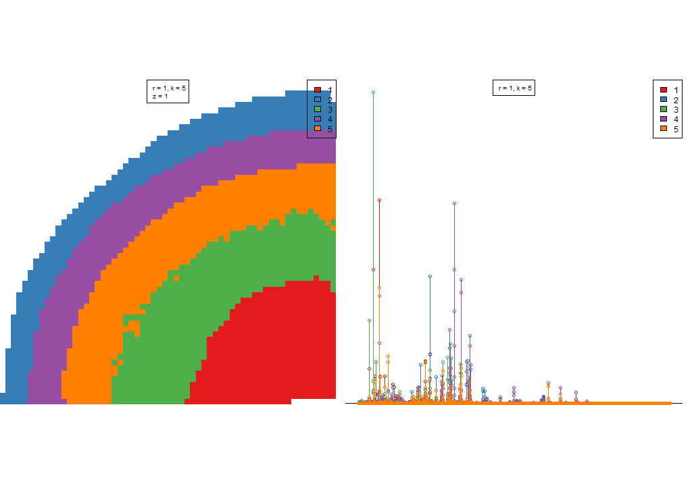
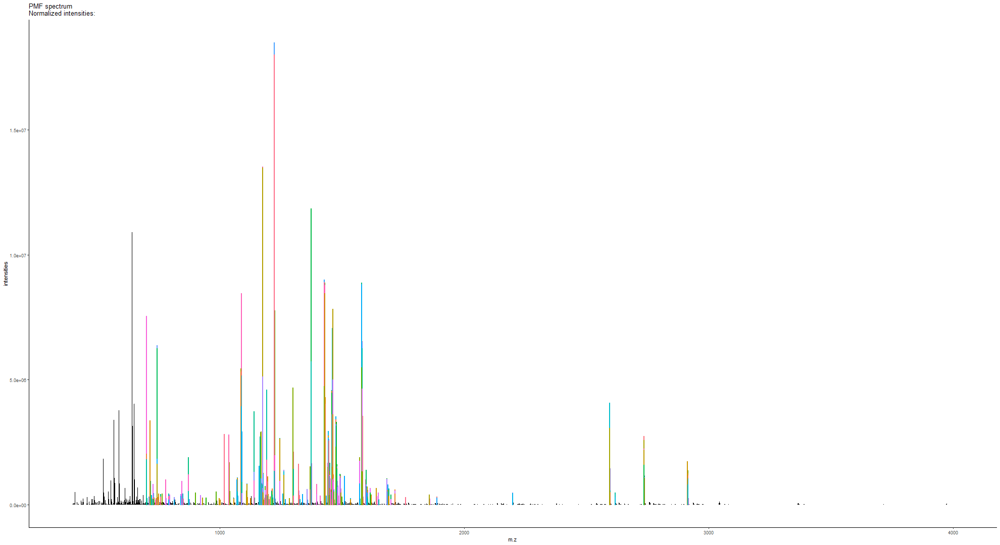
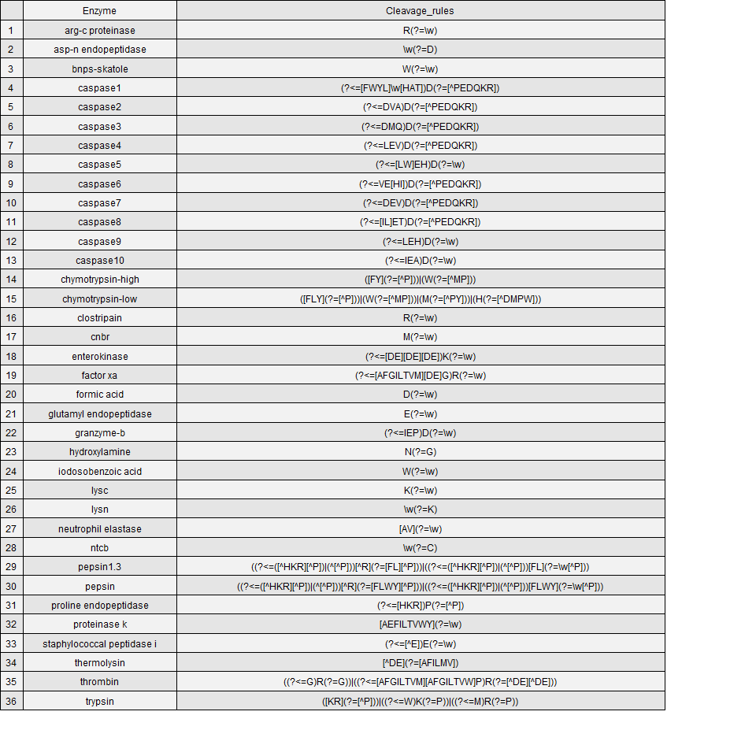

-- An R package of High-resolution Informatics Toolbox for Maldi-imaging Proteomics


## Package installation
This is an tutorial for use of HiTMaP (An R package of High-resolution Informatics Toolbox for Maldi-imaging Proteomics). To access the software use the installation codes as below: 


```r
#install the git package
install.packages("remotes")
install.packages("devtools")
#library(devtools)
library(remotes)
install_github("MASHUOA/HiTMaP",auth_token ="cf6d877f8b6ada1865987b13f9e9996c1883014a",force=T)
3
no
#Update all dependencies
BiocManager::install(ask = F)
yes
library(HiTMaP)
```
 For windows users, Rtools (*https://cran.r-project.org/bin/windows/Rtools/*) is required.

### For Linux OS users
Run the codes as below to enable the required components in Linux console.


```bash
sudo apt-get install tcl-dev tk-dev
sudo apt-get install r-cran-ncdf4
sudo apt install libxml2-dev
sudo apt install libssl-dev
sudo apt install libcurl4-openssl-dev
sudo apt-get install libnss-winbind winbind
```

### For Mac OS users

You may need to update the Xcode. Go to your Mac OS terminal and input:


```bash
xcode-select --install
```

You'll then receive:
*xcode-select: note: install requested for command line developer tools*
You will be prompted at this point in a window to update Xcode Command Line tools. 

You may also need to install the X11.app and tcl/tk support for Mac system:

+ X11.app:
https://www.xquartz.org/

+ Use the following link to download and install the correct tcltk package for your OS version.
https://cran.r-project.org/bin/macosx/tools/


## Example data
The HitMaP comes with a series of Maildi imaging data sets acquired from either FT-ICR or TOF. By the following codes, you can download these raw data set into a local folder.  
You can download the example file mannually through this link: "https://github.com/MASHUOA/HiTMaP/releases/download/0.99/Data.tar.gz"


```r
install.packages("piggyback")
library(piggyback)
library(HiTMaP)
Sys.setenv(GITHUB_TOKEN="cf6d877f8b6ada1865987b13f9e9996c1883014a")
#made sure that this foler has enough space
wd=paste0(file.path(path.package(package="HiTMaP")),"/data/")
setwd(wd)
pb_download("Data.tar.gz", repo = "MASHUOA/HiTMaP", dest = ".")
untar('Data.tar.gz',exdir =".",  tar="tar")
#unlink('Data.tar.gz')
list.dirs()
```


## Proteomics identification on Maldi imaging data file 


Now the HiTMaP is upon running. You could build the candidate list of your target proteome and perform image identification by using the function as below:


```r
#creat candidate list
library(HiTMaP)
#set project folder that contains imzML, .ibd and fasta files
wd=paste0(file.path(path.package(package="HiTMaP")),"/data/")
#set a series of imzML files to be processed
datafile=c("Bovinlens_Trypsin_FT/Bovin_lens.imzML")


imaging_identification(
#==============Choose the imzml raw data file(s) to process  make sure the fasta file in the same folder
               datafile=paste0(wd,datafile),
               threshold=0.005, 
               ppm=5,
               FDR_cutoff = 0.05,
#==============specify the digestion enzyme specificity
               Digestion_site="trypsin",
#==============specify the range of missed Cleavages
               missedCleavages=0:1,
#==============Set the target fasta file
               Fastadatabase="uniprot-bovin.fasta",
#==============Set the possible adducts and fixed modifications
               adducts=c("M+H"),
               Modifications=list(fixed=NULL),
#==============The decoy mode: could be one of the "adducts", "elements" or "isotope"
               Decoy_mode = "isotope",
               use_previous_candidates=F,
               output_candidatelist=T,
#==============Set the parameters for image segmentation
               spectra_segments_per_file=5,
               Segmentation=c("spatialKMeans","spatialShrunkenCentroids","Virtual_segmentation","none"),
               Smooth_range=1,
               Virtual_segmentation=FALSE,
               Virtual_segmentation_rankfile=NULL,
#==============Set the Score method for hi-resolution isotopic pattern matching
               score_method="SQRTP",
               peptide_ID_filter=2,
#==============Summarise the protein and peptide features across the project the result can be found at the summary folder
               Protein_feature_summary=TRUE,
               Peptide_feature_summary=TRUE,
               Region_feature_summary=TRUE,
#==============The parameters for Cluster imaging. Specify the annotations of interest, the program will perform a case-insensitive search on the result file, extract the protein(s) of interest and plot them in the cluster imaging mode
               plot_cluster_image_grid=FALSE,
               ClusterID_colname="Protein",
               componentID_colname="Peptide",
               Protein_desc_of_interest=c("Crystallin","Actin"),
               Rotate_IMG=NULL,
               )
```


## Project folder and result structure 

In the above function, You have performed proteomics analysis of the sample data file. It is a tryptic Bovin lens MALDI-imaging file which is acquired on an FT-ICR MS.
The function will take the selected data files' root directory as the project folder.
In this example, the project folder will be:


```r
library(HiTMaP)
wd=paste0("D:\\GITHUB LFS\\HiTMaP-Data\\inst","/data/Bovinlens_Trypsin_FT/")
#set a series of imzML files to be processed
datafile=c("Bovin_lens")
wd
```

```
## [1] "D:\\GITHUB LFS\\HiTMaP-Data\\inst/data/Bovinlens_Trypsin_FT/"
```


After the whole identification process, we will get two types of sub-folders in the project folder:


```r
list.dirs(wd, recursive=FALSE)
```

```
## [1] "D:\\GITHUB LFS\\HiTMaP-Data\\inst/data/Bovinlens_Trypsin_FT//Bovin_lens ID" 
## [2] "D:\\GITHUB LFS\\HiTMaP-Data\\inst/data/Bovinlens_Trypsin_FT//Summary folder"
```

1. The one which has an identical name to an input data file contains the identification result of that input:
   + the protein and peptides list of each segmentation region
   + the PMF matching plot of each segmentation
   + the image that indicates segmentations' boundary (applies to either K-mean segmentation (powered by Cardinal) or manually defined segmentation)
   + folders of each region contains the detailed identification process, FDR plots and isotopic pattern matching plots

2. "Summary folder" contains: 
   + the identification summary of protein and peptides across all the data
   + the candidate list of all possible proteins and peptides (if *use_previous_candidates* is set as **TRUE**)
   + the Cluster imaging files of the protein of interest
   
   
## Identification result visulasation and interpretation

Now we could visualize the result by the following functions:

To check the segmentation result over the sample, you need got to each data file ID folder and find the "spatialKMeans_image_plot.png" (if you are using the spatial K-means method for segmentation.)


```r
library(magick)
```

```
## Linking to ImageMagick 6.9.9.14
## Enabled features: cairo, freetype, fftw, ghostscript, lcms, pango, rsvg, webp
## Disabled features: fontconfig, x11
```

```r
p<-image_read(paste0(wd,datafile," ID/spatialKMeans_image_plot.png"))
print(p)
```

```
## # A tibble: 1 x 7
##   format width height colorspace matte filesize density
##   <chr>  <int>  <int> <chr>      <lgl>    <int> <chr>  
## 1 PNG     1024   2640 sRGB       FALSE    30726 72x72
```



The pixels in image data now has been categorized into five regions according to the initial setting of segmentation (*spectra_segments_per_file=5*). The rainbow shaped bovine lens segmentation image (on the left panel) shows a unique statistical classification based on the mz features of each region (on the right panel).

The identification will take place on the **mean spectra** of each region. To check the peptide mass fingerprint (PMF) matching quality, 
you could locate the PMF spectrum matching plot of each individual region.


```r
library(magick)
p_pmf<-image_read(paste0(wd,datafile," ID/Bovin_lens 3PMF spectrum match.png"))
print(p_pmf)
```

```
## Warning: `...` is not empty.
## 
## We detected these problematic arguments:
## * `needs_dots`
## 
## These dots only exist to allow future extensions and should be empty.
## Did you misspecify an argument?
```

```
## # A tibble: 1 x 7
##   format width height colorspace matte filesize density
##   <chr>  <int>  <int> <chr>      <lgl>    <int> <chr>  
## 1 PNG     1980   1080 sRGB       FALSE    17664 72x72
```



list of Peptides and proteins of each region has also been created so that you may check each individual region's result.


```r
peptide_pmf_result<-read.csv(paste0(wd,datafile," ID/Peptide_segment_PMF_RESULT_3.csv"))
head(peptide_pmf_result)
```

```
## Warning: `...` is not empty.
## 
## We detected these problematic arguments:
## * `needs_dots`
## 
## These dots only exist to allow future extensions and should be empty.
## Did you misspecify an argument?
```

```
## # A tibble: 6 x 23
##   Protein    mz Protein_coverage isdecoy Peptide Modification pepmz formula
##     <int> <dbl>            <dbl>   <int> <chr>   <lgl>        <dbl> <chr>  
## 1      48 1301.           0.0688       0 HLEQFA~ NA           1300. C57H90~
## 2      48 1301.           0.0688       0 QYFLDL~ NA           1300. C60H94~
## 3      48 1325.           0.0688       0 GSKCIL~ NA           1324. C62H94~
## 4      53 1329.           0.0554       0 FKNINP~ NA           1328. C64H98~
## 5      53 1450.           0.0554       0 AVQNFT~ NA           1449. C65H97~
## 6      53 1606.           0.0554       0 AVQNFT~ NA           1605. C71H10~
## # ... with 15 more variables: adduct <chr>, charge <int>, start <int>,
## #   end <int>, pro_end <int>, mz_align <dbl>, Score <dbl>, Rank <int>,
## #   moleculeNames <chr>, Region <int>, Delta_ppm <dbl>, Intensity <dbl>,
## #   peptide_count <int>, desc.x <chr>, desc.y <chr>
```


```r
protein_pmf_result<-read.csv(paste0(wd,datafile," ID/Protein_segment_PMF_RESULT_3.csv"))
head(protein_pmf_result)
```

```
## Warning: `...` is not empty.
## 
## We detected these problematic arguments:
## * `needs_dots`
## 
## These dots only exist to allow future extensions and should be empty.
## Did you misspecify an argument?
```

```
## # A tibble: 6 x 9
##   Protein Proscore isdecoy Intensity Score peptide_count Protein_coverage
##     <int>    <dbl>   <int>     <dbl> <dbl>         <int>            <dbl>
## 1   10134   0.139        0  2873903. 1.93              3           0.0672
## 2   10204   0.137        0   380571. 0.794             3           0.185 
## 3   10370   0.204        0  1877250. 2.08              4           0.0936
## 4   10659   0.112        0   327352. 0.745             3           0.164 
## 5   10888   0.0798       0   532832. 1.24              3           0.0672
## 6   11270   0.107        0  2944154. 1.33              3           0.0745
## # ... with 2 more variables: Intensity_norm <dbl>, desc <chr>
```

## Scoring system for protein and peptide
**Score** in peptide result table shows the isotopic pattern matching score of the peptide (Pepscore). In Protein result table, it shows the protein score (Proscore). The Pepscore consist of two parts: Intensity_Score and Mass_error_Score:

   + Intensity_Score indicates how well a putative isotopic pattern can be matched to the observed spectrum.The default scoring method is SQRTP. It combines the Square root mean differences between observed and theoretical peaks and observed proportion of the isotopic peaks above a certain relative intensity threshold.
   
   + Mass_error_Score indicates the summary of mass error (in *ppm*) for every detected isotopic peak. in order to integrate the Mass_error_Score in to scoring system. the mean ppm error has been normalized by ppm tolerance, and supplied to the probability normal distributions (*pnorm* function for R). The resulting value (Quantiles of the given Probability Density) is deducted by 0.5 and converted into absolute value.

$Intensity\_Score=\log(PeakCount_{Observed}/PeakCount_{Theoritical})-\log(\sqrt{\frac{\sum_{x = 1}^{n} (Theoritical\_intensity_x-Observed\_intensity_x)^2}{\sum_{x = 1}^{n} (Theoritical\_intensity_x)^2(Observed\_intensity_x)^2}}$

$Mass\_error\_Score=|(p\_norm\_dist(\frac{mean\_ppm\_error}{ppm\_tolerance})-0.5)|$


$Pepscore=Intensity\_Score-Mass\_error\_Score$

**Proscore** in the protein result table shows the overall estimation of the protein identification Accuracy

$Proscore=\frac{\sum_{x = 1}^{n}(Pepscore_x*log(Intensity_x))}{mean(log(Intensity))}*Protein\_coverage*Normalized\_intensity$

A *Peptide_region_file.csv* has also been created to summarise all the IDs in this data file:


```r
Identification_summary_table<-read.csv(paste0(wd,datafile," ID/Peptide_region_file.csv"))
head(Identification_summary_table)
```

```
## Warning: `...` is not empty.
## 
## We detected these problematic arguments:
## * `needs_dots`
## 
## These dots only exist to allow future extensions and should be empty.
## Did you misspecify an argument?
```

```
## # A tibble: 6 x 23
##   Protein    mz Protein_coverage isdecoy Peptide Modification pepmz formula
##     <int> <dbl>            <dbl>   <int> <chr>   <lgl>        <dbl> <chr>  
## 1      24 1144.           0.0612       0 GFPGQD~ NA           1143. C51H79~
## 2      24 1685.           0.0612       0 DGANGI~ NA           1684. C72H11~
## 3      24  742.           0.0612       0 GDSGPP~ NA            741. C29H48~
## 4      24 1694.           0.0612       0 LLSTEG~ NA           1693. C72H11~
## 5      24 1882.           0.0612       0 GQPGVM~ NA           1881. C82H12~
## 6      48 1217.           0.0348       0 ASTSVQ~ NA           1216. C51H94~
## # ... with 15 more variables: adduct <chr>, charge <int>, start <int>,
## #   end <int>, pro_end <int>, mz_align <dbl>, Score <dbl>, Rank <int>,
## #   moleculeNames <chr>, Region <int>, Delta_ppm <dbl>, Intensity <dbl>,
## #   peptide_count <int>, desc.x <chr>, desc.y <chr>
```

The details of protein/peptide identification process has been save to the folder named by the segmentation:


```r
list.dirs(paste0(wd,datafile," ID/"), recursive=FALSE)
```

```
## [1] "D:\\GITHUB LFS\\HiTMaP-Data\\inst/data/Bovinlens_Trypsin_FT/Bovin_lens ID//1"
## [2] "D:\\GITHUB LFS\\HiTMaP-Data\\inst/data/Bovinlens_Trypsin_FT/Bovin_lens ID//2"
## [3] "D:\\GITHUB LFS\\HiTMaP-Data\\inst/data/Bovinlens_Trypsin_FT/Bovin_lens ID//3"
## [4] "D:\\GITHUB LFS\\HiTMaP-Data\\inst/data/Bovinlens_Trypsin_FT/Bovin_lens ID//4"
```
In the identification details folder, you will find a series of FDR file and plots to demonstrate the FDR model and score cutoff threshold:


```r
dir(paste0(wd,datafile," ID/1/"), recursive=FALSE)
```

```
##  [1] "FDR.CSV"                                        
##  [2] "FDR.png"                                        
##  [3] "Matching_Score_vs_mz_target-decoy.png"          
##  [4] "Peptide_1st_ID.csv"                             
##  [5] "Peptide_1st_ID_score_rank_SQRTP.csv"            
##  [6] "Peptide_2nd_ID_score_rankSQRTP_Rank_above_3.csv"
##  [7] "Peptide_Score_histogram_target-decoy.png"       
##  [8] "ppm"                                            
##  [9] "PROTEIN_FDR.CSV"                                
## [10] "Protein_FDR.png"                                
## [11] "Protein_ID_score_rank_SQRTP.csv"                
## [12] "PROTEIN_Score_histogram.png"                    
## [13] "Spectrum.csv"                                   
## [14] "unique_peptide_ranking_vs_mz_feature.png"
```

In this folder, you will find the FDR plots for protein and peptide. The software will take the proscore and its FDR model to trim the final identification result. The *unique_peptide_ranking_vs_mz_feature.png* is a plot that could tell you the number of peptide candidates have been matched to the mz features in the first round run.You can also access the peptide spectrum match (first MS dimension) data via the "/ppm" subfolder.


```r
library(magick)
p_peptide_vs_mz_feature<-image_read(paste0(wd,datafile," ID/3/unique_peptide_ranking_vs_mz_feature.png"))
print(p_peptide_vs_mz_feature)
```

```
## # A tibble: 1 x 7
##   format width height colorspace matte filesize density
##   <chr>  <int>  <int> <chr>      <lgl>    <int> <chr>  
## 1 PNG      960    480 sRGB       FALSE    11196 72x72
```


```r
p_FDR_peptide<-image_read(paste0(wd,datafile," ID/3/FDR.png"))
p_FDR_protein<-image_read(paste0(wd,datafile," ID/3/protein_FDR.png"))
p_FDR_peptide_his<-image_read(paste0(wd,datafile," ID/3/Peptide_Score_histogram_target-decoy.png"))
p_FDR_protein_his<-image_read(paste0(wd,datafile," ID/3/PROTEIN_Score_histogram.png"))
p_combined<-image_append(c(p_FDR_peptide,p_FDR_peptide_his,p_FDR_protein,p_FDR_protein_his))
print(p_combined)
```

```
## # A tibble: 1 x 7
##   format width height colorspace matte filesize density
##   <chr>  <int>  <int> <chr>      <lgl>    <int> <chr>  
## 1 PNG     1920    480 sRGB       FALSE        0 72x72
```


you will also find a *Matching_Score_vs_mz* plots for further investigation on peptide matching quality. 


```r
library(magick)
#plot Matching_Score_vs_mz
p_Matching_Score_vs_mz<-image_read(paste0(wd,datafile," ID/3/Matching_Score_vs_mz_target-decoy.png"))
print(p_Matching_Score_vs_mz)
```

```
## # A tibble: 1 x 7
##   format width height colorspace matte filesize density
##   <chr>  <int>  <int> <chr>      <lgl>    <int> <chr>  
## 1 PNG      480    480 sRGB       FALSE    47438 72x72
```


## Identification summary and cluster imaging

In the project summary folder, you will find four files and a sub-folder:

```r
wd_sum=paste(wd,"/Summary folder", sep="")
dir(wd_sum)
```

```
## [1] "candidatelist.csv"                "cluster Ion images"              
## [3] "Peptide_Summary.csv"              "Protein_feature_list_trimmed.csv"
## [5] "protein_index.csv"                "Protein_Summary.csv"
```

"candidatelist.csv" and "protein_index.csv" contains the candidates used for this project. They are output after the candidate processing while *output_candidatelist* set as TRUE, and can be used repeatedly while *use_previous_candidates* set as TRUE.

"Peptide_Summary.csv" and "Protein_Summary.csv" contains the table of the project identification summary. You could set the *plot_cluster_image_grid* as TRUE to enable the cluster imaging function. Please be noted that you could indicate *Rotate_IMG* with a CSV file path that indicates the rotation degree of image files. 

**Note**: 90$^\circ$, 180$^\circ$ and 270$^\circ$ are recommended for image rotation. You may find an example CSV file in the library/HiTMaP/data folder.


```r
library(dplyr)
Protein_desc_of_interest<-c("Crystallin","Actin")
Protein_Summary_tb<-read.csv(paste(wd,"/Summary folder","/Protein_Summary.csv", sep=""),stringsAsFactors = F)
```


Now you could visualized the interest proteins and their associated peptides' distribution via cluster imaging function.


```r
library(magick)
p_cluster1<-image_read(paste0(wd,"/Summary folder/cluster Ion images/791_cluster_imaging.png"))
print(p_cluster1)
```

```
## Warning: `...` is not empty.
## 
## We detected these problematic arguments:
## * `needs_dots`
## 
## These dots only exist to allow future extensions and should be empty.
## Did you misspecify an argument?
```

```
## # A tibble: 1 x 7
##   format width height colorspace matte filesize density
##   <chr>  <int>  <int> <chr>      <lgl>    <int> <chr>  
## 1 PNG     1980   1308 sRGB       TRUE    302087 118x118
```


```r
p_cluster2<-image_read(paste0(wd,"/Summary folder/cluster Ion images/5027_cluster_imaging.png"))
print(p_cluster2)
```

```
## Warning: `...` is not empty.
## 
## We detected these problematic arguments:
## * `needs_dots`
## 
## These dots only exist to allow future extensions and should be empty.
## Did you misspecify an argument?
```

```
## # A tibble: 1 x 7
##   format width height colorspace matte filesize density
##   <chr>  <int>  <int> <chr>      <lgl>    <int> <chr>  
## 1 PNG     1980   1309 sRGB       TRUE    348111 118x118
```


```r
p_cluster3<-image_read(paste0(wd,"/Summary folder/cluster Ion images/5479_cluster_imaging.png"))
print(p_cluster3)
```

```
## Warning: `...` is not empty.
## 
## We detected these problematic arguments:
## * `needs_dots`
## 
## These dots only exist to allow future extensions and should be empty.
## Did you misspecify an argument?
```

```
## # A tibble: 1 x 7
##   format width height colorspace matte filesize density
##   <chr>  <int>  <int> <chr>      <lgl>    <int> <chr>  
## 1 PNG     1980   1069 sRGB       TRUE    237191 118x118
```


## Details of parameter setting


### Modification
you can choose one or a list of modifications from the unimod modification list. *Peptide_modification* function is used to load/rebuild the modification database into the global enviornment of R. It will be called automatically in the identification work flow. you can use the *code_name* or *record_id* to refer the modification (see example data "peptide calibrants" to find more details). The pipeline will select the *non-hidden* modifications.


```r
HiTMaP:::Peptide_modification(retrive_ID=NULL,update_unimod=F)
modification_list<-merge(unimod.df$modifications,unimod.df$specificity,by.x=c("record_id"),by.y=c("mod_key"),all.x=T)
head(modification_list['&'(modification_list$code_name=="Phospho",modification_list$hidden!=1),c("code_name","record_id","composition","mono_mass","position_key","one_letter")])
```

```
## # A tibble: 3 x 6
##   code_name record_id composition mono_mass position_key one_letter
##   <chr>     <chr>     <chr>       <chr>     <chr>        <chr>     
## 1 Phospho   21        H O(3) P    79.966331 2            T         
## 2 Phospho   21        H O(3) P    79.966331 2            Y         
## 3 Phospho   21        H O(3) P    79.966331 2            S
```

```r
head(modification_list['&'(modification_list$code_name=="Amide",modification_list$hidden!=1),c("code_name","record_id","composition","mono_mass","position_key","one_letter")])
```

```
## # A tibble: 2 x 6
##   code_name record_id composition mono_mass position_key one_letter
##   <chr>     <chr>     <chr>       <chr>     <chr>        <chr>     
## 1 Amide     2         H N O(-1)   -0.984016 4            C-term    
## 2 Amide     2         H N O(-1)   -0.984016 6            C-term
```

```r
head(modification_list['&'(stringr::str_detect(modification_list$code_name,"Ca"),modification_list$hidden!=1),c("code_name","record_id","composition","mono_mass","position_key","one_letter")])
```

```
## # A tibble: 5 x 6
##   code_name       record_id composition    mono_mass position_key one_letter
##   <chr>           <chr>     <chr>          <chr>     <chr>        <chr>     
## 1 Carbamidomethyl 4         H(3) C(2) N O  57.021464 2            C         
## 2 Carbamidomethyl 4         H(3) C(2) N O  57.021464 3            N-term    
## 3 Carbamyl        5         H C N O        43.005814 3            N-term    
## 4 Carbamyl        5         H C N O        43.005814 2            K         
## 5 Carboxymethyl   6         H(2) C(2) O(2) 58.005479 2            C
```

If a modification occurs on different types of site , you will also need to specify the position of a modifications.

* *Anywhere*, side chain of possible amino acids
* *Any N-term*, any N-term of enzymatic peptide 
* *Protein N-term*, any N-term of protein 
 

```r
unimod.df[["positions"]]
```

```
## Warning: `...` is not empty.
## 
## We detected these problematic arguments:
## * `needs_dots`
## 
## These dots only exist to allow future extensions and should be empty.
## Did you misspecify an argument?
```

```
## # A tibble: 6 x 2
##   record_id position      
##   <chr>     <chr>         
## 1 1         -             
## 2 2         Anywhere      
## 3 3         Any N-term    
## 4 4         Any C-term    
## 5 5         Protein N-term
## 6 6         Protein C-term
```
### Amino acid substitution
You can set the *Substitute_AA* to make the uncommon amino acid available to the workflow:
*Substitute_AA=list(AA=c("X"),AA_new_formula=c("C5H5NO2"),Formula_with_water=c(FALSE))*

* AA: the single letter amino acid to be replaced
* AA_new_formula: the new formula for the amino acid
* Formula_with_water: Set *TRUE* to indicate the formula represents the intact amino acid, *FALSE* to indicate that the formula already lost one H2O molecule and can be considered as AA backbone.


### Digestion site and enzyme

The *Digestion_site* allows you to specify a list of pre-defined enzyme and customized digestion rules in regular expression format. You can either use the enzyme name, customized cleavage rule or combination of them to get the enzymatics peptides list. 


```r
Cleavage_rules<-Cleavage_rules_fun()
Cleavage_df<-data.frame(Enzyme=names(Cleavage_rules),Cleavage_rules=unname(Cleavage_rules),stringsAsFactors = F)
library(gridExtra)
grid.ftable(Cleavage_df, gp = gpar(fontsize=9,fill = rep(c("grey90", "grey95"))))
```

<!-- -->


## Example workflow command
Below is a list of commands including the parameters for the example data sets.


```r
wd=paste0(file.path(path.package(package="HiTMaP")),"/data/")
setwd(wd)
#Navigate to the corresponding example data folder ad select the file(s) for a MSI annotation
#Bovin lens FTICR 
##Identifiction
imaging_identification(Digestion_site="trypsin",Fastadatabase="uniprot-Bovin.fasta",output_candidatelist=T,spectra_segments_per_file=4,use_previous_candidates=F,peptide_ID_filter=3,threshold = 0.005)

##Cluster image plotting
imaging_identification(Digestion_site="trypsin",Fastadatabase="uniprot-Bovin.fasta",output_candidatelist=T,spectra_segments_per_file=4,use_previous_candidates=T,peptide_ID_filter=3,threshold = 0.005,FDR_cutoff=0.05,PMF_analysis=F,plot_cluster_image_grid=T,Protein_desc_of_interest=c("crystallin","ACTIN","Vimentin","Filensin","Phakinin"))


#peptide calibrant
imaging_identification(
  Digestion_site="trypsin",
  Fastadatabase="uniprot_cali.fasta",
  output_candidatelist=T,
  plot_matching_score=T,
  spectra_segments_per_file=1,
  use_previous_candidates=F,
  peptide_ID_filter=1,ppm=5,missedCleavages=0:5,
  Modifications=list(fixed=NULL,fixmod_position=NULL,variable=c("Amide"),varmod_position=c(6)),
  FDR_cutoff=0.1,
  Substitute_AA=list(AA=c("X"),AA_new_formula=c("C5H5NO2"),Formula_with_water=c(FALSE)))

imaging_identification(
  adducts = c("M+H","M+Na"),
  Digestion_site="trypsin",
  Fastadatabase="uniprot_cali.fasta",
  output_candidatelist=T,
  plot_matching_score=T,
  spectra_segments_per_file=1,
  use_previous_candidates=F,
  peptide_ID_filter=1,ppm=5,missedCleavages=0:5,
  Modifications=list(fixed=NULL,fixmod_position=NULL,variable=c("Amide"),varmod_position=c(6)),
  FDR_cutoff=0.1,
  Substitute_AA=list(AA=c("X"),AA_new_formula=c("C5H5NO2"),Formula_with_water=c(FALSE)))

imaging_identification(
  Digestion_site="trypsin",
  Fastadatabase="uniprot_cali.fasta",
  output_candidatelist=T,
  plot_matching_score=T,
  spectra_segments_per_file=1,
  use_previous_candidates=T,
  peptide_ID_filter=1,ppm=5,missedCleavages=0:5,
  FDR_cutoff=0.1)

imaging_identification(
  Digestion_site="trypsin",
  Fastadatabase="calibrants.fasta",
  output_candidatelist=T,
  plot_matching_score=T,
  spectra_segments_per_file=1,
  use_previous_candidates=T,
  peptide_ID_filter=1,ppm=5,missedCleavages=0:5,
  Modifications=list(fixed=NULL,fixmod_position=NULL,variable=c("Amide"),varmod_position=c(6)),
  FDR_cutoff=100,
  Substitute_AA=list(AA=c("X"),AA_new_formula=c("C5H5NO2"),Formula_with_water=c(FALSE)),Thread = 1)


#Ultraflex data
imaging_identification(Digestion_site="trypsin",Fastadatabase="uniprot-bovin.fasta",output_candidatelist=T,spectra_segments_per_file=4,use_previous_candidates=F,ppm=25)
```


## Session information


```r
toLatex(sessionInfo())
```

```
## \begin{itemize}\raggedright
##   \item R version 3.6.2 (2019-12-12), \verb|x86_64-w64-mingw32|
##   \item Locale: \verb|LC_COLLATE=English_Australia.1252|, \verb|LC_CTYPE=English_Australia.1252|, \verb|LC_MONETARY=English_Australia.1252|, \verb|LC_NUMERIC=C|, \verb|LC_TIME=English_Australia.1252|
##   \item Running under: \verb|Windows 10 x64 (build 18362)|
##   \item Matrix products: default
##   \item Base packages: base, datasets, graphics, grDevices, grid,
##     methods, stats, utils
##   \item Other packages: data.table~1.12.8, dplyr~0.8.4, gridExtra~2.3,
##     HiTMaP~1.6.0, lattice~0.20-40, magick~2.3, pls~2.7-2,
##     protViz~0.6.0, XML~3.99-0.3
##   \item Loaded via a namespace (and not attached): assertthat~0.2.1,
##     Biobase~2.46.0, BiocGenerics~0.32.0, BiocManager~1.30.10,
##     BiocParallel~1.20.1, cli~2.0.1, codetools~0.2-16, compiler~3.6.2,
##     crayon~1.3.4, digest~0.6.25, doParallel~1.0.15, evaluate~0.14,
##     fansi~0.4.1, foreach~1.4.8, glue~1.3.1, gtable~0.3.0,
##     htmltools~0.4.0, iterators~1.0.12, knitr~1.28, magrittr~1.5,
##     MASS~7.3-51.5, Matrix~1.2-18, multtest~2.42.0, pacman~0.5.1,
##     parallel~3.6.2, pillar~1.4.3, pkgconfig~2.0.3, png~0.1-7,
##     purrr~0.3.3, R6~2.4.1, Rcpp~1.0.3, rlang~0.4.4, rmarkdown~2.1,
##     rstudioapi~0.11, S4Vectors~0.24.3, splines~3.6.2, stats4~3.6.2,
##     stringi~1.4.6, stringr~1.4.0, survival~3.1-8, tcltk~3.6.2,
##     tibble~2.1.3, tidyselect~1.0.0, tools~3.6.2, utf8~1.1.4,
##     vctrs~0.2.3, xfun~0.12, yaml~2.2.1
## \end{itemize}
```


End of the tutorial, Enjoy~


## References
R Packages used in this project:

   + viridisLite[@viridisLite]

   + rcdklibs[@rcdklibs]

   + rJava[@rJava]

   + data.table[@data.table]

   + RColorBrewer[@RColorBrewer]

   + magick[@magick]

   + ggplot2[@ggplot2]

   + dplyr[@dplyr]

   + stringr[@stringr]

   + protViz[@protViz]

   + cleaver[@cleaver]

   + Biostrings[@Biostrings]

   + IRanges[@IRanges]

   + Cardinal[@Cardinal]

   + tcltk[@tcltk]

   + BiocParallel[@BiocParallel]

   + spdep[@spdep1]

   + FTICRMS[@FTICRMS]

   + UniProt.ws[@UniProt.ws]
