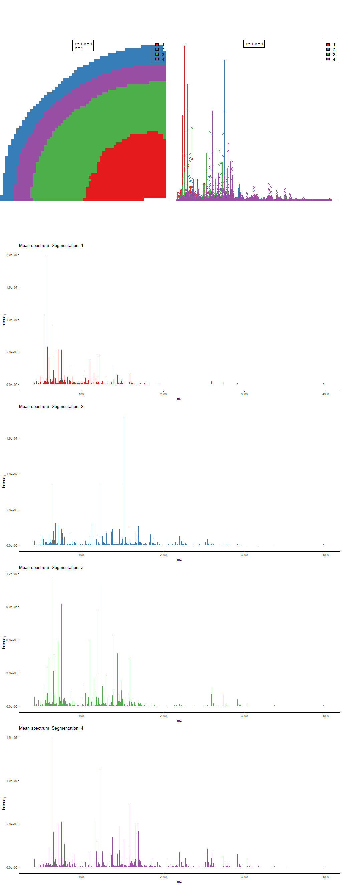
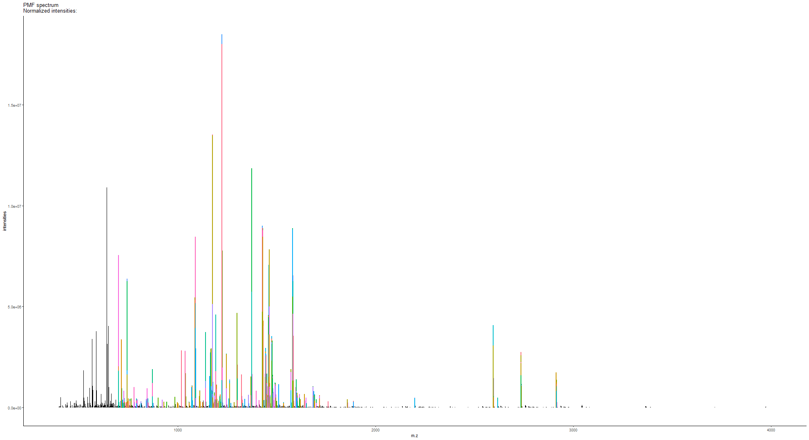
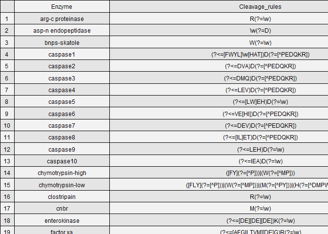

– An R package of High-resolution Informatics Toolbox for Maldi-imaging
Proteomics

Package installation
--------------------

This is an tutorial for use of HiTMaP (An R package of High-resolution
Informatics Toolbox for Maldi-imaging Proteomics). To access the
software use the installation codes as below:

``` r
#install the git package
install.packages("devtools")
Sys.setenv(R_REMOTES_NO_ERRORS_FROM_WARNINGS=T)
library(devtools)
install_github("MASHUOA/HiTMaP",auth_token ="a124a067ed1c84f8fd577c972845573922f1bb0f",force=T)
3
no
#Update all dependencies
BiocManager::install(ask = F)
yes
library(HiTMaP)
```

Proteomics identification on Maldi imaging data file
----------------------------------------------------

Now the HiTMaP is upon running. You could build the candidate list of
your target proteome and perform image identification by using the
function as below:

``` r
#creat candidate list
library(HiTMaP)
#set project folder that contains imzML, .ibd and fasta files
wd=paste0(file.path(path.package(package="HiTMaP")),"/data/")
#set a series of imzML files to be processed
datafile=c("Bovin_lens")


imaging_identification(
#==============Choose the imzml raw data file(s) to process  make sure the fasta file in the same folder
               datafile=paste0(wd,datafile),
               threshold=0.005, 
               ppm=5,
#==============specify the digestion enzyme specificity
               Digestion_site="([KR](?=[^P]))|((?<=W)K(?=P))|((?<=M)R(?=P))",
#==============specify the range of missed Cleavages
               missedCleavages=0:1,
#==============Set the target fasta file
               Fastadatabase="uniprot-bovin.fasta",
#==============Set the possible adducts and fixed modifications
               adducts=c("M+H"),
               Modifications=list(fixed=NULL),
#==============The decoy mode: could be one of the "adducts", "elements" or "isotope"
               Decoy_mode = "isotope",
               use_previous_candidates=F,
               output_candidatelist=T,
#==============Set the parameters for image segmentation
               spectra_segments_per_file=5,
               spatialKMeans=TRUE,
               Smooth_range=1,
               Virtual_segmentation=FALSE,
               Virtual_segmentation_rankfile=NULL,
#==============Set the Score method for hi-resolution isotopic pattern matching
               score_method="SQRTP",
               peptide_ID_filter=2,
#==============Summarise the protein and peptide features across the project the result can be found at the summary folder
               Protein_feature_summary=TRUE,
               Peptide_feature_summary=TRUE,
               Region_feature_summary=TRUE,
#==============The parameters for Cluster imaging. Specify the annotations of interest, the program will perform a case-insensitive search on the result file, extract the protein(s) of interest and plot them in the cluster imaging mode
               plot_cluster_image_grid=FALSE,
               ClusterID_colname="Protein",
               componentID_colname="Peptide",
               Protein_desc_of_interest=c("Crystallin","Actin"),
               Rotate_IMG=NULL,
               )
```

Project folder and result structure
-----------------------------------

In the above function, You have performed proteomics analysis of the
sample data file. It is a tryptic Bovin lens MALDI-imaging file which is
acquired on an FT-ICR MS. The function will take the selected data
files’ root directory as the project folder. In this example, the
project folder will be:

``` r
library(HiTMaP)
wd=paste0("D:\\GITHUB LFS\\HiTMaP-Data\\inst","/data/Bovinlens_Trypsin_FT/")
#set a series of imzML files to be processed
datafile=c("Bovin_lens")
wd
```

    ## [1] "D:\\GITHUB LFS\\HiTMaP-Data\\inst/data/Bovinlens_Trypsin_FT/"

After the whole identification process, we will get two types of
sub-folders in the project folder:

``` r
list.dirs(wd, recursive=FALSE)
```

    ## [1] "D:\\GITHUB LFS\\HiTMaP-Data\\inst/data/Bovinlens_Trypsin_FT//Bovin_lens ID" 
    ## [2] "D:\\GITHUB LFS\\HiTMaP-Data\\inst/data/Bovinlens_Trypsin_FT//Summary folder"

1.  The one which has an identical name to an input data file contains
    the identification result of that input:
    -   the protein and peptides list of each segmentation region
    -   the PMF matching plot of each segmentation
    -   the image that indicates segmentations’ boundary (applies to
        either K-mean segmentation (powered by Cardinal) or manually
        defined segmentation)
    -   folders of each region contains the detailed identification
        process, FDR plots and isotopic pattern matching plots
2.  “Summary folder” contains:
    -   the identification summary of protein and peptides across all
        the data
    -   the candidate list of all possible proteins and peptides (if
        *use\_previous\_candidates* is set as **TRUE**)
    -   the Cluster imaging files of the protein of interest

Identification result visulasation and interpretation
-----------------------------------------------------

Now we could visualize the result by the following functions:

To check the segmentation result over the sample, you need got to each
data file ID folder and find the “spatialKMeans\_image\_plot.png” (if
you are using the spatial K-means method for segmentation.)

``` r
library(magick)
```

    ## Linking to ImageMagick 6.9.9.14
    ## Enabled features: cairo, freetype, fftw, ghostscript, lcms, pango, rsvg, webp
    ## Disabled features: fontconfig, x11

``` r
p<-image_read(paste0(wd,datafile," ID/spatialKMeans_image_plot.png"))
print(p)
```

    ##   format width height colorspace matte filesize density
    ## 1    PNG  1024   2640       sRGB FALSE    30726   72x72



The pixels in image data now has been categorized into five regions
according to the initial setting of segmentation
(*spectra\_segments\_per\_file=5*). The rainbow shaped bovine lens
segmentation image (on the left panel) shows a unique statistical
classification based on the mz features of each region (on the right
panel).

The identification will take place on the **mean spectra** of each
region. To check the peptide mass fingerprint (PMF) matching quality,
you could locate the PMF spectrum matching plot of each individual
region.

``` r
library(magick)
p_pmf<-image_read(paste0(wd,datafile," ID/Bovin_lens 3PMF spectrum match.png"))
print(p_pmf)
```

    ##   format width height colorspace matte filesize density
    ## 1    PNG  1980   1080       sRGB FALSE    17664   72x72



list of Peptides and proteins of each region has also been created so
that you may check each individual region’s result.

``` r
peptide_pmf_result<-read.csv(paste0(wd,datafile," ID/Peptide_segment_PMF_RESULT_3.csv"))
head(peptide_pmf_result)
```

    ##   Protein       mz Protein_coverage isdecoy       Peptide Modification    pepmz
    ## 1      48 1300.664       0.06875544       0   HLEQFATEGLR           NA 1299.657
    ## 2      48 1300.661       0.06875544       0   QYFLDLALSCK           NA 1299.653
    ## 3      48 1324.643       0.06875544       0   GSKCILYCFYK           NA 1323.636
    ## 4      53 1328.747       0.05542725       0   FKNINPFPVPR           NA 1327.740
    ## 5      53 1449.712       0.05542725       0  AVQNFTEYNVHK           NA 1448.705
    ## 6      53 1605.813       0.05542725       0 AVQNFTEYNVHKR           NA 1604.806
    ##          formula adduct charge start end pro_end mz_align      Score Rank
    ## 1   C57H90N17O18    M+H      1   580 590    1149 1300.666  2.4633527    4
    ## 2 C60H94N13O17S1    M+H      1   744 754    1149 1300.666  2.0216690   10
    ## 3 C62H94N13O15S2    M+H      1   840 850    1149 1324.647 -0.2644896   32
    ## 4   C64H98N17O14    M+H      1   207 217     433 1328.747  1.0865820    7
    ## 5   C65H97N18O20    M+H      1    92 103     433 1449.714  0.7060553   10
    ## 6  C71H109N22O21    M+H      1    92 104     433 1605.806  2.7178547   11
    ##   moleculeNames Region Delta_ppm Intensity peptide_count
    ## 1   HLEQFATEGLR      3 0.9026772 4672324.6             3
    ## 2   QYFLDLALSCK      3 1.4117311 4672324.6             3
    ## 3   GSKCILYCFYK      3 1.5164261  145191.4             3
    ## 4   FKNINPFPVPR      3 0.9094769  191636.4             3
    ## 5  AVQNFTEYNVHK      3 2.8830137 1275214.1             3
    ## 6 AVQNFTEYNVHKR      3 1.6464326  558610.4             3
    ##                                                                                                                                          desc.x
    ## 1                                  sp|Q29449|AT8A1_BOVIN Probable phospholipid-transporting ATPase IA OS=Bos taurus OX=9913 GN=ATP8A1 PE=1 SV=2
    ## 2                                  sp|Q29449|AT8A1_BOVIN Probable phospholipid-transporting ATPase IA OS=Bos taurus OX=9913 GN=ATP8A1 PE=1 SV=2
    ## 3                                  sp|Q29449|AT8A1_BOVIN Probable phospholipid-transporting ATPase IA OS=Bos taurus OX=9913 GN=ATP8A1 PE=1 SV=2
    ## 4 sp|Q3SX05|ECSIT_BOVIN Evolutionarily conserved signaling intermediate in Toll pathway, mitochondrial OS=Bos taurus OX=9913 GN=ECSIT PE=2 SV=1
    ## 5 sp|Q3SX05|ECSIT_BOVIN Evolutionarily conserved signaling intermediate in Toll pathway, mitochondrial OS=Bos taurus OX=9913 GN=ECSIT PE=2 SV=1
    ## 6 sp|Q3SX05|ECSIT_BOVIN Evolutionarily conserved signaling intermediate in Toll pathway, mitochondrial OS=Bos taurus OX=9913 GN=ECSIT PE=2 SV=1
    ##                                                                                                                                          desc.y
    ## 1                                  sp|Q29449|AT8A1_BOVIN Probable phospholipid-transporting ATPase IA OS=Bos taurus OX=9913 GN=ATP8A1 PE=1 SV=2
    ## 2                                  sp|Q29449|AT8A1_BOVIN Probable phospholipid-transporting ATPase IA OS=Bos taurus OX=9913 GN=ATP8A1 PE=1 SV=2
    ## 3                                  sp|Q29449|AT8A1_BOVIN Probable phospholipid-transporting ATPase IA OS=Bos taurus OX=9913 GN=ATP8A1 PE=1 SV=2
    ## 4 sp|Q3SX05|ECSIT_BOVIN Evolutionarily conserved signaling intermediate in Toll pathway, mitochondrial OS=Bos taurus OX=9913 GN=ECSIT PE=2 SV=1
    ## 5 sp|Q3SX05|ECSIT_BOVIN Evolutionarily conserved signaling intermediate in Toll pathway, mitochondrial OS=Bos taurus OX=9913 GN=ECSIT PE=2 SV=1
    ## 6 sp|Q3SX05|ECSIT_BOVIN Evolutionarily conserved signaling intermediate in Toll pathway, mitochondrial OS=Bos taurus OX=9913 GN=ECSIT PE=2 SV=1

``` r
protein_pmf_result<-read.csv(paste0(wd,datafile," ID/Protein_segment_PMF_RESULT_3.csv"))
head(protein_pmf_result)
```

    ##   Protein   Proscore isdecoy Intensity     Score peptide_count Protein_coverage
    ## 1   10134 0.13943597       0 2873903.1 1.9269417             3       0.06715328
    ## 2   10204 0.13654123       0  380571.3 0.7940642             3       0.18468468
    ## 3   10370 0.20365140       0 1877250.1 2.0776861             4       0.09364548
    ## 4   10659 0.11239668       0  327352.4 0.7448240             3       0.16400000
    ## 5   10888 0.07975644       0  532832.0 1.2420183             3       0.06720978
    ## 6   11270 0.10687770       0 2944154.2 1.3292158             3       0.07449857
    ##   Intensity_norm
    ## 1      1.0775539
    ## 2      0.9310593
    ## 3      1.0466962
    ## 4      0.9201443
    ## 5      0.9554442
    ## 6      1.0793038
    ##                                                                                                                          desc
    ## 1                   tr|G3N2M8|G3N2M8_BOVIN Sterile alpha motif domain containing 15 OS=Bos taurus OX=9913 GN=SAMD15 PE=4 SV=2
    ## 2                                      tr|A0A3Q1LYB6|A0A3Q1LYB6_BOVIN Uncharacterized protein OS=Bos taurus OX=9913 PE=4 SV=1
    ## 3             tr|E1B9U7|E1B9U7_BOVIN Polypeptide N-acetylgalactosaminyltransferase OS=Bos taurus OX=9913 GN=GALNT17 PE=3 SV=3
    ## 4 tr|A0A3Q1M1B1|A0A3Q1M1B1_BOVIN Phosphatidylinositol transfer protein beta isoform OS=Bos taurus OX=9913 GN=PITPNB PE=4 SV=1
    ## 5                                  tr|F1MMD4|F1MMD4_BOVIN Matrix metallopeptidase 11 OS=Bos taurus OX=9913 GN=MMP11 PE=3 SV=2
    ## 6                         tr|F6RR01|F6RR01_BOVIN Ribosome production factor 1 homolog OS=Bos taurus OX=9913 GN=RPF1 PE=4 SV=1

Scoring system for protein and peptide
--------------------------------------

**Score** in peptide result table shows the isotopic pattern matching
score of the peptide. In Protein result table, it shows the intensity
weighted peptide spectrum matching score.

$Score=\\log(Observed\\\_Peak/Theoritical\\\_peak)-\\log(\\sqrt{\\frac{\\sum\_{x = 1}^{n} (Theoritical\\\_intensity\_x-Observed\\\_intensity\_x)^2}{\\sum\_{x = 1}^{n} (Theoritical\\\_intensity\_x)^2(Observed\\\_intensity\_x)^2}}$

**Proscore** in the protein result table shows the overall estimation of
the protein identification Accuracy

$Proscore=\\frac{\\sum\_{x = 1}^{n}(Score\_x\*log(Intensity\_x))}{mean(log(Intensity))}\*Protein\\\_coverage\*Normalized\\\_intensity$

A *Peptide\_region\_file.csv* has also been created to summarise all the
IDs in this data file:

``` r
Identification_summary_table<-read.csv(paste0(wd,datafile," ID/Peptide_region_file.csv"))
head(Identification_summary_table)
```

    ##   Protein        mz Protein_coverage isdecoy              Peptide Modification
    ## 1      24 1143.5793       0.06119704       0         GFPGQDGLAGPK           NA
    ## 2      24 1684.8878       0.06119704       0   DGANGIPGPIGPPGPRGR           NA
    ## 3      24  742.3478       0.06119704       0             GDSGPPGR           NA
    ## 4      24 1693.8214       0.06119704       0      LLSTEGSQNITYHCK           NA
    ## 5      24 1881.9276       0.06119704       0 GQPGVMGFPGPKGANGEPGK           NA
    ## 6      48 1216.7008       0.03481288       0          ASTSVQNRLLK           NA
    ##       pepmz         formula adduct charge start  end pro_end  mz_align
    ## 1 1142.5720    C51H79N14O16    M+H      1   516  527    1487 1143.5828
    ## 2 1683.8805   C72H118N25O22    M+H      1  1175 1192    1487 1684.8830
    ## 3  741.3406    C29H48N11O12    M+H      1   933  940    1487  742.3504
    ## 4 1692.8141 C72H117N20O25S1    M+H      1  1380 1394    1487 1693.8197
    ## 5 1880.9203 C82H129N24O25S1    M+H      1   597  616    1487 1881.9268
    ## 6 1215.6935    C51H94N17O17    M+H      1   614  624    1149 1216.7047
    ##       Score Rank        moleculeNames Region Delta_ppm Intensity peptide_count
    ## 1 1.4443497    2         GFPGQDGLAGPK      2 1.3471596  250698.3             5
    ## 2 1.9337304    2   DGANGIPGPIGPPGPRGR      2 1.5937657 2696717.3             5
    ## 3 1.2698949    1             GDSGPPGR      2 0.1407633  190469.7             5
    ## 4 1.3660521    3      LLSTEGSQNITYHCK      2 2.2329023  368927.9             5
    ## 5 0.5868561   17 GQPGVMGFPGPKGANGEPGK      2 3.0817671  974427.3             5
    ## 6 1.9039495    1          ASTSVQNRLLK      2 1.8837090 2036000.7             1
    ##                                                                                                         desc.x
    ## 1                   sp|P02459|CO2A1_BOVIN Collagen alpha-1(II) chain OS=Bos taurus OX=9913 GN=COL2A1 PE=1 SV=4
    ## 2                   sp|P02459|CO2A1_BOVIN Collagen alpha-1(II) chain OS=Bos taurus OX=9913 GN=COL2A1 PE=1 SV=4
    ## 3                   sp|P02459|CO2A1_BOVIN Collagen alpha-1(II) chain OS=Bos taurus OX=9913 GN=COL2A1 PE=1 SV=4
    ## 4                   sp|P02459|CO2A1_BOVIN Collagen alpha-1(II) chain OS=Bos taurus OX=9913 GN=COL2A1 PE=1 SV=4
    ## 5                   sp|P02459|CO2A1_BOVIN Collagen alpha-1(II) chain OS=Bos taurus OX=9913 GN=COL2A1 PE=1 SV=4
    ## 6 sp|Q29449|AT8A1_BOVIN Probable phospholipid-transporting ATPase IA OS=Bos taurus OX=9913 GN=ATP8A1 PE=1 SV=2
    ##                                                                                                         desc.y
    ## 1                   sp|P02459|CO2A1_BOVIN Collagen alpha-1(II) chain OS=Bos taurus OX=9913 GN=COL2A1 PE=1 SV=4
    ## 2                   sp|P02459|CO2A1_BOVIN Collagen alpha-1(II) chain OS=Bos taurus OX=9913 GN=COL2A1 PE=1 SV=4
    ## 3                   sp|P02459|CO2A1_BOVIN Collagen alpha-1(II) chain OS=Bos taurus OX=9913 GN=COL2A1 PE=1 SV=4
    ## 4                   sp|P02459|CO2A1_BOVIN Collagen alpha-1(II) chain OS=Bos taurus OX=9913 GN=COL2A1 PE=1 SV=4
    ## 5                   sp|P02459|CO2A1_BOVIN Collagen alpha-1(II) chain OS=Bos taurus OX=9913 GN=COL2A1 PE=1 SV=4
    ## 6 sp|Q29449|AT8A1_BOVIN Probable phospholipid-transporting ATPase IA OS=Bos taurus OX=9913 GN=ATP8A1 PE=1 SV=2

The details of protein/peptide identification process has been save to
the folder named by the segmentation:

``` r
list.dirs(paste0(wd,datafile," ID/"), recursive=FALSE)
```

    ## [1] "D:\\GITHUB LFS\\HiTMaP-Data\\inst/data/Bovinlens_Trypsin_FT/Bovin_lens ID//1"
    ## [2] "D:\\GITHUB LFS\\HiTMaP-Data\\inst/data/Bovinlens_Trypsin_FT/Bovin_lens ID//2"
    ## [3] "D:\\GITHUB LFS\\HiTMaP-Data\\inst/data/Bovinlens_Trypsin_FT/Bovin_lens ID//3"
    ## [4] "D:\\GITHUB LFS\\HiTMaP-Data\\inst/data/Bovinlens_Trypsin_FT/Bovin_lens ID//4"

In the identification details folder, you will find a series of FDR file
and plots to demonstrate the FDR model and score cutoff threshold:

``` r
dir(paste0(wd,datafile," ID/1/"), recursive=FALSE)
```

    ##  [1] "FDR.CSV"                                        
    ##  [2] "FDR.png"                                        
    ##  [3] "Matching_Score_vs_mz_target-decoy.png"          
    ##  [4] "Peptide_1st_ID.csv"                             
    ##  [5] "Peptide_1st_ID_score_rank_SQRTP.csv"            
    ##  [6] "Peptide_2nd_ID_score_rankSQRTP_Rank_above_3.csv"
    ##  [7] "Peptide_Score_histogram_target-decoy.png"       
    ##  [8] "ppm"                                            
    ##  [9] "PROTEIN_FDR.CSV"                                
    ## [10] "Protein_FDR.png"                                
    ## [11] "Protein_ID_score_rank_SQRTP.csv"                
    ## [12] "PROTEIN_Score_histogram.png"                    
    ## [13] "Spectrum.csv"                                   
    ## [14] "unique_peptide_ranking_vs_mz_feature.png"

In this folder, you will find the FDR plots for protein and peptide. The
software will take the proscore and its FDR model to trim the final
identification result. The
*unique\_peptide\_ranking\_vs\_mz\_feature.png* is a plot that could
tell you the number of peptide candidates have been matched to the mz
features in the first round run.You can also access the peptide spectrum
match (first MS dimension) data via the “/ppm” subfolder.

``` r
library(magick)
p_peptide_vs_mz_feature<-image_read(paste0(wd,datafile," ID/3/unique_peptide_ranking_vs_mz_feature.png"))
print(p_peptide_vs_mz_feature)
```

    ##   format width height colorspace matte filesize density
    ## 1    PNG   960    480       sRGB FALSE    11196   72x72


``` r
p_FDR_peptide<-image_read(paste0(wd,datafile," ID/3/FDR.png"))
p_FDR_protein<-image_read(paste0(wd,datafile," ID/3/protein_FDR.png"))
p_FDR_peptide_his<-image_read(paste0(wd,datafile," ID/3/Peptide_Score_histogram_target-decoy.png"))
p_FDR_protein_his<-image_read(paste0(wd,datafile," ID/3/PROTEIN_Score_histogram.png"))
p_combined<-image_append(c(p_FDR_peptide,p_FDR_peptide_his,p_FDR_protein,p_FDR_protein_his))
print(p_combined)
```

    ##   format width height colorspace matte filesize density
    ## 1    PNG  1920    480       sRGB FALSE        0   72x72


you will also find a *Matching\_Score\_vs\_mz* plots for further
investigation on peptide matching quality.

``` r
library(magick)
#plot Matching_Score_vs_mz
p_Matching_Score_vs_mz<-image_read(paste0(wd,datafile," ID/3/Matching_Score_vs_mz_target-decoy.png"))
print(p_Matching_Score_vs_mz)
```

    ##   format width height colorspace matte filesize density
    ## 1    PNG   480    480       sRGB FALSE    47438   72x72


Identification summary and cluster imaging
------------------------------------------

In the project summary folder, you will find four files and a
sub-folder:

``` r
wd_sum=paste(wd,"/Summary folder", sep="")
dir(wd_sum)
```

    ## [1] "candidatelist.csv"   "cluster Ion images"  "Peptide_Summary.csv"
    ## [4] "protein_index.csv"   "Protein_Summary.csv"

“candidatelist.csv” and “protein\_index.csv” contains the candidates
used for this project. They are output after the candidate processing
while *output\_candidatelist* set as TRUE, and can be used repeatedly
while *use\_previous\_candidates* set as TRUE.

“Peptide\_Summary.csv” and “Protein\_Summary.csv” contains the table of
the project identification summary. You could set the
*plot\_cluster\_image\_grid* as TRUE to enable the cluster imaging
function. Please be noted that you could indicate *Rotate\_IMG* with a
CSV file path that indicates the rotation degree of image files.

**Note**: 90**<sup>∘</sup>, 180**<sup>∘</sup> and 270**<sup>∘</sup> are
recommended for image rotation. You may find an example CSV file in the
library/HiTMaP/data folder.

``` r
library(dplyr)
Protein_desc_of_interest<-c("Crystallin","Actin")
Protein_Summary_tb<-read.csv(paste(wd,"/Summary folder","/Protein_Summary.csv", sep=""),stringsAsFactors = F)
```

Now you could visualized the interest proteins and their associated
peptides’ distribution via cluster imaging function.

``` r
p_cluster1<-image_read(paste0(wd,"/Summary folder/cluster Ion images/791_cluster_imaging.png"))
print(p_cluster1)
```

    ## # A tibble: 1 x 7
    ##   format width height colorspace matte filesize density
    ##   <chr>  <int>  <int> <chr>      <lgl>    <int> <chr>  
    ## 1 PNG     1980    849 sRGB       TRUE    661169 118x118


``` r
p_cluster2<-image_read(paste0(wd,"/Summary folder/cluster Ion images/5027_cluster_imaging.png"))
print(p_cluster2)
```

    ## # A tibble: 1 x 7
    ##   format width height colorspace matte filesize density
    ##   <chr>  <int>  <int> <chr>      <lgl>    <int> <chr>  
    ## 1 PNG     1980    649 sRGB       TRUE    503884 118x118


``` r
p_cluster3<-image_read(paste0(wd,"/Summary folder/cluster Ion images/5479_cluster_imaging.png"))
print(p_cluster3)
```

    ## # A tibble: 1 x 7
    ##   format width height colorspace matte filesize density
    ##   <chr>  <int>  <int> <chr>      <lgl>    <int> <chr>  
    ## 1 PNG     1980    359 sRGB       TRUE    362007 118x118


Details of parameter setting
----------------------------

### Modification

you can choose one or a list of modifications from the unimod
modification list. *Peptide\_modification* function is used to
load/rebuild the modification database into the global enviornment of R.
It will be called automatically in the identification work flow. you can
use the *code\_name* or *record\_id* to refer the modification (see
example data “peptide calibrants” to find more details). The pipeline
will select the *non-hidden* modifications.

``` r
HiTMaP:::Peptide_modification(retrive_ID=NULL,update_unimod=F)
modification_list<-merge(unimod.df$modifications,unimod.df$specificity,by.x=c("record_id"),by.y=c("mod_key"),all.x=T)
head(modification_list['&'(modification_list$code_name=="Phospho",modification_list$hidden!=1),c("code_name","record_id","composition","mono_mass","position_key","one_letter")])
```

    ##      code_name record_id composition mono_mass position_key one_letter
    ## 1604   Phospho        21    H O(3) P 79.966331            2          T
    ## 1607   Phospho        21    H O(3) P 79.966331            2          Y
    ## 1608   Phospho        21    H O(3) P 79.966331            2          S

``` r
head(modification_list['&'(modification_list$code_name=="Amide",modification_list$hidden!=1),c("code_name","record_id","composition","mono_mass","position_key","one_letter")])
```

    ##      code_name record_id composition mono_mass position_key one_letter
    ## 1553     Amide         2   H N O(-1) -0.984016            4     C-term
    ## 1554     Amide         2   H N O(-1) -0.984016            6     C-term

If a modification occurs on different types of site , you will also need
to specify the position of a modifications.

-   *Anywhere*, side chain of possible amino acids
-   *Any N-term*, any N-term of enzymatic peptide
-   *Protein N-term*, any N-term of protein

``` r
unimod.df[["positions"]]
```

    ##   record_id       position
    ## 1         1              -
    ## 2         2       Anywhere
    ## 3         3     Any N-term
    ## 4         4     Any C-term
    ## 5         5 Protein N-term
    ## 6         6 Protein C-term

### Amino acid substitution

You can set the *Substitute\_AA* to make the uncommon amino acid
available to the workflow:
*Substitute\_AA=list(AA=c(“X”),AA\_new\_formula=c(“C5H5NO2”),Formula\_with\_water=c(FALSE))*

-   AA: the single letter amino acid to be replaced
-   AA\_new\_formula: the new formula for the amino acid
-   Formula\_with\_water: Set *TRUE* to indicate the formula represents
    the intact amino acid, *FALSE* to indicate that the formula already
    lost one H2O molecule and can be considered as AA backbone.

### Digestion site

The *Digestion\_site* allows you to specify a list of pre-defined enzyme
and customized digestion rules in regular expression format. You can
either use the enzyme name, customized cleavage rule or combination of
them to get the enzymatics peptides list.

``` r
Cleavage_rules<-Cleavage_rules_fun()
Cleavage_df<-data.frame(Enzyme=names(Cleavage_rules),Cleavage_rules=unname(Cleavage_rules),stringsAsFactors = F)
library(gridExtra)
grid.ftable(Cleavage_df, gp = gpar(fontsize=9,fill = rep(c("grey90", "grey95"))))
```



Example data
------------

The HitMaP comes with a series of Maildi imaging data sets acquired from
either FT-ICR or TOF. By the following codes, you can download these raw
data set into a local folder.

``` r
#install.packages("piggyback")
library(piggyback)
library(HiTMaP)
Sys.setenv(GITHUB_TOKEN="a124a067ed1c84f8fd577c972845573922f1bb0f")
#made sure that this foler has enough space
wd=paste0(file.path(path.package(package="HiTMaP")),"/data/")
setwd(wd)
pb_download("Data.tar.gz", repo = "MASHUOA/HiTMaP", dest = ".")
untar('Data.tar.gz',exdir =".",  tar="tar")
#unlink('Data.tar.gz')
list.dirs()
```

Below is a list of commands including the parameters for the example
data sets.

``` r
#matrisome
imaging_identification(Digestion_site="(?<=[P]\\w)G(?=\\w)|(?<=[P]\\w)\\w(?=L)",Fastadatabase="matrisome.fasta",spectra_segments_per_file=3)

#Human brain FTICR
imaging_identification(Digestion_site="([KR](?=[^P]))|((?<=W)K(?=P))|((?<=M)R(?=P))",Fastadatabase="uniprot-Human_w_cali.fasta",output_candidatelist=T,spectra_segments_per_file=4,use_previous_candidates=F,ppm=5)

imaging_identification(Digestion_site="([KR](?=[^P]))|((?<=W)K(?=P))|((?<=M)R(?=P))",Fastadatabase="uniprot-Human_w_cali.fasta",output_candidatelist=T,spectra_segments_per_file=4,use_previous_candidates=T,ppm=10,missedCleavages=0:5,Protein_desc_of_interest=c("Histone ","GN=MBP","ACTIN"))

imaging_identification(Digestion_site="([KR](?=[^P]))|((?<=W)K(?=P))|((?<=M)R(?=P))",Fastadatabase="uniprot-Human.fasta",output_candidatelist=T,spectra_segments_per_file=4,use_previous_candidates=T,ppm=12.5,PMF_analysis=T,plot_cluster_image_grid=T,Protein_desc_of_interest=c("Histone ","GN=MBP","ACTIN"))

imaging_identification(Digestion_site="([KR](?=[^P]))|((?<=W)K(?=P))|((?<=M)R(?=P))",Fastadatabase="uniprot-Human.fasta",output_candidatelist=T,spectra_segments_per_file=4,use_previous_candidates=T,ppm=12.5,PMF_analysis=F,plot_cluster_image_grid=T,Protein_desc_of_interest=c("Histone ","GN=MBP","ACTIN"))

imaging_identification(Digestion_site="([KR](?=[^P]))|((?<=W)K(?=P))|((?<=M)R(?=P))",Fastadatabase="uniprot-Human.fasta",output_candidatelist=T,spectra_segments_per_file=4,use_previous_candidates=T,ppm=10,FDR_cutoff = 0.1,PMF_analysis=T,plot_cluster_image_grid=T,Protein_desc_of_interest=c("Histone ","GN=MBP","ACTIN"))

#Bovin lens FTICR
imaging_identification(Digestion_site="([KR](?=[^P]))|((?<=W)K(?=P))|((?<=M)R(?=P))",Fastadatabase="uniprot-Bovin.fasta",output_candidatelist=T,spectra_segments_per_file=4,use_previous_candidates=T,threshold=0.005)

imaging_identification(Digestion_site="([KR](?=[^P]))|((?<=W)K(?=P))|((?<=M)R(?=P))",Fastadatabase="uniprot-Bovin.fasta",output_candidatelist=T,spectra_segments_per_file=4,use_previous_candidates=T,peptide_ID_filter=3,threshold = 0.005)

imaging_identification(Digestion_site="([KR](?=[^P]))|((?<=W)K(?=P))|((?<=M)R(?=P))",Fastadatabase="uniprot-Bovin.fasta",output_candidatelist=T,spectra_segments_per_file=4,use_previous_candidates=T,peptide_ID_filter=3,threshold = 0.005,FDR_cutoff=0.05)

imaging_identification(Digestion_site="([KR](?=[^P]))|((?<=W)K(?=P))|((?<=M)R(?=P))",Fastadatabase="uniprot-Bovin.fasta",output_candidatelist=T,spectra_segments_per_file=4,use_previous_candidates=T,peptide_ID_filter=3,threshold = 0.005,FDR_cutoff=0.05,PMF_analysis=F,plot_cluster_image_grid=T,Protein_desc_of_interest=c("crystallin","ACTIN"))


#protein calibrant
imaging_identification(Digestion_site="([KR](?=[^P]))|((?<=W)K(?=P))|((?<=M)R(?=P))",Fastadatabase="cali.fasta",output_candidatelist=T,spectra_segments_per_file=4,use_previous_candidates=F,ppm=5,peptide_ID_filter=1,missedCleavages=0:5)

imaging_identification(Digestion_site="([KR](?=[^P]))|((?<=W)K(?=P))|((?<=M)R(?=P))",Fastadatabase="uniprot_cali.fasta",output_candidatelist=T,spectra_segments_per_file=1,use_previous_candidates=F,ppm=10,Protein_desc_of_interest="Pro_CALI",peptide_ID_filter=3,threshold=0.005)

imaging_identification(Digestion_site="([KR](?=[^P]))|((?<=W)K(?=P))|((?<=M)R(?=P))",Fastadatabase="3protein_cali.fasta",output_candidatelist=T,spectra_segments_per_file=1,use_previous_candidates=F,ppm=10,Protein_desc_of_interest="Pro_CALI",peptide_ID_filter=3,threshold=0.005)

imaging_identification(Digestion_site="([KR](?=[^P]))|((?<=W)K(?=P))|((?<=M)R(?=P))",Fastadatabase="uniprot_cali.fasta",output_candidatelist=T,spectra_segments_per_file=1,use_previous_candidates=T,ppm=5,Protein_desc_of_interest="Pro_CALI",threshold=0.005,FDR_cutoff=0.1)

imaging_identification(Digestion_site="([KR](?=[^P]))|((?<=W)K(?=P))|((?<=M)R(?=P))",Fastadatabase="uniprot_cali.fasta",output_candidatelist=T,spectra_segments_per_file=1,use_previous_candidates=T,ppm=5,Protein_desc_of_interest="Pro_CALI",threshold=0.005,FDR_cutoff=0.05)

#peptide calibrant
imaging_identification(Digestion_site="([KR](?=[^P]))|((?<=W)K(?=P))|((?<=M)R(?=P))",Fastadatabase="uniprot_cali.fasta",output_candidatelist=T,spectra_segments_per_file=1,use_previous_candidates=F,peptide_ID_filter=1,ppm=5,missedCleavages=0:5,Modifications=list(fixed=NULL,fixmod_position=NULL,variable=c("Amide"),varmod_position=c(6)),FDR_cutoff=0.1)

imaging_identification(Digestion_site="([KR](?=[^P]))|((?<=W)K(?=P))|((?<=M)R(?=P))",Fastadatabase="uniprot_cali.fasta",output_candidatelist=T,spectra_segments_per_file=1,use_previous_candidates=T,peptide_ID_filter=1,ppm=5,missedCleavages=0:5)

#Ultraflex data
imaging_identification(Digestion_site="([KR](?=[^P]))|((?<=W)K(?=P))|((?<=M)R(?=P))",Fastadatabase="uniprot-bovin.fasta",output_candidatelist=T,spectra_segments_per_file=4,use_previous_candidates=T,ppm=25,peptide_ID_filter=3,Protein_desc_of_interest<-c("Crystallin","Actin"))

imaging_identification(Digestion_site="([KR](?=[^P]))|((?<=W)K(?=P))|((?<=M)R(?=P))",Fastadatabase="uniprot-Human.fasta",output_candidatelist=T,spectra_segments_per_file=4,use_previous_candidates=F,ppm=25,peptide_ID_filter=3,Protein_desc_of_interest<-c("Crystallin","Actin"))

imaging_identification(Digestion_site="([KR](?=[^P]))|((?<=W)K(?=P))|((?<=M)R(?=P))",Fastadatabase="uniprot-bovin.fasta",output_candidatelist=T,spectra_segments_per_file=4,use_previous_candidates=F,ppm=25)

imaging_identification(Digestion_site="([KR](?=[^P]))|((?<=W)K(?=P))|((?<=M)R(?=P))",Fastadatabase="uniprot-mus.fasta",output_candidatelist=T,spectra_segments_per_file=4,use_previous_candidates=F,ppm=25)
```

For Mac OS users
----------------

You may need to update the Xcode. Go to your Mac OS terminal and input:

``` bash
xcode-select --install
```

You’ll then receive: *xcode-select: note: install requested for command
line developer tools* You will be prompted at this point in a window to
update Xcode Command Line tools.

You may also need to install the X11.app and tcl/tk support for Mac
system:

-   X11.app:
    <a href="https://www.xquartz.org/" class="uri">https://www.xquartz.org/</a>

-   Use the following link to download and install the correct tcltk
    package for your OS version.
    <a href="https://cran.r-project.org/bin/macosx/tools/" class="uri">https://cran.r-project.org/bin/macosx/tools/</a>

Session information
-------------------

``` r
sessionInfo()
```

    ## R version 3.6.1 (2019-07-05)
    ## Platform: x86_64-w64-mingw32/x64 (64-bit)
    ## Running under: Windows 10 x64 (build 18362)
    ## 
    ## Matrix products: default
    ## 
    ## locale:
    ## [1] LC_COLLATE=English_United States.1252 
    ## [2] LC_CTYPE=English_United States.1252   
    ## [3] LC_MONETARY=English_United States.1252
    ## [4] LC_NUMERIC=C                          
    ## [5] LC_TIME=English_United States.1252    
    ## 
    ## attached base packages:
    ## [1] grid      stats     graphics  grDevices utils     datasets  methods  
    ## [8] base     
    ## 
    ## other attached packages:
    ## [1] gridExtra_2.3     XML_3.98-1.20     protViz_0.5.1     dplyr_0.8.3      
    ## [5] magick_2.2        HiTMaP_1.6.0      data.table_1.12.8 pls_2.7-2        
    ## [9] lattice_0.20-38  
    ## 
    ## loaded via a namespace (and not attached):
    ##  [1] Rcpp_1.0.3          pillar_1.4.3        compiler_3.6.1     
    ##  [4] BiocManager_1.30.10 iterators_1.0.12    tools_3.6.1        
    ##  [7] zeallot_0.1.0       digest_0.6.23       gtable_0.3.0       
    ## [10] tibble_2.1.3        evaluate_0.14       pkgconfig_2.0.3    
    ## [13] png_0.1-7           rlang_0.4.2         Matrix_1.2-18      
    ## [16] foreach_1.4.7       cli_2.0.1           yaml_2.2.0         
    ## [19] parallel_3.6.1      xfun_0.11           stringr_1.4.0      
    ## [22] knitr_1.26          vctrs_0.2.1         S4Vectors_0.22.1   
    ## [25] tidyselect_0.2.5    stats4_3.6.1        multtest_2.40.0    
    ## [28] glue_1.3.1          Biobase_2.44.0      R6_2.4.1           
    ## [31] fansi_0.4.0         tcltk_3.6.1         survival_3.1-8     
    ## [34] BiocParallel_1.18.1 rmarkdown_2.0       pacman_0.5.1       
    ## [37] purrr_0.3.3         magrittr_1.5        backports_1.1.5    
    ## [40] codetools_0.2-16    htmltools_0.4.0     BiocGenerics_0.30.0
    ## [43] splines_3.6.1       MASS_7.3-51.4       assertthat_0.2.1   
    ## [46] utf8_1.1.4          stringi_1.4.3       doParallel_1.0.15  
    ## [49] crayon_1.3.4

End of the tutorial, Enjoy\~

References
----------

R Packages used in this project:

-   viridisLite(Garnier 2018)

-   rcdklibs(Guha 2017)

-   rJava(Urbanek 2019)

-   data.table(Dowle and Srinivasan 2019)

-   RColorBrewer(Neuwirth 2014)

-   magick(Ooms 2019)

-   ggplot2(Wickham 2016)

-   dplyr(Wickham et al. 2019)

-   stringr(Wickham 2019)

-   protViz(Panse and Grossmann 2019)

-   cleaver(Gibb 2019)

-   Biostrings(Pag�s et al. 2019)

-   IRanges(Lawrence et al. 2013)

-   Cardinal(Bemis et al. 2015)

-   tcltk(R Core Team 2019)

-   BiocParallel(Morgan et al. 2019)

-   spdep(Bivand and Wong 2018)

-   FTICRMS(Barkauskas 2012)

-   UniProt.ws(Carlson 2019)

Barkauskas, Don. 2012. *FTICRMS: Programs for Analyzing Fourier
Transform-Ion Cyclotron Resonance Mass Spectrometry Data*.
<https://CRAN.R-project.org/package=FTICRMS>.

Bemis, Kyle D., April Harry, Livia S. Eberlin, Christina Ferreira,
Stephanie M. van de Ven, Parag Mallick, Mark Stolowitz, and Olga Vitek.
2015. “Cardinal: An R Package for Statistical Analysis of Mass
Spectrometry-Based Imaging Experiments.” *Bioinformatics*.
<https://doi.org/10.1093/bioinformatics/btv146>.

Bivand, Roger, and David W. S. Wong. 2018. “Comparing Implementations of
Global and Local Indicators of Spatial Association.” *TEST* 27 (3):
716–48. <https://doi.org/10.1007/s11749-018-0599-x>.

Carlson, Marc. 2019. *UniProt.ws: R Interface to Uniprot Web Services*.

Dowle, Matt, and Arun Srinivasan. 2019. *Data.table: Extension of
‘Data.frame‘*. <https://CRAN.R-project.org/package=data.table>.

Garnier, Simon. 2018. *ViridisLite: Default Color Maps from ’Matplotlib’
(Lite Version)*. <https://CRAN.R-project.org/package=viridisLite>.

Gibb, Sebastian. 2019. *Cleaver: Cleavage of Polypeptide Sequences*.
<https://github.com/sgibb/cleaver/>.

Guha, Rajarshi. 2017. *Rcdklibs: The Cdk Libraries Packaged for R*.
<https://CRAN.R-project.org/package=rcdklibs>.

Lawrence, Michael, Wolfgang Huber, Hervé Pagès, Patrick Aboyoun, Marc
Carlson, Robert Gentleman, Martin Morgan, and Vincent Carey. 2013.
“Software for Computing and Annotating Genomic Ranges.” *PLoS
Computational Biology* 9 (8).
<https://doi.org/10.1371/journal.pcbi.1003118>.

Morgan, Martin, Valerie Obenchain, Michel Lang, Ryan Thompson, and
Nitesh Turaga. 2019. *BiocParallel: Bioconductor Facilities for Parallel
Evaluation*. <https://github.com/Bioconductor/BiocParallel>.

Neuwirth, Erich. 2014. *RColorBrewer: ColorBrewer Palettes*.
<https://CRAN.R-project.org/package=RColorBrewer>.

Ooms, Jeroen. 2019. *Magick: Advanced Graphics and Image-Processing in
R*. <https://CRAN.R-project.org/package=magick>.

Pag�s, H., P. Aboyoun, R. Gentleman, and S. DebRoy. 2019. *Biostrings:
Efficient Manipulation of Biological Strings*.

Panse, Christian, and Jonas Grossmann. 2019. *ProtViz: Visualizing and
Analyzing Mass Spectrometry Related Data in Proteomics*.

R Core Team. 2019. *R: A Language and Environment for Statistical
Computing*. Vienna, Austria: R Foundation for Statistical Computing.
<https://www.R-project.org/>.

Urbanek, Simon. 2019. *RJava: Low-Level R to Java Interface*.
<https://CRAN.R-project.org/package=rJava>.

Wickham, Hadley. 2016. *Ggplot2: Elegant Graphics for Data Analysis*.
Springer-Verlag New York. <https://ggplot2.tidyverse.org>.

———. 2019. *Stringr: Simple, Consistent Wrappers for Common String
Operations*. <https://CRAN.R-project.org/package=stringr>.

Wickham, Hadley, Romain Fran�ois, Lionel Henry, and Kirill Muller. 2019.
*Dplyr: A Grammar of Data Manipulation*.
<https://CRAN.R-project.org/package=dplyr>.
