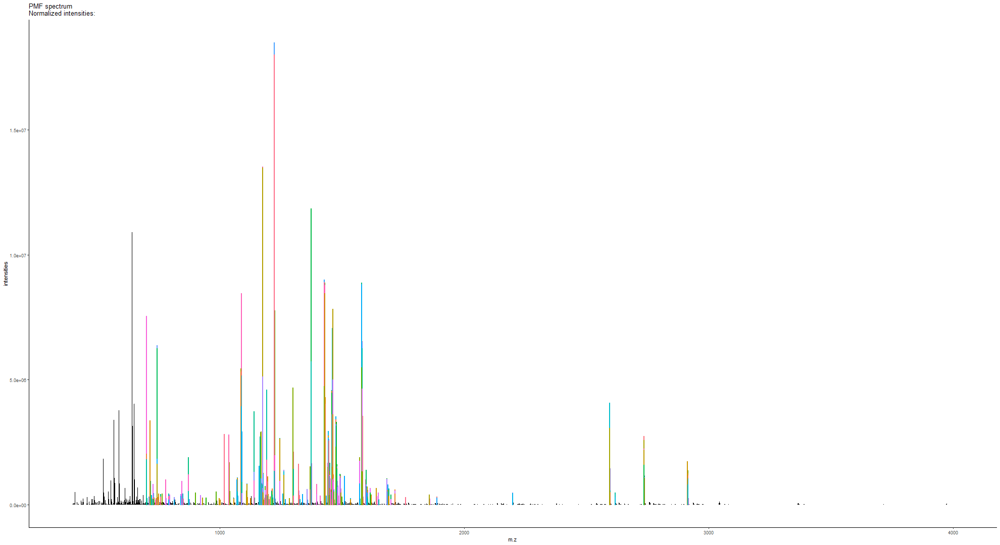

-- An R package of High-resolution Informatics Toolbox for Maldi-imaging Proteomics


## Package installation
This is an tutorial for use of HiTMaP (An R package of High-resolution Informatics Toolbox for Maldi-imaging Proteomics). To access the software use the installation codes as below: 


```r
#install the git package
install.packages("devtools")
Sys.setenv(R_REMOTES_NO_ERRORS_FROM_WARNINGS=T)
library(devtools)
install_github("MASHUOA/HiTMaP",auth_token ="a124a067ed1c84f8fd577c972845573922f1bb0f",force=T)
#Update all dependencies
1
library(HiTMaP)
```


## Proteomics identification on Maldi imaging data file 

Now the HiTMaP is upon running. You could build the candidate list of your target proteome and perform image identification by using the function as below:


```r
#creat candidate list
library(HiTMaP)
#set project folder that contains imzML, .ibd and fasta files
wd=paste0(file.path(path.package(package="HiTMaP")),"/data/")
#set a series of imzML files to be processed
datafile=c("Bovin_lens")


imaging_identification(
#==============Choose the imzml raw data file(s) to process  make sure the fasta file in the same folder
               datafile=paste0(wd,datafile),
               threshold=0.005, 
               ppm=5,
#==============specify the digestion enzyme specificity
               Digestion_site="([KR](?=[^P]))|((?<=W)K(?=P))|((?<=M)R(?=P))",
#==============specify the range of missed Cleavages
               missedCleavages=0:1,
#==============Set the target fasta file
               Fastadatabase="uniprot-bovin.fasta",
#==============Set the possible adducts and fixed modifications
               adducts=c("M+H"),
               Modifications=list(fixed=NULL),
#==============The decoy mode: could be one of the "adducts", "elements" or "isotope"
               Decoy_mode = "isotope",
               use_previous_candidates=F,
               output_candidatelist=T,
#==============Set the parameters for image segmentation
               spectra_segments_per_file=5,
               spatialKMeans=TRUE,
               Smooth_range=1,
               Virtual_segmentation=FALSE,
               Virtual_segmentation_rankfile=NULL,
#==============Set the Score method for hi-resolution isotopic pattern matching
               score_method="SQRTP",
               peptide_ID_filter=2,
#==============Summarise the protein and peptide features across the project the result can be found at the summary folder
               Protein_feature_summary=TRUE,
               Peptide_feature_summary=TRUE,
               Region_feature_summary=TRUE,
#==============The parameters for Cluster imaging. Specify the annotations of interest, the program will perform a case-insensitive search on the result file, extract the protein(s) of interest and plot them in the cluster imaging mode
               plot_cluster_image_grid=FALSE,
               ClusterID_colname="Protein",
               componentID_colname="Peptide",
               Protein_desc_of_interest=c("Crystallin","Actin"),
               Rotate_IMG=NULL,
               )
```


## Project folder and result structure 

In the above function, You have performed proteomics analysis of the sample data file. It is a tryptic Bovin lens MALDI-imaging file which is acquired on an FT-ICR MS.
The function will take the selected data files' root directory as the project folder.
In this example, the project folder will be:


```r
library(HiTMaP)
wd=paste0("D:\\GITHUB LFS\\HiTMaP-Data\\inst","/data/Bovinlens_Trypsin_FT/")
#set a series of imzML files to be processed
datafile=c("Bovin_lens")
wd
```

```
## [1] "D:\\GITHUB LFS\\HiTMaP-Data\\inst/data/Bovinlens_Trypsin_FT/"
```


After the whole identification process, we will get two types of sub-folders in the project folder:


```r
list.dirs(wd, recursive=FALSE)
```

```
## [1] "D:\\GITHUB LFS\\HiTMaP-Data\\inst/data/Bovinlens_Trypsin_FT//Bovin_lens ID" 
## [2] "D:\\GITHUB LFS\\HiTMaP-Data\\inst/data/Bovinlens_Trypsin_FT//Summary folder"
```

1. The one which has an identical name to an input data file contains the identification result of that input:
   + the protein and peptides list of each segmentation region
   + the PMF matching plot of each segmentation
   + the image that indicates segmentations' boundary (applies to either K-mean segmentation (powered by Cardinal) or manually defined segmentation)
   + folders of each region contains the detailed identification process, FDR plots and isotopic pattern matching plots

2. "Summary folder" contains: 
   + the identification summary of protein and peptides across all the data
   + the candidate list of all possible proteins and peptides (if *use_previous_candidates* is set as **TRUE**)
   + the Cluster imaging files of the protein of interest
   
   
## Identification result visulasation and interpretation

Now we could visualize the result by the following functions:

To check the segmentation result over the sample, you need got to each data file ID folder and find the "spatialKMeans_image_plot.png" (if you are using the spatial K-means method for segmentation.)


```r
library(magick)
```

```
## Linking to ImageMagick 6.9.9.14
## Enabled features: cairo, freetype, fftw, ghostscript, lcms, pango, rsvg, webp
## Disabled features: fontconfig, x11
```

```r
p<-image_read(paste0(wd,datafile," ID/spatialKMeans_image_plot.png"))
print(p)
```

```
## # A tibble: 1 x 7
##   format width height colorspace matte filesize density
##   <chr>  <int>  <int> <chr>      <lgl>    <int> <chr>  
## 1 PNG     1024   2640 sRGB       FALSE    30726 72x72
```


The pixels in image data now has been categorized into five regions according to the initial setting of segmentation (*spectra_segments_per_file=5*). The rainbow shaped bovine lens segmentation image (on the left panel) shows a unique statistical classification based on the mz features of each region (on the right panel).

The identification will take place on the **mean spectra** of each region. To check the peptide mass fingerprint (PMF) matching quality, 
you could locate the PMF spectrum matching plot of each individual region.


```r
library(magick)
p_pmf<-image_read(paste0(wd,datafile," ID/Bovin_lens 3PMF spectrum match.png"))
print(p_pmf)
```

```
## # A tibble: 1 x 7
##   format width height colorspace matte filesize density
##   <chr>  <int>  <int> <chr>      <lgl>    <int> <chr>  
## 1 PNG     1980   1080 sRGB       FALSE    16659 72x72
```


list of Peptides and proteins of each region has also been created so that you may check each individual region's result.


```r
peptide_pmf_result<-read.csv(paste0(wd,datafile," ID/Peptide_segment_PMF_RESULT_3.csv"))
head(peptide_pmf_result)
```

```
## # A tibble: 6 x 20
##   Protein Peptide Modification pepmz formula    mz adduct isdecoy charge start
##     <int> <fct>   <lgl>        <dbl> <fct>   <dbl> <fct>    <int>  <int> <int>
## 1      53 FKNINP… NA           1328. C64H98… 1329. M+H          0      1   207
## 2      53 AVQNFT… NA           1449. C65H97… 1450. M+H          0      1    92
## 3      53 AVQNFT… NA           1605. C71H10… 1606. M+H          0      1    92
## 4      75 GLASRK… NA           2617. C113H1… 2618. M+H          0      1   198
## 5      75 ALGSDH… NA           1586. C72H11… 1587. M+H          0      1   304
## 6      75 GLDWVK  NA            716. C34H53…  717. M+H          0      1    80
## # … with 10 more variables: end <int>, pro_end <int>, mz_align <dbl>,
## #   Score <dbl>, Rank <int>, moleculeNames <fct>, Region <int>,
## #   Delta_ppm <dbl>, Intensity <dbl>, desc <fct>
```


```r
protein_pmf_result<-read.csv(paste0(wd,datafile," ID/Protein_segment_PMF_RESULT_3.csv"))
head(protein_pmf_result)
```

```
## # A tibble: 6 x 9
##   Protein Proscore isdecoy Intensity Score peptide_count Protein_coverage
##     <int>    <dbl>   <int>     <dbl> <dbl>         <int>            <dbl>
## 1   10134   0.139        0  2873903. 1.93              3           0.0672
## 2   10204   0.137        0   380571. 0.794             3           0.185 
## 3   10370   0.204        0  1877250. 2.08              4           0.0936
## 4   10659   0.112        0   327352. 0.745             3           0.164 
## 5   10888   0.0798       0   532832. 1.24              3           0.0672
## 6   11270   0.107        0  2944154. 1.33              3           0.0745
## # … with 2 more variables: Intensity_norm <dbl>, desc <fct>
```

## Scoring system for protein and peptide
**Score** in peptide result table shows the isotopic pattern matching score of the peptide. In Protein result table, it shows the intensity weighted peptide spectrum matching score.

$Score=\log(Observed\_Peak/Theoritical\_peak)-\log(\sqrt{\frac{\sum_{x = 1}^{n} (Theoritical\_intensity_x-Observed\_intensity_x)^2}{\sum_{x = 1}^{n} (Theoritical\_intensity_x)^2(Observed\_intensity_x)^2}}$


**Proscore** in the protein result table shows the overall estimation of the protein identification Accuracy

$Proscore=\frac{\sum_{x = 1}^{n}(Score_x*log(Intensity_x))}{mean(log(Intensity))}*Protein\_coverage*Normalized\_intensity$

A *Peptide_region_file.csv* has also been created to summarise all the IDs in this data file:


```r
Identification_summary_table<-read.csv(paste0(wd,datafile," ID/Peptide_region_file.csv"))
head(Identification_summary_table)
```

```
## # A tibble: 6 x 20
##   Protein Peptide Modification pepmz formula    mz adduct isdecoy charge start
##     <int> <fct>   <lgl>        <dbl> <fct>   <dbl> <fct>    <int>  <int> <int>
## 1      24 GFPGQD… NA           1143. C51H79… 1144. M+H          0      1   516
## 2      24 GLTGPI… NA           1589. C69H11… 1590. M+H          0      1   786
## 3      24 DGANGI… NA           1684. C72H11… 1685. M+H          0      1  1175
## 4      24 LLSTEG… NA           1693. C72H11… 1694. M+H          0      1  1380
## 5      24 GQPGVM… NA           1881. C82H12… 1882. M+H          0      1   597
## 6      24 GDSGPP… NA            741. C29H48…  742. M+H          0      1   933
## # … with 10 more variables: end <int>, pro_end <int>, mz_align <dbl>,
## #   Score <dbl>, Rank <int>, moleculeNames <fct>, Region <int>,
## #   Delta_ppm <dbl>, Intensity <dbl>, desc <fct>
```

The details of protein/peptide identification process has been save to the folder named by the segmentation:


```r
list.dirs(paste0(wd,datafile," ID/"), recursive=FALSE)
```

```
## [1] "D:\\GITHUB LFS\\HiTMaP-Data\\inst/data/Bovinlens_Trypsin_FT/Bovin_lens ID//1"
## [2] "D:\\GITHUB LFS\\HiTMaP-Data\\inst/data/Bovinlens_Trypsin_FT/Bovin_lens ID//2"
## [3] "D:\\GITHUB LFS\\HiTMaP-Data\\inst/data/Bovinlens_Trypsin_FT/Bovin_lens ID//3"
## [4] "D:\\GITHUB LFS\\HiTMaP-Data\\inst/data/Bovinlens_Trypsin_FT/Bovin_lens ID//4"
```
In the identification details folder, you will find a series of FDR file and plots to demonstrate the FDR model and score cutoff threshold:


```r
dir(paste0(wd,datafile," ID/1/"), recursive=FALSE)
```

```
##  [1] "FDR.CSV"                                        
##  [2] "FDR.png"                                        
##  [3] "Matching_Score_vs_mz_target-decoy.png"          
##  [4] "Peptide_1st_ID.csv"                             
##  [5] "Peptide_1st_ID_score_rank_SQRTP.csv"            
##  [6] "Peptide_2nd_ID_score_rankSQRTP_Rank_above_3.csv"
##  [7] "Peptide_Score_histogram_target-decoy.png"       
##  [8] "ppm"                                            
##  [9] "PROTEIN_FDR.CSV"                                
## [10] "Protein_FDR.png"                                
## [11] "Protein_ID_score_rank_SQRTP.csv"                
## [12] "PROTEIN_Score_histogram.png"                    
## [13] "Spectrum.csv"                                   
## [14] "unique_peptide_ranking_vs_mz_feature.png"
```

In this folder, you will find the FDR plots for protein and peptide. The software will take the proscore and its FDR model to trim the final identification result. The *unique_peptide_ranking_vs_mz_feature.png* is a plot that could tell you the number of peptide candidates have been matched to the mz features in the first round run.You can also access the peptide spectrum match (first MS dimension) data via the "/ppm" subfolder.


```r
library(magick)
p_peptide_vs_mz_feature<-image_read(paste0(wd,datafile," ID/3/unique_peptide_ranking_vs_mz_feature.png"))
print(p_peptide_vs_mz_feature)
```

```
## # A tibble: 1 x 7
##   format width height colorspace matte filesize density
##   <chr>  <int>  <int> <chr>      <lgl>    <int> <chr>  
## 1 PNG      960    480 sRGB       FALSE    11196 72x72
```


```r
p_FDR_peptide<-image_read(paste0(wd,datafile," ID/3/FDR.png"))
p_FDR_protein<-image_read(paste0(wd,datafile," ID/3/protein_FDR.png"))
p_FDR_peptide_his<-image_read(paste0(wd,datafile," ID/3/Peptide_Score_histogram_target-decoy.png"))
p_FDR_protein_his<-image_read(paste0(wd,datafile," ID/3/PROTEIN_Score_histogram.png"))
p_combined<-image_append(c(p_FDR_peptide,p_FDR_peptide_his,p_FDR_protein,p_FDR_protein_his))
print(p_combined)
```

```
## # A tibble: 1 x 7
##   format width height colorspace matte filesize density
##   <chr>  <int>  <int> <chr>      <lgl>    <int> <chr>  
## 1 PNG     1920    480 sRGB       FALSE        0 72x72
```


you will also find a *Matching_Score_vs_mz* plots for further investigation on peptide matching quality. 


```r
library(magick)
#plot Matching_Score_vs_mz
p_Matching_Score_vs_mz<-image_read(paste0(wd,datafile," ID/3/Matching_Score_vs_mz_target-decoy.png"))
print(p_Matching_Score_vs_mz)
```

```
## # A tibble: 1 x 7
##   format width height colorspace matte filesize density
##   <chr>  <int>  <int> <chr>      <lgl>    <int> <chr>  
## 1 PNG      480    480 sRGB       FALSE    47438 72x72
```


## Identification summary and cluster imaging

In the project summary folder, you will find four files and a sub-folder:

```r
wd_sum=paste(wd,"/Summary folder", sep="")
dir(wd_sum)
```

```
## [1] "candidatelist.csv"   "cluster Ion images"  "Peptide_Summary.csv"
## [4] "protein_index.csv"   "Protein_Summary.csv"
```

"candidatelist.csv" and "protein_index.csv" contains the candidates used for this project. They are output after the candidate processing while *output_candidatelist* set as TRUE, and can be used repeatedly while *use_previous_candidates* set as TRUE.

"Peptide_Summary.csv" and "Protein_Summary.csv" contains the table of the project identification summary. You could set the *plot_cluster_image_grid* as TRUE to enable the cluster imaging function. Please be noted that you could indicate *Rotate_IMG* with a CSV file path that indicates the rotation degree of image files. 

**Note**: 90$^\circ$, 180$^\circ$ and 270$^\circ$ are recommended for image rotation. You may find an example CSV file in the library/HiTMaP/data folder.


```r
library(dplyr)
Protein_desc_of_interest<-c("Crystallin","Actin")
Protein_Summary_tb<-read.csv(paste(wd,"/Summary folder","/Protein_Summary.csv", sep=""),stringsAsFactors = F)
```


Now you could visualized the interest proteins and their associated peptides' distribution via cluster imaging function.


```r
p_cluster1<-image_read(paste0(wd,"/Summary folder/cluster Ion images/791_cluster_imaging.png"))
print(p_cluster1)
```

```
## # A tibble: 1 x 7
##   format width height colorspace matte filesize density
##   <chr>  <int>  <int> <chr>      <lgl>    <int> <chr>  
## 1 PNG     1980    849 sRGB       TRUE    661169 118x118
```


```r
p_cluster2<-image_read(paste0(wd,"/Summary folder/cluster Ion images/5027_cluster_imaging.png"))
print(p_cluster2)
```

```
## # A tibble: 1 x 7
##   format width height colorspace matte filesize density
##   <chr>  <int>  <int> <chr>      <lgl>    <int> <chr>  
## 1 PNG     1980    649 sRGB       TRUE    503884 118x118
```


```r
p_cluster3<-image_read(paste0(wd,"/Summary folder/cluster Ion images/5479_cluster_imaging.png"))
print(p_cluster3)
```

```
## # A tibble: 1 x 7
##   format width height colorspace matte filesize density
##   <chr>  <int>  <int> <chr>      <lgl>    <int> <chr>  
## 1 PNG     1980    359 sRGB       TRUE    362007 118x118
```


## Details of parameter setting


### Modification
you can choose one or a list of modifications from the unimod modification list. *Peptide_modification* function is used to load/rebuild the modification database into the global enviornment of R. It will be called automatically in the identification work flow. you can use the *code_name* or *record_id* to refer the modification (see example data "peptide calibrants" to find more details). The pipeline will select the *non-hidden* modifications.


```r
HiTMaP:::Peptide_modification(retrive_ID=NULL,update_unimod=F)
modification_list<-merge(unimod.df$modifications,unimod.df$specificity,by.x=c("record_id"),by.y=c("mod_key"),all.x=T)
head(modification_list['&'(modification_list$code_name=="Phospho",modification_list$hidden!=1),c("code_name","record_id","composition","mono_mass","position_key","one_letter")])
```

```
## # A tibble: 3 x 6
##   code_name record_id composition mono_mass position_key one_letter
##   <chr>     <chr>     <chr>       <chr>     <chr>        <chr>     
## 1 Phospho   21        H O(3) P    79.966331 2            T         
## 2 Phospho   21        H O(3) P    79.966331 2            Y         
## 3 Phospho   21        H O(3) P    79.966331 2            S
```

If a modification contains different types of site, you will also need to specify the position of a modifications. 


```r
unimod.df[["positions"]]
```

```
## # A tibble: 6 x 2
##   record_id position      
##   <chr>     <chr>         
## 1 1         -             
## 2 2         Anywhere      
## 3 3         Any N-term    
## 4 4         Any C-term    
## 5 5         Protein N-term
## 6 6         Protein C-term
```
### Amino acid substitution
You can set the *Substitute_AA* to make the uncommon amino acid available to the workflow:
*Substitute_AA=list(AA=c("X"),AA_new_formula=c("C5H5NO2"),Formula_with_water=c(FALSE))*
AA: the single letter amino acid to be replaced
AA_new_formula: the new formula for the amino acid
Formula_with_water: Set *TRUE* to indicate the formula represents the intact amino acid, *FALSE* to indicate that the formula already lost one H2O molecule and can be considered as AA backbone.


### Digestionn site

The *Digestion_site* allows you to specify a list of pre-defined enzyme and customized digestion rules in regular expression format.


```r
Cleavage_rules<-Cleavage_rules_fun()
Cleavage_df<-data.frame(Enzyme=names(Cleavage_rules),Cleavage_rules=unname(Cleavage_rules),stringsAsFactors = F)
library(gridExtra)
```

```
## 
## Attaching package: 'gridExtra'
```

```
## The following object is masked from 'package:dplyr':
## 
##     combine
```

```r
grid.ftable(Cleavage_df, gp = gpar(fontsize=8,fill = rep(c("grey90", "grey95"))))
```

<!-- -->

```r
#print(Cleavage_df)
```


## Example data
The HitMaP comes with a series of Maildi imaging data sets acquired from either FT-ICR or TOF. By the following codes, you can download these raw data set into a local folder.  


Below is a list of commands including the parameters for the example data sets.


## References
R Packages used in this project:

   + viridisLite[@viridisLite]

   + rcdklibs[@rcdklibs]

   + rJava[@rJava]

   + data.table[@data.table]

   + RColorBrewer[@RColorBrewer]

   + magick[@magick]

   + ggplot2[@ggplot2]

   + dplyr[@dplyr]

   + stringr[@stringr]

   + protViz[@protViz]

   + cleaver[@cleaver]

   + Biostrings[@Biostrings]

   + IRanges[@IRanges]

   + Cardinal[@Cardinal]

   + tcltk[@tcltk]

   + BiocParallel[@BiocParallel]

   + spdep[@spdep1]

   + FTICRMS[@FTICRMS]

   + UniProt.ws[@UniProt.ws]


## Session information


```r
sessionInfo()
```

```
## R version 3.6.1 (2019-07-05)
## Platform: x86_64-w64-mingw32/x64 (64-bit)
## Running under: Windows 10 x64 (build 18362)
## 
## Matrix products: default
## 
## locale:
## [1] LC_COLLATE=English_United States.1252 
## [2] LC_CTYPE=English_United States.1252   
## [3] LC_MONETARY=English_United States.1252
## [4] LC_NUMERIC=C                          
## [5] LC_TIME=English_United States.1252    
## 
## attached base packages:
## [1] grid      stats     graphics  grDevices utils     datasets  methods  
## [8] base     
## 
## other attached packages:
## [1] gridExtra_2.3     XML_3.98-1.20     protViz_0.5.1     dplyr_0.8.3      
## [5] magick_2.2        HiTMaP_1.6.0      data.table_1.12.8 pls_2.7-2        
## [9] lattice_0.20-38  
## 
## loaded via a namespace (and not attached):
##  [1] tidyselect_0.2.5    xfun_0.11           purrr_0.3.3        
##  [4] splines_3.6.1       tcltk_3.6.1         vctrs_0.2.1        
##  [7] htmltools_0.4.0     stats4_3.6.1        yaml_2.2.0         
## [10] utf8_1.1.4          survival_3.1-8      rlang_0.4.2        
## [13] pillar_1.4.2        glue_1.3.1          BiocParallel_1.18.1
## [16] BiocGenerics_0.30.0 foreach_1.4.7       stringr_1.4.0      
## [19] gtable_0.3.0        codetools_0.2-16    evaluate_0.14      
## [22] Biobase_2.44.0      knitr_1.26          doParallel_1.0.15  
## [25] parallel_3.6.1      fansi_0.4.0         Rcpp_1.0.3         
## [28] backports_1.1.5     BiocManager_1.30.10 S4Vectors_0.22.1   
## [31] png_0.1-7           digest_0.6.23       stringi_1.4.3      
## [34] cli_2.0.0           tools_3.6.1         magrittr_1.5       
## [37] tibble_2.1.3        pacman_0.5.1        crayon_1.3.4       
## [40] pkgconfig_2.0.3     zeallot_0.1.0       MASS_7.3-51.4      
## [43] Matrix_1.2-18       assertthat_0.2.1    rmarkdown_2.0      
## [46] rstudioapi_0.10     iterators_1.0.12    R6_2.4.1           
## [49] multtest_2.40.0     compiler_3.6.1
```


End of the tutorial, Enjoy~
