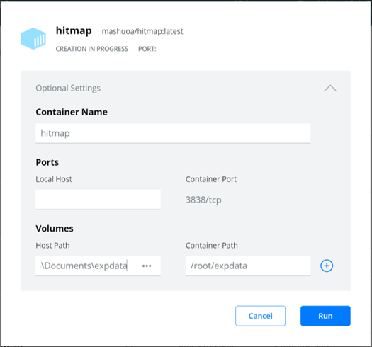
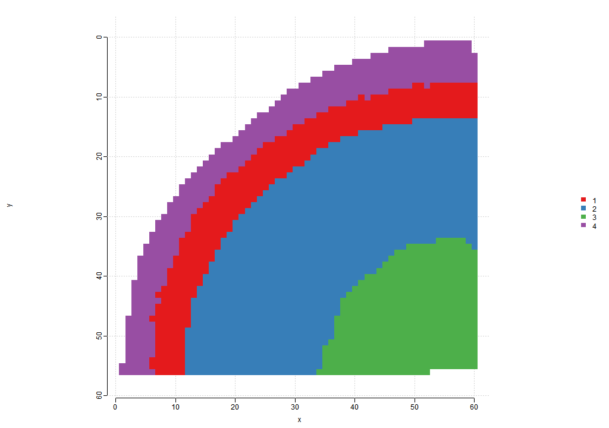
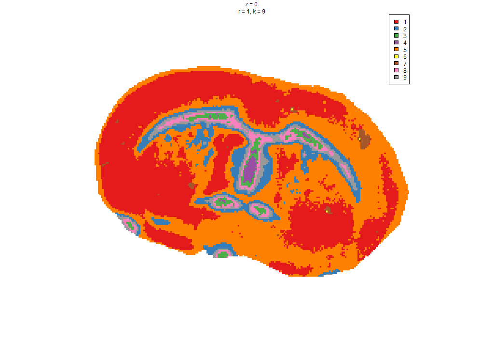
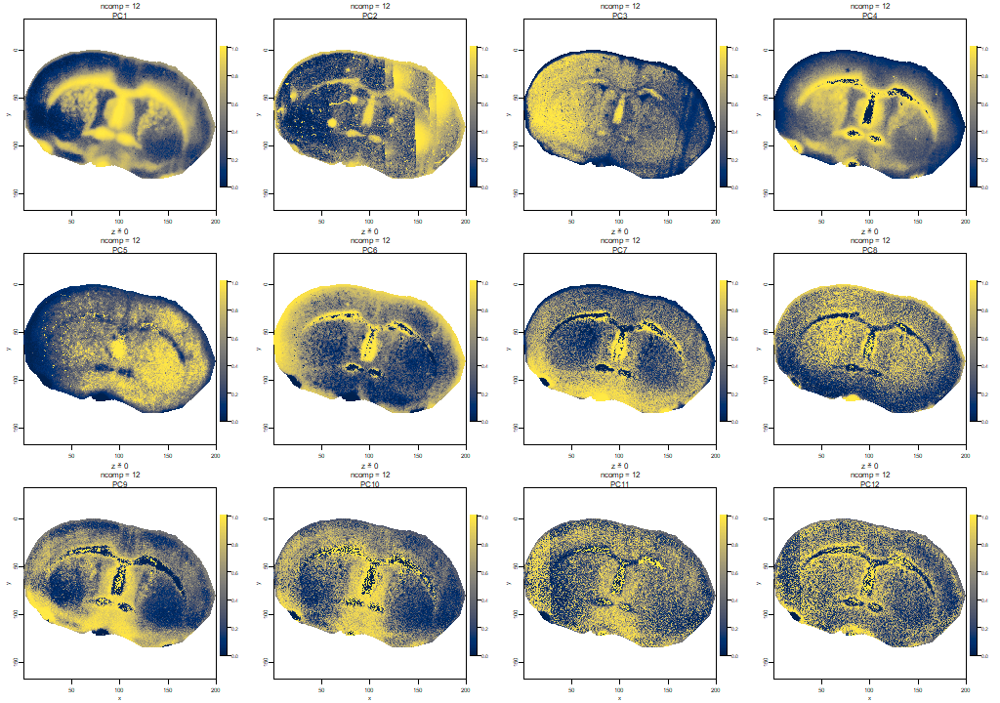
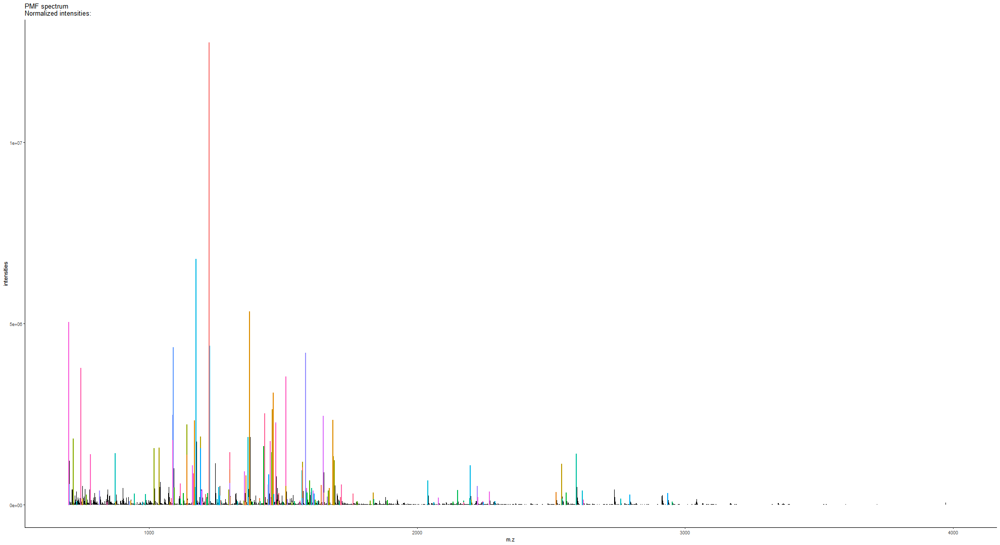
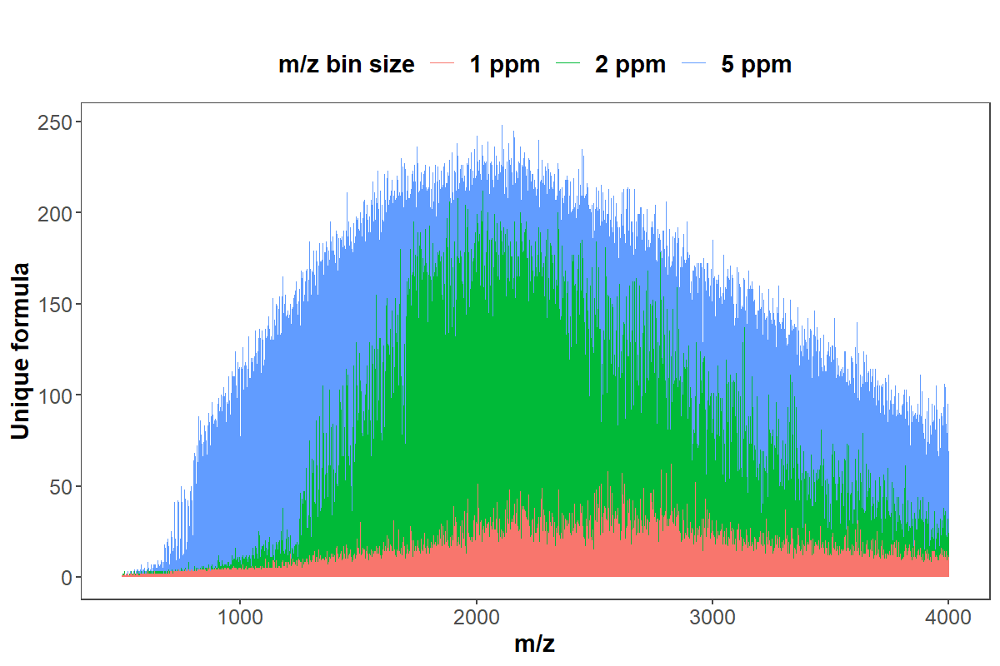
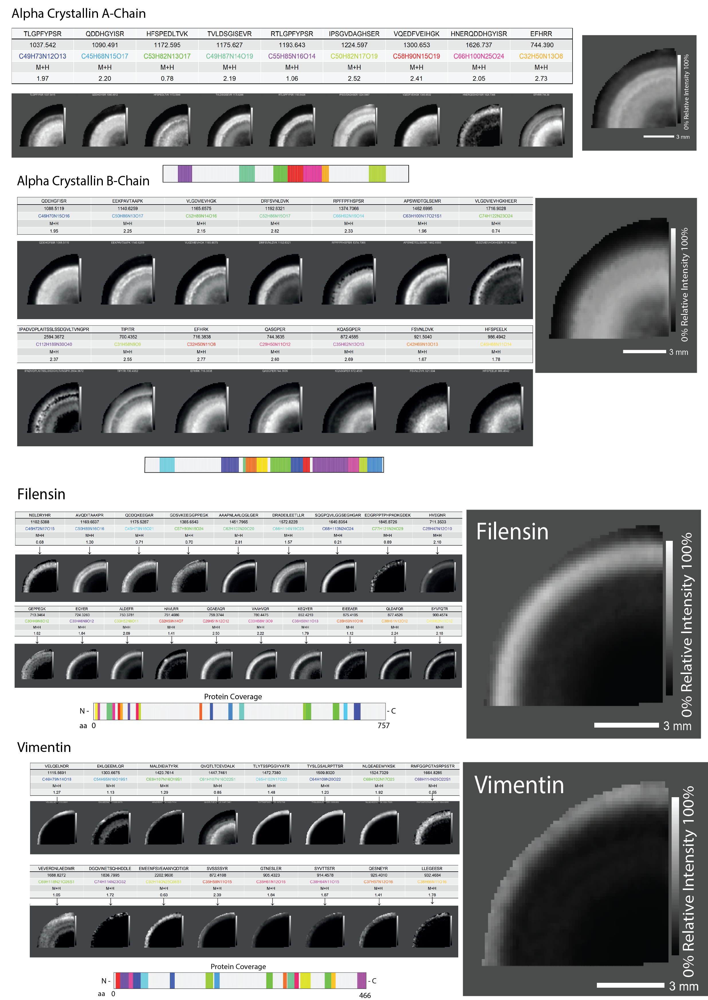
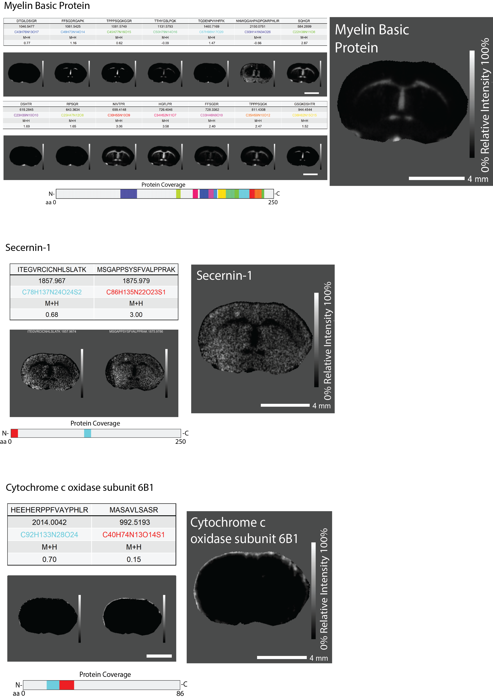
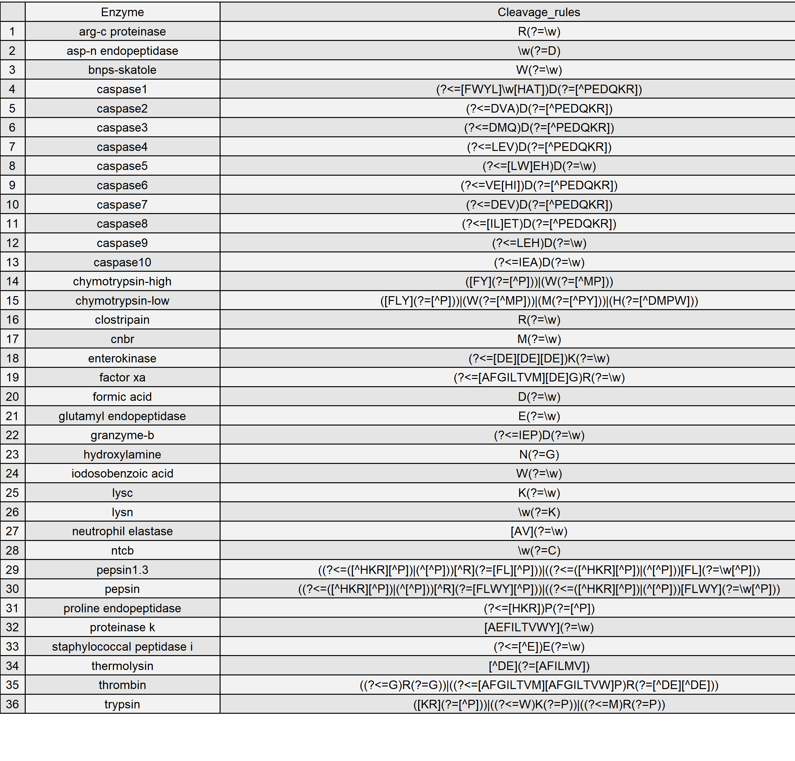

HiT-MaP
================

- [Package installation](#package-installation)
  - [Installation of docker image](#installation-of-docker-image)
  - [Installation code for R console
    installation](#installation-code-for-r-console-installation)
  - [Codes for Linux OS building
    enviornment](#codes-for-linux-os-building-enviornment)
  - [Codes for Mac OS building enviornment
    (optional)](#codes-for-mac-os-building-enviornment-optional)
- [Example data and source code](#example-data-and-source-code)
- [Proteomics identification on maldi-imaging
  dataset](#proteomics-identification-on-maldi-imaging-dataset)
- [Project folder and result
  structure](#project-folder-and-result-structure)
- [Identification result visulasation and
  interpretation](#identification-result-visulasation-and-interpretation)
- [Scoring system for protein and
  peptide](#scoring-system-for-protein-and-peptide)
- [Identification summary and cluster
  imaging](#identification-summary-and-cluster-imaging)
- [Pixel level Proteomics data
  export](#pixel-level-proteomics-data-export)
- [Details of parameter setting](#details-of-parameter-setting)
  - [Modification](#modification)
  - [Amino acid substitution](#amino-acid-substitution)
  - [Digestion site and enzyme](#digestion-site-and-enzyme)
  - [Imaging-MS data preprocessing](#imaging-ms-data-preprocessing)
- [Example workflow command](#example-workflow-command)
  - [Peptide calibrant](#peptide-calibrant)
  - [Bovine lens](#bovine-lens)
  - [Mouse brain](#mouse-brain)
- [Cite this project](#cite-this-project)
- [Session information](#session-information)
- [References](#references)

– An R package of High-resolution Informatics Toolbox for Maldi-imaging
Proteomics

Find our published research article on *Nature Communications*:

<https://doi.org/10.1038/s41467-021-23461-w>

<figure>

<figcaption aria-hidden="true"><a
href="https://doi.org/10.1038/s41467-021-23461-w"
class="uri">https://doi.org/10.1038/s41467-021-23461-w</a></figcaption>
</figure>

<figure>

<figcaption aria-hidden="true">zenodo</figcaption>
</figure>

Maintainer: George Guo <george.guo@auckland.ac.nz>

About us:

[Mass Spectrometry Hub \| University of
Auckland](https://mash.auckland.ac.nz/)

[Cancer research theme \| Garvan Institute of Medical
Research](https://www.garvan.org.au/)

[MSRC Schey lab \| Vanderbilt
University](https://lab.vanderbilt.edu/msrc-schey-lab/)

# Package installation

This is a tutorial for the use of HiTMaP (An R package of
High-resolution Informatics Toolbox for Maldi-imaging Proteomics).
User’s may run HiTMaP using Docker, or through R console, however Docker
is recommended to avoid issues with package dependency.

## Installation of docker image

HiTMaP has been encapsulated into a docker image. After a proper
installation and configuration of Docker engine ([Docker
documentation](https://docker-docs.netlify.app/install/overview/)),
user’s can download the latest version of HiT-MaP by using the bash code
as below.

``` bash
docker pull mashuoa/hitmap
```

Tags of available docker images:

1.  **mashuoa/hitmap:latest** contains the stable build release (built
    from the Dockerfile at MASHUOA/hitmap_docker with the effort from
    John Reeves <j.reeves@garvan.org.au>).

2.  **mashuoa/hitmap:natcomms** contains the original version when this
    project been accepted (minor changes applied to enhance the
    multi-files cluster image rendering).

3.  **mashuoa/hitmap:gui_latest** contains the developing graphical user
    interface of HiTMaP. Please map the 3838 port to the container and
    access the GUI via <http://localhost:3838/>. We are happy to hear
    your voice regarding the High-RES IMS pre-processing, segmentation
    and annotation as well as their corresponding GUI configurations.

4.  We are able to supply a singularity template to the users who want
    to deploy the HiTMaP on an HPC server. This scripts also are
    available at the MASHUOA/hitmap/dockerfiles.

Setting up and running the docker container:

``` bash
# For windows user's, run the image with a local user\Documents\expdata folder mapped to the docker container:
docker run --name hitmap -v %userprofile%\Documents\expdata:/root/expdata -a stdin -a stdout -i -t mashuoa/hitmap /bin/bash
# For linux or mac user's, run the image with a local user/expdata folder mapped to the docker container:
docker run --name hitmap -v ~/expdata:/root/expdata -a stdin -a stdout -i -t mashuoa/hitmap /bin/bash

#Run the R console
R
```

Revoke Docker terminal:

``` bash
#use ctrl+d to exit the docker container shell

#Restart the container and connect to the shell
docker restart hitmap
docker container exec -it hitmap /bin/bash
```

Stop/remove docker container (warning: if no local disk is mapped to
“~/expdata”, please backup your existing result files from the container
before you remove it):

``` bash
docker stop hitmap
docker rm hitmap
```

If you are using docker GUI, pull the docker image using the codes above
and follow the image as below to setup the container. if you are using
**mashuoa/hitmap:shiny_server**, please also map local host:3838 to the
container (Ports -\> local hosts -\> 3838).

<figure>

<figcaption aria-hidden="true">Docker GUI setting</figcaption>
</figure>

## Installation code for R console installation

The code below is used for an experienced R user to build a local
R/HiTMaP running environment. Major dependencies to note:

- R base
- Rtools, Windows user required
  ([*https://cran.r-project.org/bin/windows/Rtools/*](https://cran.r-project.org/bin/windows/Rtools/))
- java running library (for linux, additional configuration is needed:
  *R CMD javareconf*)
- orca for plotly (<https://github.com/plotly/orca/releases/tag/v1.3.1>)
- magick++ (for Linux, additional configuration is needed to expand the
  pixel limitation)

``` r
#install the git package
install.packages("remotes")
install.packages("devtools")
install.packages("BiocManager")

#Update all dependencies
BiocManager::install(ask = F)

#library(devtools)
library(remotes)
Sys.setenv("R_REMOTES_NO_ERRORS_FROM_WARNINGS" = "true")
options(install.packages.check.source = "no")
BiocManager::install(c( "XVector", "Biostrings", "KEGGREST","cleaver"),INSTALL_opts="-Wno-error")
BiocManager::install(c("EBImage","Rdisop"))
remotes::install_github("MASHUOA/HiTMaP",force=T,build_opts = c("--no-resave-data", "--no-manual","-Wno-error", "--no-build-vignettes"),configure.vars="CFLAGS= -O3 -Wall -mtune=native -march=native -Wno-error",ask = F)

library(HiTMaP)
```

## Codes for Linux OS building enviornment

Run the codes as below to enable the required components in Linux
console.

``` bash
function apt_install() {
    if ! dpkg -s "$@" >/dev/null 2>&1; then
        if [ "$(find /var/lib/apt/lists/* | wc -l)" = "0" ]; then
            apt-get update
        fi
        apt-get install -y --allow-downgrades --no-install-recommends "$@"
    fi
}

apt_install \
    sudo \
    gdebi-core \
    libcairo2=1.18.0-1+b1 \
    libcairo-script-interpreter2=1.18.0-1+b1 \
    lsb-release \
    libcurl4-openssl-dev \
    libcairo2-dev \
    libxt-dev \
    xtail \
    wget \
    default-jdk \
    libxml2-dev \
    libssl-dev \
    libudunits2-dev \
    librsvg2-dev \
    libmagick++-dev \
    r-cran-ncdf4 \
    libz-dev \
    libnss-winbind \
    winbind \
    dirmngr \
    gnupg \
    apt-transport-https \
    ca-certificates \
    software-properties-common \
    libfftw3-dev \
    texlive \
    libgdal-dev \
    ghostscript \
    g++
```

## Codes for Mac OS building enviornment (optional)

The following code is for a local GUI purpose. Hitmap now has been built
on the shiny server system. You can skip this step in the later version.
You may need to update the Xcode. Go to your Mac OS terminal and input:

``` bash
xcode-select --install
```

You’ll then receive: *xcode-select: note: install requested for command
line developer tools* You will be prompted at this point in a window to
update Xcode Command Line tools.

You may also need to install the X11.app and tcl/tk support for Mac
system:

- X11.app: <https://www.xquartz.org/>

- Use the following link to download and install the correct tcltk
  package for your OS version.
  <https://cran.r-project.org/bin/macosx/tools/>

# Example data and source code

The HitMaP comes with a series of maldi-imaging datasets acquired by
FT-ICR mass spectromety. With the following code, you can download these
raw data set into a local folder.

You can download the example data manually through this link:
“<https://github.com/MASHUOA/HiTMaP/releases/download/1.1.0/Data.tar.gz>”

Or download the files in a R console:

``` r
if(!require(piggyback)) install.packages("piggyback")
library(piggyback)

#made sure that this folder has enough space
wd="~/expdata/"
dir.create(wd)
setwd(wd)

pb_download("HiTMaP-master.zip", repo = "MASHUOA/HiTMaP", dest = ".",show_progress = F, tag="1.1.0")

pb_download("Data.tar.gz", repo = "MASHUOA/HiTMaP", dest = ".")

untar('Data.tar.gz',exdir =".",  tar="tar")

#unlink('Data.tar.gz')
list.dirs()
```

The example data contains three folders for three individual IMS
datasets, which each contain a configuration file, and the fasta
database, respectively: *“./Bovinlens_Trypsin_FT”*
*“./MouseBrain_Trypsin_FT”* *“./Peptide_calibrants_FT”*

An Tiny version of data set is also available by using the code below:

``` r
if(!require(piggyback)) install.packages("piggyback")
library(piggyback)

#made sure that this folder has enough space
wd="~/expdata/"
dir.create(wd)
setwd(wd)
pb_download("Data_tiny.tar.gz", repo = "MASHUOA/HiTMaP", dest = ".")
untar('Data_tiny.tar.gz',exdir =".",  tar="tar")

#unlink('Data.tar.gz')
list.dirs()
```

The tiny version dataset was generated from the Bovinlens and MouseBrain
original data:

1.  m/z range: 700 - 1400

2.  pixel range:

x \<= 20%, y \>= 80% (Bovinlens)

x \<= 30%, y \<= 20% (MouseBrain)

# Proteomics identification on maldi-imaging dataset

To perform false-discovery rate controlled peptide and protein
annotation, run the following script below in your R session:

``` r
#create candidate list
library(HiTMaP)
#set project folder that contains imzML, .ibd and fasta files
#wd=paste0(file.path(path.package(package="HiTMaP")),"/data/")
#set a series of imzML files to be processed
datafile=c("Bovinlens_Trypsin_FT/Bovin_lens.imzML")
wd="~/expdata/"


preprocess = list(force_preprocess=TRUE,
                  use_preprocessRDS=FALSE,
                  smoothSignal=list(method = c("Disable", "gaussian", "sgolay", "ma")[1]),
                  reduceBaseline=list(method = c("Disable", "locmin", "median")[1]),
                  peakPick=list(method=c("diff", "sd", "mad", "quantile", "filter", "cwt")[3]),
                  peakAlign=list(tolerance=5, units="ppm", level=c("local","global")[1], method=c("Enable","Disable")[1]),
                  normalize=list(method=c("Disable","rms","tic","reference")[1], mz=NULL)
                  )

imaging_identification(
#==============Choose the imzml raw data file(s) to process  make sure the fasta file in the same folder
               datafile=paste0(wd,datafile),
               threshold=0.005,
               ppm=5,
               FDR_cutoff = 0.05,
#==============specify the digestion enzyme specificity
               Digestion_site="trypsin",
#==============specify the range of missed Cleavages
               missedCleavages=0:1,
#==============Set the target fasta file
               Fastadatabase="uniprot-bovin.fasta",
#==============Set the possible adducts and fixed modifications
               adducts=c("M+H"),
               Modifications=list(fixed=NULL,fixmod_position=NULL,variable=NULL,varmod_position=NULL),
#==============The decoy mode: could be one of the "adducts", "elements" or "isotope"
               Decoy_mode = "isotope",
               use_previous_candidates=F,
               output_candidatelist=T,
#==============The pre-processing param
               preprocess=preprocess,
#==============Set the parameters for image segmentation
               spectra_segments_per_file=4,
               Segmentation="spatialKMeans",
               Smooth_range=1,
               Virtual_segmentation=FALSE,
               Virtual_segmentation_rankfile=NULL,
#==============Set the Score method for hi-resolution isotopic pattern matching
               score_method="SQRTP",
               peptide_ID_filter=2,
#==============Summarise the protein and peptide features across the project the result can be found at the summary folder
               Protein_feature_summary=TRUE,
               Peptide_feature_summary=TRUE,
               Region_feature_summary=TRUE,
#==============The parameters for Cluster imaging. Specify the annotations of interest, the program will perform a case-insensitive search on the result file, extract the protein(s) of interest and plot them in the cluster imaging mode
               plot_cluster_image_grid=FALSE,
               ClusterID_colname="Protein",
               componentID_colname="Peptide",
               Protein_desc_of_interest=c("Crystallin","Actin"),
               Rotate_IMG=NULL,
               )
```

# Project folder and result structure

In the above function, you have performed proteomics analysis on the
sample data file. It is a tryptic Bovin lens MALDI-imaging file which is
acquired on an FT-ICR MS. The function will take the selected data
files’ root directory as the project folder. In this example, the
project folder will be:

``` r
library(HiTMaP)
wd=paste0("D:\\GITHUB LFS\\HiTMaP-Data\\inst","/data/Bovinlens_Trypsin_FT/")
datafile=c("Bovin_lens")
example_region <- "1"
```

After the whole identification process, you will get two sub-folders
within the project folder:

``` r
list.dirs(wd, recursive=FALSE)
```

    ## [1] "D:\\GITHUB LFS\\HiTMaP-Data\\inst/data/Bovinlens_Trypsin_FT/Bovin_lens ID"
    ## [2] "D:\\GITHUB LFS\\HiTMaP-Data\\inst/data/Bovinlens_Trypsin_FT/source"
    ## [3] "D:\\GITHUB LFS\\HiTMaP-Data\\inst/data/Bovinlens_Trypsin_FT/Summary folder"
    ## [4] "D:\\GITHUB LFS\\HiTMaP-Data\\inst/data/Bovinlens_Trypsin_FT/Summary folder_mod_testing"

1.  The one which has an identical name to an input data file contains
    the identification result of that input:

    - the protein and peptides list of each segmentation region
    - the PMF matching plot of each segmentation
    - the image that indicates segmentations’ boundary (applies to
      either K-mean segmentation (powered by Cardinal) or manually
      defined segmentation)
    - folders of each region contains the detailed identification
      process, FDR plots and isotopic pattern matching plots

2.  “Summary folder” contains:

    - the identification summary of protein and peptides across all the
      data
    - the candidate list of all possible proteins and peptides (if
      *use_previous_candidates* is set as **TRUE**)
    - the Cluster imaging files of the protein of interest
    - the database stats result for resolution-based candidates binning
      (optional)

# Identification result visulasation and interpretation

To plot the MALDI-image peptide and protein images, use the following
functions:

To check the segmentation result over the sample, you need to navigate
to each data file ID folder and find the “spatialKMeans_image_plot.png”
(if you are using the spatial K-means method for segmentation.)

``` r
library(magick)
```

    ## Linking to ImageMagick 6.9.13.29
    ## Enabled features: cairo, freetype, fftw, ghostscript, heic, lcms, pango, raw, rsvg, webp
    ## Disabled features: fontconfig, x11

``` r
p<-image_read(paste0(wd,datafile," ID/spatialKMeans_image_plot_4_segs.png"))
print(p)
```

    ##   format width height colorspace matte filesize density
    ## 1    PNG  1024    720       sRGB FALSE     9212   72x72



The pixels in image data now has been categorized into four regions
according to the initial setting of segmentation
(*spectra_segments_per_file=5*). The rainbow shaped bovine lens
segmentation image (on the left panel) shows a unique statistical
classification based on the mz features of each region (on the right
panel).

The mouse brain example segmentation result (spatialKmeans n=9) shown as
below:



For further investigation of the segmentation process, you may find a
PCA images set in the **“Datafile ID”** folder. THe PCA images are good
summary of features and potential region of interests within a data
file. The combination of these PCs of interest will guide you to the
insightful tissue structure profile.



The identification will take place on the **mean spectra** of each
region. To check the peptide mass fingerprint (PMF) matching quality,
you could locate the PMF spectrum matching plot of each individual
region.

``` r
library(magick)
p_pmf<-image_read(paste0(wd,datafile," ID/Bovin_lens ", example_region, " PMF spectrum match.png"))
print(p_pmf)
```

    ##   format width height colorspace matte filesize density
    ## 1    PNG  1980   1080       sRGB FALSE    13143   72x72



A list of the peptides and proteins annotated within each region has
also been created for manual exploration of the results.

``` r
peptide_pmf_result<-read.csv(paste0(wd,datafile," ID/Peptide_segment_PMF_RESULT_", example_region, ".csv"))
head(peptide_pmf_result)
```

    ##   Protein isdecoy       mz Protein_coverage         Peptide
    ## 1     267       0 1328.743        0.3388430     KVPFTRPASQR
    ## 2     267       0 1374.712        0.3388430    VPFTRPASQRSS
    ## 3     267       0 1715.788        0.3388430 CQLCALTAPYSYQGR
    ## 4     267       0 1472.681        0.3388430   FLVVGSRCSMCGR
    ## 5     452       0 1060.527        0.5364807       QVDQLTNDK
    ## 6     452       0 1509.802        0.5364807  TYSLGSALRPTTSR
    ##            Modification    pepmz         formula adduct charge start end
    ## 1                Acetyl 1327.736    C59H98N19O16    M+H      1   109 119
    ## 2                Acetyl 1373.705    C59H96N19O19    M+H      1   110 121
    ## 3                Acetyl 1714.781 C74H115N20O23S2    M+H      1    15  29
    ## 4  Hydroxylation Acetyl 1471.673 C60H102N19O18S3    M+H      1    57  69
    ## 5                       1059.520    C43H74N13O18    M+H      1   160 168
    ## 6                       1508.795   C64H109N20O22    M+H      1    37  50
    ##   pro_end mz_align      Score Rank   moleculeNames Region Delta_ppm  Intensity
    ## 1     121 1328.738  1.1097931    6     KVPFTRPASQR      1 0.4595788   88397.21
    ## 2     121 1374.709  3.0496830    3    VPFTRPASQRSS      1 1.4132137 5331397.80
    ## 3     121 1715.785  0.3898185   14 CQLCALTAPYSYQGR      1 1.6430926   33244.94
    ## 4     121 1472.681 -0.5964163   31   FLVVGSRCSMCGR      1 0.7041539  169469.93
    ## 5     466 1060.522  0.3215564    7       QVDQLTNDK      1 1.9798384   54228.14
    ## 6     466 1509.801  1.9357770    1  TYSLGSALRPTTSR      1 0.7114612 3526809.50
    ##   peptide_count
    ## 1             4
    ## 2             4
    ## 3             4
    ## 4             4
    ## 5            25
    ## 6            25
    ##                                                                                                                 desc
    ## 1 sp|Q0VCH3|CDPF1_BOVIN Cysteine-rich DPF motif domain-containing protein 1 OS=Bos taurus OX=9913 GN=CDPF1 PE=2 SV=1
    ## 2 sp|Q0VCH3|CDPF1_BOVIN Cysteine-rich DPF motif domain-containing protein 1 OS=Bos taurus OX=9913 GN=CDPF1 PE=2 SV=1
    ## 3 sp|Q0VCH3|CDPF1_BOVIN Cysteine-rich DPF motif domain-containing protein 1 OS=Bos taurus OX=9913 GN=CDPF1 PE=2 SV=1
    ## 4 sp|Q0VCH3|CDPF1_BOVIN Cysteine-rich DPF motif domain-containing protein 1 OS=Bos taurus OX=9913 GN=CDPF1 PE=2 SV=1
    ## 5                                               sp|P48616|VIME_BOVIN Vimentin OS=Bos taurus OX=9913 GN=VIM PE=1 SV=3
    ## 6                                               sp|P48616|VIME_BOVIN Vimentin OS=Bos taurus OX=9913 GN=VIM PE=1 SV=3

``` r
protein_pmf_result<-read.csv(paste0(wd,datafile," ID/Protein_segment_PMF_RESULT_", example_region, ".csv"))
head(protein_pmf_result)
```

    ##   Protein   Proscore isdecoy Intensity    Score peptide_count Protein_coverage
    ## 1    1135 0.14034092       0  277045.6 1.667168             2        0.5185185
    ## 2    1212 0.35579772       0 2681460.1 2.027322             2        0.5714286
    ## 3   12426 0.09625365       0  208001.3 1.548857             2        0.4313725
    ## 4   13198 0.15871724       0  865337.3 1.548529             3        0.4361702
    ## 5   13450 0.10119069       0  222022.1 2.378740             4        0.2869955
    ## 6    1387 0.14000192       0  640352.4 1.471124             5        0.4410256
    ##   Intensity_norm
    ## 1      0.1623457
    ## 2      0.3071273
    ## 3      0.1440633
    ## 4      0.2349897
    ## 5      0.1482240
    ## 6      0.2157848
    ##                                                                                                     desc
    ## 1                                   sp|P63296|SECR_BOVIN Secretin OS=Bos taurus OX=9913 GN=SCT PE=1 SV=1
    ## 2                                     sp|P01251|THPS_BOVIN Splenin OS=Bos taurus OX=9913 GN=SP PE=1 SV=1
    ## 3                         tr|G3MX73|G3MX73_BOVIN Uncharacterized protein OS=Bos taurus OX=9913 PE=4 SV=2
    ## 4            tr|A0A3Q1M5V9|A0A3Q1M5V9_BOVIN C-C motif chemokine OS=Bos taurus OX=9913 GN=CCL26 PE=3 SV=1
    ## 5 tr|A0A3Q1N897|A0A3Q1N897_BOVIN BHLH domain-containing protein OS=Bos taurus OX=9913 GN=TCF24 PE=4 SV=1
    ## 6                   sp|Q0VCF9|LSM12_BOVIN Protein LSM12 homolog OS=Bos taurus OX=9913 GN=LSM12 PE=2 SV=2

# Scoring system for protein and peptide

**Score** in peptide result table shows the isotopic pattern matching
score of the peptide (Pepscore). In Protein result table, it shows the
protein score (Proscore). The ‘Pepscore’ consist of two parts:
Intensity_Score and Mass_error_Score:

- Intensity_Score indicates how well a putative isotopic pattern can be
  matched to the observed spectrum.The default scoring method is SQRTP.
  It combines the ‘square root mean’ differences between observed and
  theoretical peaks and observed proportion of the isotopic peaks above
  a certain relative intensity threshold.

- Mass_error_Score indicates the summary of mass error (in *ppm*) for
  every detected isotopic peak. In order to integrate the
  Mass_error_Score in to scoring system, the mean ppm error has been
  normalized by ppm tolerance, and supplied to the probability normal
  distributions (*pnorm* function for R). The resulting value (quantiles
  of the given probability density) is deducted by 0.5 and converted
  into an absolute value.


**Proscore** in the protein result table shows the overall estimation of
the protein identification Accuracy.


A *Peptide_region_file.csv* has also been created to summarise all the
IDs in this data file:

``` r
Identification_summary_table<-read.csv(paste0(wd,datafile," ID/Peptide_region_file.csv"))
head(Identification_summary_table)
```

    ##   Protein isdecoy       mz Protein_coverage         Peptide
    ## 1     267       0 1328.743        0.3388430     KVPFTRPASQR
    ## 2     267       0 1374.712        0.3388430    VPFTRPASQRSS
    ## 3     267       0 1715.788        0.3388430 CQLCALTAPYSYQGR
    ## 4     267       0 1472.681        0.3388430   FLVVGSRCSMCGR
    ## 5     452       0 1060.527        0.5364807       QVDQLTNDK
    ## 6     452       0 1509.802        0.5364807  TYSLGSALRPTTSR
    ##            Modification    pepmz         formula adduct charge start end
    ## 1                Acetyl 1327.736    C59H98N19O16    M+H      1   109 119
    ## 2                Acetyl 1373.705    C59H96N19O19    M+H      1   110 121
    ## 3                Acetyl 1714.781 C74H115N20O23S2    M+H      1    15  29
    ## 4  Hydroxylation Acetyl 1471.673 C60H102N19O18S3    M+H      1    57  69
    ## 5                       1059.520    C43H74N13O18    M+H      1   160 168
    ## 6                       1508.795   C64H109N20O22    M+H      1    37  50
    ##   pro_end mz_align      Score Rank   moleculeNames Region Delta_ppm  Intensity
    ## 1     121 1328.738  1.1097931    6     KVPFTRPASQR      1 0.4595788   88397.21
    ## 2     121 1374.709  3.0496830    3    VPFTRPASQRSS      1 1.4132137 5331397.80
    ## 3     121 1715.785  0.3898185   14 CQLCALTAPYSYQGR      1 1.6430926   33244.94
    ## 4     121 1472.681 -0.5964163   31   FLVVGSRCSMCGR      1 0.7041539  169469.93
    ## 5     466 1060.522  0.3215564    7       QVDQLTNDK      1 1.9798384   54228.14
    ## 6     466 1509.801  1.9357770    1  TYSLGSALRPTTSR      1 0.7114612 3526809.50
    ##   peptide_count
    ## 1             4
    ## 2             4
    ## 3             4
    ## 4             4
    ## 5            25
    ## 6            25
    ##                                                                                                                 desc
    ## 1 sp|Q0VCH3|CDPF1_BOVIN Cysteine-rich DPF motif domain-containing protein 1 OS=Bos taurus OX=9913 GN=CDPF1 PE=2 SV=1
    ## 2 sp|Q0VCH3|CDPF1_BOVIN Cysteine-rich DPF motif domain-containing protein 1 OS=Bos taurus OX=9913 GN=CDPF1 PE=2 SV=1
    ## 3 sp|Q0VCH3|CDPF1_BOVIN Cysteine-rich DPF motif domain-containing protein 1 OS=Bos taurus OX=9913 GN=CDPF1 PE=2 SV=1
    ## 4 sp|Q0VCH3|CDPF1_BOVIN Cysteine-rich DPF motif domain-containing protein 1 OS=Bos taurus OX=9913 GN=CDPF1 PE=2 SV=1
    ## 5                                               sp|P48616|VIME_BOVIN Vimentin OS=Bos taurus OX=9913 GN=VIM PE=1 SV=3
    ## 6                                               sp|P48616|VIME_BOVIN Vimentin OS=Bos taurus OX=9913 GN=VIM PE=1 SV=3

The details of protein/peptide identification process has been save to
the folder named by the segmentation:

``` r
list.dirs(paste0(wd,datafile," ID/"), recursive=FALSE)
```

    ## [1] "D:\\GITHUB LFS\\HiTMaP-Data\\inst/data/Bovinlens_Trypsin_FT/Bovin_lens ID/1"

In the identification details folder, you will find a series of FDR file
and plots to demonstrate the FDR model and score cutoff threshold:

``` r
dir(paste0(wd,datafile," ID/1/"), recursive=FALSE)
```

    ##  [1] "FDR.CSV"
    ##  [2] "FDR.png"
    ##  [3] "Matching_Score_vs_mz_target-decoy.png"
    ##  [4] "Peptide_1st_ID.csv"
    ##  [5] "Peptide_1st_ID_score_rank_SQRTP.csv"
    ##  [6] "Peptide_2nd_ID_score_rankSQRTP_Rank_above_3.csv"
    ##  [7] "Peptide_Score_histogram_target-decoy.png"
    ##  [8] "PROTEIN_FDR.CSV"
    ##  [9] "Protein_FDR.png"
    ## [10] "Protein_ID_score_rank_filtered_grouped_SQRTP.csv"
    ## [11] "Protein_ID_score_rank_filtered_SQRTP.csv"
    ## [12] "Protein_ID_score_rank_SQRTP.csv"
    ## [13] "PROTEIN_Score_histogram.png"
    ## [14] "Spectrum.csv"
    ## [15] "unique_peptide_ranking_vs_mz_feature.png"
    ## [16] "unique_peptide_ranking_vs_mz_feature_2nd.png"

In this folder, you will find the FDR plots for protein and peptide
annotation. The software will take the proscore and its FDR model to
trim the final identification results. The
*unique_peptide_ranking_vs_mz_feature.png* is a plot that could tell you
the number of peptide candidates that have been matched to the mz
features in the first round run. You can also access the peptide
spectrum match (first MS dimension) data via the “/ppm” subfolder.

``` r
library(magick)
p_FDR_peptide<-image_read(paste0(wd,datafile," ID/", example_region, "/FDR.png"))
p_FDR_protein<-image_read(paste0(wd,datafile," ID/", example_region, "/protein_FDR.png"))
p_FDR_peptide_his<-image_read(paste0(wd,datafile," ID/", example_region, "/Peptide_Score_histogram_target-decoy.png"))
p_FDR_protein_his<-image_read(paste0(wd,datafile," ID/", example_region, "/PROTEIN_Score_histogram.png"))
p_combined<-image_append(c(p_FDR_peptide,p_FDR_peptide_his,p_FDR_protein,p_FDR_protein_his))
print(p_combined)
```

    ##   format width height colorspace matte filesize density
    ## 1    PNG  1920    480       sRGB FALSE        0   72x72


You will also find a *Matching_Score_vs_mz* plot for further
investigation on peptide matching quality.

``` r
library(magick)
#plot Matching_Score_vs_mz
p_Matching_Score_vs_mz<-image_read(paste0(wd,datafile," ID/", example_region, "/Matching_Score_vs_mz_target-decoy.png"))
print(p_Matching_Score_vs_mz)
```

    ##   format width height colorspace matte filesize density
    ## 1    PNG   480    480       sRGB FALSE    91941   72x72


# Identification summary and cluster imaging

In the project summary folder, you will find four files and a
sub-folder:

``` r
wd_sum=paste(wd,"/Summary folder", sep="")
dir(wd_sum)
```

    ## [1] "candidatelist.csv"           "cluster Ion images"
    ## [3] "Peptide_Summary.csv"         "protein_index.csv"
    ## [5] "Protein_peptide_Summary.csv" "Protein_Summary.csv"
    ## [7] "Region_feature_summary.csv"

“candidatelist.csv” and “protein_index.csv” contains the candidates used
for this analysis. They are output after the candidate processing while
*output_candidatelist* set as TRUE, and can be used repeatedly while
*use_previous_candidates* set as TRUE.

We have implemented a functionality to perform additional statistical
analysis around the number of enzymatically generated peptides derived
from a given proteome database. If the user sets the argument
‘Database_stats’ to TRUE in the main workflow, the function will be
called. Briefly, the function will list all of the m/z’s of a unique
formulae from the peptide candidate pool within a given m/z range. The
m/z’s will then be binned using three tolerance window: 1 ppm, 2 ppm and
5 ppm. A plot showing the number of unique formulae vs. m/z bins will be
generated and exported to the summary folder (DB_stats_mz_bin).

<figure>

<figcaption aria-hidden="true">Proteome database stats</figcaption>
</figure>

“Peptide_Summary.csv” and “Protein_Summary.csv” contains the table of
the project identification summary. You could set the
*plot_cluster_image_grid* as TRUE to enable the cluster imaging
function. Please be noted that you could indicate *Rotate_IMG* with a
CSV file path that indicates the rotation degree of image files.

**Note**: 90°, 180° and 270° are recommended for image rotation. You may
find an example CSV file in the
*expdata/MouseBrain_Trypsin_FT/file_rotationbk.csv*.

``` r
library(dplyr)
Protein_desc_of_interest<-c("Crystallin","Actin")
Protein_Summary_tb<-read.csv(paste(wd,"/Summary folder","/Protein_Summary.csv", sep=""),stringsAsFactors = F)
```

Finally, you are able visualize the annotated proteins and their
associated peptide distributions via the cluster image rendering
function.



vimentin:

β-crystallin:

α-crystallin:



Secernin 1

CX6A1 cytochrome coxidase subunit 6A1

Myelin basic protein

# Pixel level Proteomics data export

# Details of parameter setting

## Modification

### Enhanced UniMod Modification Helper (New!)

HiTMaP now includes enhanced functions for easy modification handling
with improved ambiguity resolution and user-friendly input parsing. The
new `format_unimod_modifications()` function provides a modern interface
to the UniMod database.

**Key Benefits:** - ✅ **Handles ambiguous modification names** with
multiple matching strategies - ✅ **Supports common abbreviations** (Ox,
Phos, CAM, Ace, etc.) - ✅ **Position-specific filtering** (single AA,
multiple AA, terminal positions) - ✅ **Interactive and non-interactive
modes** for different workflows - ✅ **Error-resistant** with clear
feedback on matches/failures - ✅ **Fully compatible** with existing
HiTMaP workflow functions - ✅ **MALDI imaging optimized** - defaults
appropriate for direct tissue analysis - ✅ **Quick preset scenarios**
for common MALDI imaging setups

> **Note:** Unlike LC-MS/MS proteomics, MALDI imaging typically does not
> use fixed cysteine modifications (Carbamidomethyl) since samples are
> analyzed directly from tissue without reduction/alkylation steps. The
> presets reflect this difference.

#### Basic Usage

``` r
# Load HiTMaP package (functions are automatically available)
library(HiTMaP)

# Simple variable modifications for MALDI imaging
mods <- format_unimod_modifications(
  modifications = c("Oxidation", "Acetyl"),
  positions = c("M", "N-term"),
  mod_type = "variable",
  interactive = FALSE
)

# Use in imaging_identification
imaging_identification(
  datafile = "your_data.imzML",
  Fastadatabase = "database.fasta",
  Modifications = mods$modifications,  # Properly formatted for HiTMaP
  ppm = 5,
  threshold = 0.001
  # ... other parameters
)
```

#### Quick Setup Presets

``` r
# Standard MALDI imaging setup (Oxidation + Acetylation - no fixed Cys)
standard_mods <- quick_modification_setup("standard")

# Comprehensive PTM discovery for MALDI imaging
comprehensive_mods <- quick_modification_setup("comprehensive")

# No modifications
minimal_mods <- quick_modification_setup("minimal")

# Custom modifications
custom_mods <- quick_modification_setup("custom",
  custom_mods = c("Phospho", "Methyl"),
  custom_positions = c("STY", "K")
)

# Use any preset in your workflow
imaging_identification(
  datafile = "sample.imzML",
  Modifications = standard_mods$modifications,
  # ... other parameters
)
```

#### Advanced Features

**Ambiguity Handling**: The function automatically handles ambiguous
modification names and provides clear feedback:

``` r
# Handles common synonyms and abbreviations
mods <- format_unimod_modifications(
  modifications = c("Ox", "Phos", "CAM", "Ace"),  # Common abbreviations
  mod_type = "variable",
  interactive = FALSE  # Auto-select best matches
)

# Check what was matched
print_modification_summary(mods)
```

**Position-Specific Modifications**:

``` r
# Specific amino acid targets
mods <- format_unimod_modifications(
  modifications = c("Phospho", "Methylation", "Citrullination"),
  positions = c("STY", "KR", "R"),  # Multi-character positions supported
  mod_type = "variable"
)

# Terminal modifications
terminal_mods <- format_unimod_modifications(
  modifications = c("Acetyl", "Formyl"),
  positions = c("N-term", "N-term"),
  mod_type = "variable"
)
```

**Mixed Fixed and Variable Modifications** (if needed for specific
applications):

``` r
# Fixed modifications (only if alkylation was performed before MALDI)
fixed_mods <- format_unimod_modifications(
  modifications = "Carbamidomethyl",
  positions = "C",
  mod_type = "fixed"
)

# Variable modifications for MALDI imaging
var_mods <- format_unimod_modifications(
  modifications = c("Oxidation", "Deamidation", "Sodium adduct"),
  positions = c("M", "NQ", "any"),
  mod_type = "variable"
)

# Combine for workflow (uncommon for MALDI imaging)
combined_mods <- list(
  fixed = fixed_mods$modifications$fixed,
  fixmod_position = fixed_mods$modifications$fixmod_position,
  variable = var_mods$modifications$variable,
  varmod_position = var_mods$modifications$varmod_position
)

# For LC-MS/MS style workflows with alkylation, use:
# lcms_style <- quick_modification_setup("custom",
#   custom_mods = c("Carbamidomethyl", "Oxidation"),
#   custom_positions = c("C", "M")
# )
```

### Traditional Modification Specification

You can still choose one or a list of modifications from the unimod
modification list using the traditional approach. *Peptide_modification*
function is used to load/rebuild the modification database into the
global enviornment of R. It will be called automatically in the
identification work flow. you can use the *code_name* or *record_id* to
refer the modification (see example data “peptide calibrants” to find
more details). The pipeline will select the *non-hidden* modifications.

``` r
library(stringr)
HiTMaP:::Peptide_modification(retrive_ID=NULL,update_unimod=F)
modification_list<-merge(unimod.df$modifications,unimod.df$specificity,by.x=c("record_id"),by.y=c("mod_key"),all.x=T)
head(modification_list['&'(modification_list$code_name=="Phospho",modification_list$hidden!=1),c("code_name","record_id","composition","mono_mass","position_key","one_letter")])
```

    ##      code_name record_id composition mono_mass position_key one_letter
    ## 1706   Phospho        21    H O(3) P 79.966331            2          T
    ## 1707   Phospho        21    H O(3) P 79.966331            2          S
    ## 1709   Phospho        21    H O(3) P 79.966331            2          Y

``` r
head(modification_list['&'(modification_list$code_name=="Amide",modification_list$hidden!=1),c("code_name","record_id","composition","mono_mass","position_key","one_letter")])
```

    ##      code_name record_id composition mono_mass position_key one_letter
    ## 1574     Amide         2   H N O(-1) -0.984016            4     C-term
    ## 1575     Amide         2   H N O(-1) -0.984016            6     C-term

``` r
head(modification_list['&'(stringr::str_detect(modification_list$code_name,"Ca"),modification_list$hidden!=1),c("code_name","record_id","composition","mono_mass","position_key","one_letter")])
```

    ##            code_name record_id    composition mono_mass position_key one_letter
    ## 2059 Carbamidomethyl         4  H(3) C(2) N O 57.021464            2          C
    ## 2063 Carbamidomethyl         4  H(3) C(2) N O 57.021464            3     N-term
    ## 2227        Carbamyl         5        H C N O 43.005814            2          K
    ## 2232        Carbamyl         5        H C N O 43.005814            3     N-term
    ## 2383   Carboxymethyl         6 H(2) C(2) O(2) 58.005479            2          C

If a modification occurs on a particular site, you will also need to
specify the position of a modifications.

- *Anywhere*, side chain of possible amino acids
- *Any N-term*, any N-term of enzymatic peptide
- *Protein N-term*, any N-term of protein

``` r
unimod.df[["positions"]]
```

    ##   record_id       position
    ## 1         1              -
    ## 2         2       Anywhere
    ## 3         3     Any N-term
    ## 4         4     Any C-term
    ## 5         5 Protein N-term
    ## 6         6 Protein C-term

## Amino acid substitution

You can set the *Substitute_AA* to make the uncommon amino acid
available to the workflow:
*Substitute_AA=list(AA=c(“X”),AA_new_formula=c(“C5H5NO2”),Formula_with_water=c(FALSE))*

- AA: the single letter amino acid to be replaced
- AA_new_formula: the new formula for the amino acid
- Formula_with_water: Set *TRUE* to indicate the formula represents the
  intact amino acid, *FALSE* to indicate that the formula already lost
  one H2O molecule and can be considered as AA backbone.

## Digestion site and enzyme

The *Digestion_site* allows you to specify a list of pre-defined enzyme
and customized digestion rules in regular expression format. You can
either use the enzyme name, customized cleavage rule or combination of
them to get the enzymatics peptides list.

``` r
Cleavage_rules<-Cleavage_rules_fun()
Cleavage_df<-data.frame(Enzyme=names(Cleavage_rules),Cleavage_rules=unname(Cleavage_rules),stringsAsFactors = F)
library(gridExtra)
grid.ftable(Cleavage_df, gp = gpar(fontsize=9,fill = rep(c("grey90", "grey95"))))
```

<!-- -->

## Imaging-MS data preprocessing

**preprocess\$mz_bin_list** is an argument for costumized peak-picking
and mz bining purpose. If it is not NULL, the workflow will bypass
signal smooth, noise reduction, and peakpicking steps. User need to give
a numeric vector as the mz input to this argument. The workflow will
first filter the vector with the given ppm tolerance to ensure there’s
no overlapped mz bins (mz +/- ppm tolerance). Then, a m/z binning
procedure will be conducted to the image data to produce a peak-picked
dataset (the peak bin width will be the ppm tolerance).

If user uses a processed IMS data that contains the centroid feature
value (e.g. exported from scils lab with feature list reduced data).
User will still be safe to use this mz_bin_list in order to mount the
centroid data properly. In this case, the ppm tolerance will only
applied to the following annotation procedure.

**normalize=list(method=c(“Disable”,“rms”,“tic”,“reference”)\[1\],mz=1)**
the current IMS normalization is done on pixel-to-pixel level, which
will affect the feature distribution in some tissue. We use “Disable” in
the example dataset to minimize the required RAM space and working time.
The step may result in a big RAM usage on some IMS data. If the error
message mentioned a “vector allocation” issue, Please consider to
disable the normalization.

# Example workflow command

Below is a list of commands including the parameters for the example
data sets.

## Peptide calibrant

``` r
#peptide calibrant
library(HiTMaP)
datafile=c("Peptide_calibrants_FT/trypsin_non-decell_w.calibrant_FTICR")
wd="~/expdata/"

# Calibrants dataset analysis with modification
imaging_identification(datafile=paste0(wd,datafile),
  Digestion_site="trypsin",
  Fastadatabase="uniprot_cali.fasta",
  output_candidatelist=T,
  plot_matching_score=T,
  spectra_segments_per_file=1,
  use_previous_candidates=F,
  peptide_ID_filter=1,ppm=5,missedCleavages=0:5,
  Modifications=list(fixed=NULL,fixmod_position=NULL,variable=c("Amide"),varmod_position=c(6)),
  FDR_cutoff=0.1,
  Substitute_AA=list(AA=c("X"),AA_new_formula=c("C5H5NO2"),Formula_with_water=c(FALSE)))

# Calibrants dataset analysis with no modification
imaging_identification(datafile=paste0(wd,datafile),
  Digestion_site="trypsin",
  Fastadatabase="uniprot_cali.fasta",
  output_candidatelist=T,
  plot_matching_score=T,
  spectra_segments_per_file=1,
  use_previous_candidates=T,
  peptide_ID_filter=1,ppm=5,missedCleavages=0:5,
  FDR_cutoff=0.1)

library(HiTMaP)
datafile=c("Peptide_calibrants_FT/trypsin_non-decell_w.calibrant_FTICR")
wd="~/expdata/"
# Calibrants dataset analysis with modification
imaging_identification(datafile=paste0(wd,datafile),
  Digestion_site="trypsin",
  Fastadatabase="calibrants.fasta",
  output_candidatelist=T,
  plot_matching_score=T,
  spectra_segments_per_file=1,
  use_previous_candidates=F,
  peptide_ID_filter=1,ppm=5,missedCleavages=0:5,
  Modifications=list(fixed=NULL,fixmod_position=NULL,variable=c("Amide"),varmod_position=c(6)),
  FDR_cutoff=0.1,
  Substitute_AA=list(AA=c("X"),AA_new_formula=c("C5H5NO2"),Formula_with_water=c(FALSE)),Thread = 1)
```

## Bovine lens

``` r
library(HiTMaP)
datafile=c("Bovinlens_Trypsin_FT/Bovin_lens.imzML")
wd="~/expdata/"

# Data pre-processing and proteomics annotation
library(HiTMaP)
imaging_identification(datafile=paste0(wd,datafile),Digestion_site="trypsin",
                       Fastadatabase="uniprot-bovin.fasta",output_candidatelist=T,
                       preprocess=list(force_preprocess=TRUE,
                               use_preprocessRDS=TRUE,
                               smoothSignal=list(method="Disable"),
                               reduceBaseline=list(method="Disable"),
                               peakPick=list(method="mad"),
                               peakAlign=list(tolerance=5, units="ppm"),
                               normalize=list(method=c("Disable","rms","tic","reference")[1],mz=1)),
                       spectra_segments_per_file=4,use_previous_candidates=F,ppm=5,FDR_cutoff = 0.05,IMS_analysis=T,
                       Rotate_IMG="file_rotationbk.csv",plot_cluster_image_grid=F)

datafile=c("Bovinlens_Trypsin_FT/Bovin_lens.imzML")
wd="~/expdata/"
library(HiTMaP)
imaging_identification(datafile=paste0(wd,datafile),Digestion_site="trypsin",
                       Fastadatabase="uniprot-bovin.fasta",output_candidatelist=T,use_previous_candidates=T,
                       preprocess=list(force_preprocess=F,
                               use_preprocessRDS=TRUE,
                               smoothSignal=list(method="Disable"),
                               reduceBaseline=list(method="Disable"),
                               peakPick=list(method="Default"),
                               peakAlign=list(tolerance=5, units="ppm"),
                               normalize=list(method=c("Disable","rms","tic","reference")[1],mz=1)),
                       spectra_segments_per_file=4,ppm=5,FDR_cutoff = 0.05,IMS_analysis=T,
                       Rotate_IMG="file_rotationbk.csv",plot_cluster_image_grid=F)

# Re-analysis and cluster image rendering

library(HiTMaP)
datafile=c("Bovinlens_Trypsin_FT/Bovin_lens.imzML")
wd="~/expdata/"
imaging_identification(datafile=paste0(wd,datafile),Digestion_site="trypsin",
                       Fastadatabase="uniprot-bovin.fasta",
                       use_previous_candidates=T,ppm=5,IMS_analysis=F,
                       plot_cluster_image_grid=T,
                       export_Header_table=T,
                       img_brightness=250,
                       plot_cluster_image_overwrite=T,
                       cluster_rds_path = "/Bovin_lens ID/preprocessed_imdata.RDS",pixel_size_um = 150,
                       Plot_score_abs_cutoff=-0.1,
                       remove_score_outlier=T,
                       Protein_desc_of_interest=c("Crystallin","Phakinin","Filensin","Actin","Vimentin","Cortactin","Visinin","Arpin","Tropomyosin","Myosin Light Chain 3","Kinesin Family Member 14","Dynein Regulatory Complex","Ankyrin Repeat Domain 45"))

# Re-analysis and cluster image rendering using color scale

library(HiTMaP)
datafile=c("Bovinlens_Trypsin_FT/Bovin_lens.imzML")
wd="~/expdata/"
imaging_identification(datafile=paste0(wd,datafile),Digestion_site="trypsin",
                       Fastadatabase="uniprot-bovin.fasta",
                       use_previous_candidates=T,ppm=5,IMS_analysis=F,
                       plot_cluster_image_grid=T,
                       export_Header_table=T,
                       img_brightness=250,
                       plot_cluster_image_overwrite=T,
                       cluster_rds_path = "/Bovin_lens ID/preprocessed_imdata.RDS",pixel_size_um = 150,
                       Plot_score_abs_cutoff=-0.1,
                       remove_score_outlier=T,cluster_color_scale="fleximaging",
                       Protein_desc_of_interest=c("Crystallin","Phakinin","Filensin","Actin","Vimentin","Cortactin","Visinin","Arpin","Tropomyosin","Myosin Light Chain 3","Kinesin Family Member 14","Dynein Regulatory Complex","Ankyrin Repeat Domain 45"))
```

## Mouse brain

``` r
library(HiTMaP)
datafile=c("MouseBrain_Trypsin_FT/Mouse_brain.imzML")
wd="~/expdata/"
preprocess = list(force_preprocess=TRUE,
                  use_preprocessRDS=FALSE,
                  smoothSignal=list(method = c("Disable", "gaussian", "sgolay", "ma")[1]),
                  reduceBaseline=list(method = c("Disable", "locmin", "median")[1]),
                  peakPick=list(method=c("diff", "sd", "mad", "quantile", "filter", "cwt")[3]),
                  peakAlign=list(tolerance=5, units="ppm", level=c("local","global")[1], method=c("Enable","Disable")[1]),
                  normalize=list(method=c("Disable","rms","tic","reference")[1], mz=NULL)
                  )

# Data pre-processing and proteomics annotation
library(HiTMaP)
imaging_identification(datafile=paste0(wd,datafile),Digestion_site="trypsin",
                       Fastadatabase="uniprot_mouse_20210107.fasta",output_candidatelist=T,
                       preprocess=preprocess,
                       spectra_segments_per_file=9,use_previous_candidates=F,ppm=10,FDR_cutoff = 0.05,IMS_analysis=T,
                       Rotate_IMG="file_rotationbk.csv",
                       mzrange = c(500,4000),plot_cluster_image_grid=F)


# Re-analysis and cluster image rendering
library(HiTMaP)
datafile=c("MouseBrain_Trypsin_FT/Mouse_brain.imzML")
wd="~/expdata/"
imaging_identification(datafile=paste0(wd,datafile),Digestion_site="trypsin",
                       Fastadatabase="uniprot_mouse_20210107.fasta",
                       preprocess=list(force_preprocess=FALSE),
                       spectra_segments_per_file=9,use_previous_candidates=T,ppm=10,FDR_cutoff = 0.05,IMS_analysis=F,
                       mzrange = c(500,4000),plot_cluster_image_grid=T,
                       img_brightness=250, plot_cluster_image_overwrite=T,
                       cluster_rds_path = "/Mouse_brain ID/preprocessed_imdata.RDS",
                       pixel_size_um = 50,
                       Plot_score_abs_cutoff=-0.1,
                       remove_score_outlier=T,
                       Protein_desc_of_interest=c("Secernin","GN=MBP","Cytochrome"))

library(HiTMaP)
datafile=c("MouseBrain_Trypsin_FT_200brit_man_seg/Mouse_brain.imzML")
wd="~/expdata/"
imaging_identification(datafile=paste0(wd,datafile),Digestion_site="trypsin",
                       Fastadatabase="uniprot_mouse_20210107.fasta",
                       preprocess=list(force_preprocess=FALSE),
                       spectra_segments_per_file=9,use_previous_candidates=T,ppm=10,FDR_cutoff = 0.05,IMS_analysis=F,
                       mzrange = c(500,4000),plot_cluster_image_grid=T,
                       img_brightness=250, plot_cluster_image_overwrite=T,
                       cluster_rds_path = "/Mouse_brain ID/preprocessed_imdata.RDS",
                       pixel_size_um = 50,
                       Plot_score_abs_cutoff=-0.1,
                       remove_score_outlier=T,
                       Protein_desc_of_interest=c("GTR9"))
```

# Cite this project

This study has been accepted by Nature Communications:
<DOI:10.1038/s41467-021-23461-w> “Automated annotation and visualisation
of high-resolution spatial proteomic mass spectrometry imaging data
using HIT-MAP” online on the 28th May 2021.

# Session information

``` r
sessionInfo()
```

    ## R version 4.6.1 (2026-06-24 ucrt)
    ## Platform: x86_64-w64-mingw32/x64
    ## Running under: Windows 11 x64 (build 26200)
    ##
    ## Matrix products: default
    ##   LAPACK version 3.12.1
    ##
    ## locale:
    ## [1] LC_COLLATE=English_New Zealand.utf8  LC_CTYPE=English_New Zealand.utf8
    ## [3] LC_MONETARY=English_New Zealand.utf8 LC_NUMERIC=C
    ## [5] LC_TIME=English_New Zealand.utf8
    ##
    ## time zone: Pacific/Auckland
    ## tzcode source: internal
    ##
    ## attached base packages:
    ## [1] grid      stats     graphics  grDevices utils     datasets  methods
    ## [8] base
    ##
    ## other attached packages:
    ## [1] gridExtra_2.3.1 XML_3.99-0.23   protViz_0.7.9   stringr_1.6.0
    ## [5] dplyr_1.2.1     magick_2.9.1    HiTMaP_1.1.0
    ##
    ## loaded via a namespace (and not attached):
    ##  [1] vctrs_0.7.3      cli_3.6.6        knitr_1.51       rlang_1.3.0
    ##  [5] xfun_0.59        stringi_1.8.7    otel_0.2.0       png_0.1-9
    ##  [9] generics_0.1.4   glue_1.8.1       htmltools_0.5.9  rmarkdown_2.31
    ## [13] evaluate_1.0.5   tibble_3.3.1     fastmap_1.2.0    yaml_2.3.12
    ## [17] lifecycle_1.0.5  compiler_4.6.1   codetools_0.2-20 Rcpp_1.1.2
    ## [21] pkgconfig_2.0.3  digest_0.6.39    R6_2.6.1         tidyselect_1.2.1
    ## [25] pillar_1.11.1    magrittr_2.0.5   gtable_0.3.6     tools_4.6.1

End of the tutorial, Enjoy~

# References

R Packages used in this project:

- viridisLite\[@viridisLite\]

- rcdklibs\[@rcdklibs\]

- rJava\[@rJava\]

- data.table\[@data.table\]

- RColorBrewer\[@RColorBrewer\]

- magick\[@magick\]

- ggplot2\[@ggplot2\]

- dplyr\[@dplyr\]

- stringr\[@stringr\]

- protViz\[@protViz\]

- cleaver\[@cleaver\]

- Biostrings\[@Biostrings\]

- IRanges\[@IRanges\]

- Cardinal\[@Cardinal\]

- tcltk\[@tcltk\]

- BiocParallel\[@BiocParallel\]

- spdep\[@spdep1\]

- FTICRMS\[@FTICRMS\]

- UniProt.ws\[@UniProt.ws\]
