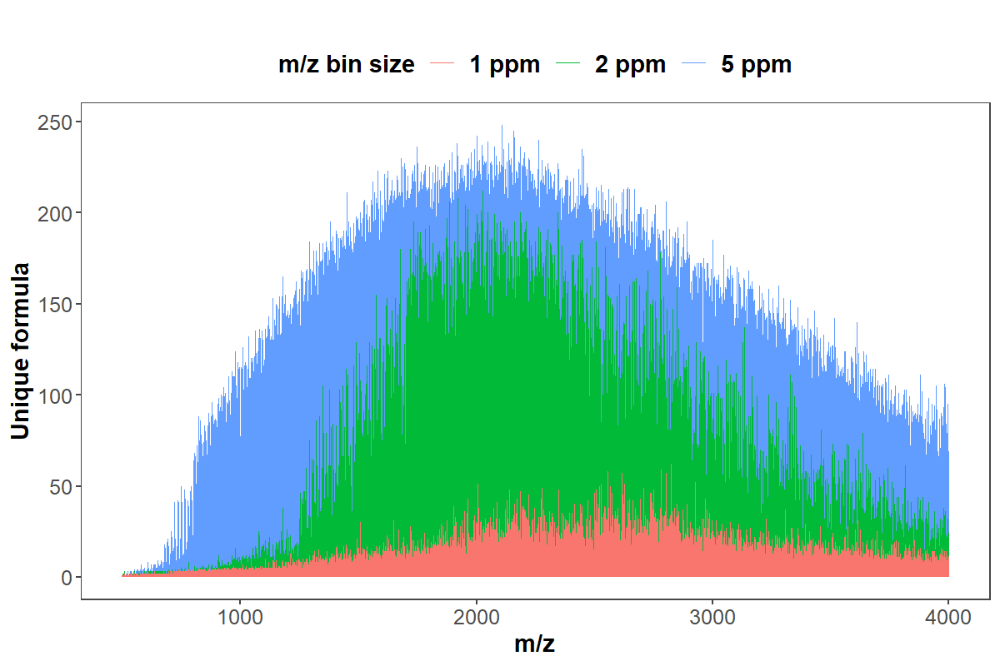
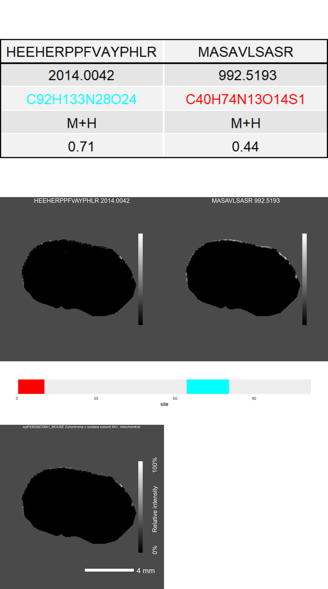

HiT-MaP
================

-   [Package installation](#package-installation)
    -   [Installation of docker image](#installation-of-docker-image)
    -   [Installation code for R console
        installation](#installation-code-for-r-console-installation)
    -   [Codes for Linux OS building
        enviornment](#codes-for-linux-os-building-enviornment)
    -   [Codes for Mac OS building enviornment
        (optional)](#codes-for-mac-os-building-enviornment-optional)
-   [Example data and source code](#example-data-and-source-code)
-   [Proteomics identification on maldi-imaging
    dataset](#proteomics-identification-on-maldi-imaging-dataset)
-   [Project folder and result
    structure](#project-folder-and-result-structure)
-   [Identification result visulasation and
    interpretation](#identification-result-visulasation-and-interpretation)
-   [Scoring system for protein and
    peptide](#scoring-system-for-protein-and-peptide)
-   [Identification summary and cluster
    imaging](#identification-summary-and-cluster-imaging)
-   [Details of parameter setting](#details-of-parameter-setting)
    -   [Modification](#modification)
    -   [Amino acid substitution](#amino-acid-substitution)
    -   [Digestion site and enzyme](#digestion-site-and-enzyme)
-   [Example workflow command](#example-workflow-command)
    -   [Peptide calibrant](#peptide-calibrant)
    -   [Bovine lens](#bovine-lens)
    -   [Mouse brain](#mouse-brain)
-   [Cite this project](#cite-this-project)
-   [Session information](#session-information)
-   [References](#references)

– An R package of High-resolution Informatics Toolbox for Maldi-imaging
Proteomics

Find our published research article on *Nature Communications*:
<DOI:10.1038/s41467-021-23461-w>


# Package installation

This is a tutorial for the use of HiTMaP (An R package of
High-resolution Informatics Toolbox for Maldi-imaging Proteomics).
User’s may run HiTMaP using Docker, or through R, however Docker is
recommended to avoid issues with package dependency.

## Installation of docker image

HiTMaP has been encapsulated into a docker image. Using a bash terminal,
user’s can download the latest version by using the code as below.

``` bash
docker pull mashuoa/hitmap
```

Seting up and running the docker container:

``` bash
# For windows user's, run the image with a local user\Documents\expdata folder mapped to the docker container:
docker run --name hitmap -v %userprofile%\Documents\expdata:/root/expdata -a stdin -a stdout -i -t mashuoa/hitmap /bin/bash 

# For linux or mac user's, run the image with a local user/expdata folder mapped to the docker container:
docker run --name hitmap -v ~/expdata:/root/expdata -a stdin -a stdout -i -t mashuoa/hitmap /bin/bash 

#Run the R console
R
```

Revoke Docker terminal:

``` bash
#use ctrl+d to exit the docker container shell 

#Restart the container and connect to the shell 
docker restart hitmap
docker container exec -it hitmap /bin/bash
```

Stop/remove docker container (warning: if no local disk is mapped to
“\~/expdata,” please backup your existing result files from the
container before you remove it):

``` bash
docker stop hitmap
docker rm hitmap
```

If you are using docker GUI, pull the docker image using the codes above
and follow the image as below to setup the container.


## Installation code for R console installation

The code below is used for an experienced R user to build a local
R/HiTMaP running environment. Major dependencies to note:

-   R base
-   java running library (for linux, additional configuration is needed:
    *R CMD javareconf*)
-   orca for plotly
    (<https://github.com/plotly/orca/releases/tag/v1.3.1>)
-   magick++ (for Linux, additional configuration is needed to expand
    the pixel limitation)

``` r
#install the git package
install.packages("remotes")
install.packages("devtools")
#library(devtools)
library(remotes)
Sys.setenv("R_REMOTES_NO_ERRORS_FROM_WARNINGS" = "true")
remotes::install_github("MASHUOA/HiTMaP",force=T)
3
no
#Update all dependencies
BiocManager::install(ask = F)
yes
library(HiTMaP)
```

For windows users, Rtools
(*<https://cran.r-project.org/bin/windows/Rtools/>*) is required.

## Codes for Linux OS building enviornment

Run the codes as below to enable the required components in Linux
console.

``` bash
sudo apt-get install tcl-dev tk-dev
sudo apt-get install r-cran-ncdf4
sudo apt-get install libz-dev
sudo apt install libxml2-dev
sudo apt install libssl-dev
sudo apt install libcurl4-openssl-dev
sudo apt-get install libnss-winbind winbind
sudo apt install dirmngr gnupg apt-transport-https ca-certificates software-properties-common

sudo add-apt-repository ppa:webupd8team/y-ppa-manager
sudo apt-get update
sudo apt-get install y-ppa-manager
sudo y-ppa-manager

sudo apt-key adv --keyserver keyserver.ubuntu.com --recv-keys
sudo add-apt-repository 'deb https://cloud.r-project.org/bin/linux/ubuntu focal-cran40/'
sudo apt-cache policy r-base
sudo apt-get purge r-base
sudo apt-get install r-base-core="4.0.2-1.2004.0"
sudo apt-get install libmagick++-dev

sudo apt-get install libfftw3-dev
sudo apt-get install r-base-dev texlive-full
sudo apt-get install libudunits2-dev
sudo apt-get install libgdal-dev
```

## Codes for Mac OS building enviornment (optional)

The following code is for a local GUI purpose. Hitmap now has been built
on the shiny server system. You can skip this step in the later version.
You may need to update the Xcode. Go to your Mac OS terminal and input:

``` bash
xcode-select --install
```

You’ll then receive: *xcode-select: note: install requested for command
line developer tools* You will be prompted at this point in a window to
update Xcode Command Line tools.

You may also need to install the X11.app and tcl/tk support for Mac
system:

-   X11.app: <https://www.xquartz.org/>

-   Use the following link to download and install the correct tcltk
    package for your OS version.
    <https://cran.r-project.org/bin/macosx/tools/>

# Example data and source code

The HitMaP comes with a series of maldi-imaging datasets acquired by
FT-ICR mass spectromety. With the following code, you can download these
raw data set into a local folder.

You can download the example data manually through this link:
“<https://github.com/MASHUOA/HiTMaP/releases/download/1.0/Data.tar.gz>”

Or download the files in a R console:

``` r
if(!require(piggyback)) install.packages("piggyback")
library(piggyback)

#made sure that this folder has enough space
wd="~/expdata/"
dir.create(wd)
setwd(wd)

pb_download("HiTMaP-master.zip", repo = "MASHUOA/HiTMaP", dest = ".")

pb_download("Data.tar.gz", repo = "MASHUOA/HiTMaP", dest = ".")

untar('Data.tar.gz',exdir =".",  tar="tar")

#unlink('Data.tar.gz')
list.dirs()
```

The example data contains three folders for three individual IMS
datasets, which each contain a configuration file, and the fasta
database, respectively: *“./Bovinlens\_Trypsin\_FT”*
*“./MouseBrain\_Trypsin\_FT”* *“./Peptide\_calibrants\_FT”*

# Proteomics identification on maldi-imaging dataset

To perform false-discovery rate controlled peptide and protein
annotation, run the following script below in your R session:

``` r
#create candidate list
library(HiTMaP)
#set project folder that contains imzML, .ibd and fasta files
#wd=paste0(file.path(path.package(package="HiTMaP")),"/data/")
#set a series of imzML files to be processed
datafile=c("Bovinlens_Trypsin_FT/Bovin_lens.imzML")
wd="~/expdata/"


imaging_identification(
#==============Choose the imzml raw data file(s) to process  make sure the fasta file in the same folder
               datafile=paste0(wd,datafile),
               threshold=0.005, 
               ppm=5,
               FDR_cutoff = 0.05,
#==============specify the digestion enzyme specificity
               Digestion_site="trypsin",
#==============specify the range of missed Cleavages
               missedCleavages=0:1,
#==============Set the target fasta file
               Fastadatabase="uniprot-bovin.fasta",
#==============Set the possible adducts and fixed modifications
               adducts=c("M+H"),
               Modifications=list(fixed=NULL,fixmod_position=NULL,variable=NULL,varmod_position=NULL),
#==============The decoy mode: could be one of the "adducts", "elements" or "isotope"
               Decoy_mode = "isotope",
               use_previous_candidates=F,
               output_candidatelist=T,
#==============The pre-processing param
               preprocess=list(force_preprocess=TRUE,
                               use_preprocessRDS=TRUE,
                               smoothSignal=list(method="Disable"),
                               reduceBaseline=list(method="Disable"),
                               peakPick=list(method="adaptive"),
                               peakAlign=list(tolerance=5, units="ppm"),
                               normalize=list(method=c("rms","tic","reference")[1],mz=1)),
#==============Set the parameters for image segmentation
               spectra_segments_per_file=4,
               Segmentation="spatialKMeans",
               Smooth_range=1,
               Virtual_segmentation=FALSE,
               Virtual_segmentation_rankfile=NULL,
#==============Set the Score method for hi-resolution isotopic pattern matching
               score_method="SQRTP",
               peptide_ID_filter=2,
#==============Summarise the protein and peptide features across the project the result can be found at the summary folder
               Protein_feature_summary=TRUE,
               Peptide_feature_summary=TRUE,
               Region_feature_summary=TRUE,
#==============The parameters for Cluster imaging. Specify the annotations of interest, the program will perform a case-insensitive search on the result file, extract the protein(s) of interest and plot them in the cluster imaging mode
               plot_cluster_image_grid=FALSE,
               ClusterID_colname="Protein",
               componentID_colname="Peptide",
               Protein_desc_of_interest=c("Crystallin","Actin"),
               Rotate_IMG=NULL,
               )
```

# Project folder and result structure

In the above function, you have performed proteomics analysis on the
sample data file. It is a tryptic Bovin lens MALDI-imaging file which is
acquired on an FT-ICR MS. The function will take the selected data
files’ root directory as the project folder. In this example, the
project folder will be:

``` r
library(HiTMaP)
wd=paste0("D:\\GITHUB LFS\\HiTMaP-Data\\inst","/data/Bovinlens_Trypsin_FT/")
datafile=c("Bovin_lens")
```

After the whole identification process, you will get two sub-folders
within the project folder:

``` r
list.dirs(wd, recursive=FALSE)
```

    ## [1] "D:\\GITHUB LFS\\HiTMaP-Data\\inst/data/Bovinlens_Trypsin_FT//Bovin_lens ID" 
    ## [2] "D:\\GITHUB LFS\\HiTMaP-Data\\inst/data/Bovinlens_Trypsin_FT//Summary folder"

1.  The one which has an identical name to an input data file contains
    the identification result of that input:
    -   the protein and peptides list of each segmentation region
    -   the PMF matching plot of each segmentation
    -   the image that indicates segmentations’ boundary (applies to
        either K-mean segmentation (powered by Cardinal) or manually
        defined segmentation)
    -   folders of each region contains the detailed identification
        process, FDR plots and isotopic pattern matching plots
2.  “Summary folder” contains:
    -   the identification summary of protein and peptides across all
        the data
    -   the candidate list of all possible proteins and peptides (if
        *use\_previous\_candidates* is set as **TRUE**)
    -   the Cluster imaging files of the protein of interest
    -   the database stats result for resolution-based candidates
        binning (optional)

# Identification result visulasation and interpretation

To plot the MALDI-image peptide and protein images, use the following
functions:

To check the segmentation result over the sample, you need to d to each
data file ID folder and find the “spatialKMeans\_image\_plot.png” (if
you are using the spatial K-means method for segmentation.)

``` r
library(magick)
```

    ## Linking to ImageMagick 6.9.11.57
    ## Enabled features: cairo, freetype, fftw, ghostscript, heic, lcms, pango, raw, rsvg, webp
    ## Disabled features: fontconfig, x11

``` r
p<-image_read(paste0(wd,datafile," ID/spatialKMeans_image_plot.png"))
print(p)
```

    ##   format width height colorspace matte filesize density
    ## 1    PNG  1024   2640       sRGB FALSE    30726   72x72


The pixels in image data now has been categorized into four regions
according to the initial setting of segmentation
(*spectra\_segments\_per\_file=5*). The rainbow shaped bovine lens
segmentation image (on the left panel) shows a unique statistical
classification based on the mz features of each region (on the right
panel).

The identification will take place on the **mean spectra** of each
region. To check the peptide mass fingerprint (PMF) matching quality,
you could locate the PMF spectrum matching plot of each individual
region.

``` r
library(magick)
p_pmf<-image_read(paste0(wd,datafile," ID/Bovin_lens 3PMF spectrum match.png"))
print(p_pmf)
```

    ##   format width height colorspace matte filesize density
    ## 1    PNG  1980   1080       sRGB FALSE    17664   72x72


A list of the peptides and proteins annotated within each region has
also been created for manual exploration of the results.

``` r
peptide_pmf_result<-read.csv(paste0(wd,datafile," ID/Peptide_segment_PMF_RESULT_3.csv"))
head(peptide_pmf_result)
```

    ##   Protein       mz Protein_coverage isdecoy       Peptide Modification    pepmz
    ## 1      48 1300.664       0.06875544       0   HLEQFATEGLR           NA 1299.657
    ## 2      48 1300.661       0.06875544       0   QYFLDLALSCK           NA 1299.653
    ## 3      48 1324.643       0.06875544       0   GSKCILYCFYK           NA 1323.636
    ## 4      53 1328.747       0.05542725       0   FKNINPFPVPR           NA 1327.740
    ## 5      53 1449.712       0.05542725       0  AVQNFTEYNVHK           NA 1448.705
    ## 6      53 1605.813       0.05542725       0 AVQNFTEYNVHKR           NA 1604.806
    ##          formula adduct charge start end pro_end mz_align      Score Rank
    ## 1   C57H90N17O18    M+H      1   580 590    1149 1300.666  2.4633527    4
    ## 2 C60H94N13O17S1    M+H      1   744 754    1149 1300.666  2.0216690   10
    ## 3 C62H94N13O15S2    M+H      1   840 850    1149 1324.647 -0.2644896   32
    ## 4   C64H98N17O14    M+H      1   207 217     433 1328.747  1.0865820    7
    ## 5   C65H97N18O20    M+H      1    92 103     433 1449.714  0.7060553   10
    ## 6  C71H109N22O21    M+H      1    92 104     433 1605.806  2.7178547   11
    ##   moleculeNames Region Delta_ppm Intensity peptide_count
    ## 1   HLEQFATEGLR      3 0.9026772 4672324.6             3
    ## 2   QYFLDLALSCK      3 1.4117311 4672324.6             3
    ## 3   GSKCILYCFYK      3 1.5164261  145191.4             3
    ## 4   FKNINPFPVPR      3 0.9094769  191636.4             3
    ## 5  AVQNFTEYNVHK      3 2.8830137 1275214.1             3
    ## 6 AVQNFTEYNVHKR      3 1.6464326  558610.4             3
    ##                                                                                                                                          desc.x
    ## 1                                  sp|Q29449|AT8A1_BOVIN Probable phospholipid-transporting ATPase IA OS=Bos taurus OX=9913 GN=ATP8A1 PE=1 SV=2
    ## 2                                  sp|Q29449|AT8A1_BOVIN Probable phospholipid-transporting ATPase IA OS=Bos taurus OX=9913 GN=ATP8A1 PE=1 SV=2
    ## 3                                  sp|Q29449|AT8A1_BOVIN Probable phospholipid-transporting ATPase IA OS=Bos taurus OX=9913 GN=ATP8A1 PE=1 SV=2
    ## 4 sp|Q3SX05|ECSIT_BOVIN Evolutionarily conserved signaling intermediate in Toll pathway, mitochondrial OS=Bos taurus OX=9913 GN=ECSIT PE=2 SV=1
    ## 5 sp|Q3SX05|ECSIT_BOVIN Evolutionarily conserved signaling intermediate in Toll pathway, mitochondrial OS=Bos taurus OX=9913 GN=ECSIT PE=2 SV=1
    ## 6 sp|Q3SX05|ECSIT_BOVIN Evolutionarily conserved signaling intermediate in Toll pathway, mitochondrial OS=Bos taurus OX=9913 GN=ECSIT PE=2 SV=1
    ##                                                                                                                                          desc.y
    ## 1                                  sp|Q29449|AT8A1_BOVIN Probable phospholipid-transporting ATPase IA OS=Bos taurus OX=9913 GN=ATP8A1 PE=1 SV=2
    ## 2                                  sp|Q29449|AT8A1_BOVIN Probable phospholipid-transporting ATPase IA OS=Bos taurus OX=9913 GN=ATP8A1 PE=1 SV=2
    ## 3                                  sp|Q29449|AT8A1_BOVIN Probable phospholipid-transporting ATPase IA OS=Bos taurus OX=9913 GN=ATP8A1 PE=1 SV=2
    ## 4 sp|Q3SX05|ECSIT_BOVIN Evolutionarily conserved signaling intermediate in Toll pathway, mitochondrial OS=Bos taurus OX=9913 GN=ECSIT PE=2 SV=1
    ## 5 sp|Q3SX05|ECSIT_BOVIN Evolutionarily conserved signaling intermediate in Toll pathway, mitochondrial OS=Bos taurus OX=9913 GN=ECSIT PE=2 SV=1
    ## 6 sp|Q3SX05|ECSIT_BOVIN Evolutionarily conserved signaling intermediate in Toll pathway, mitochondrial OS=Bos taurus OX=9913 GN=ECSIT PE=2 SV=1

``` r
protein_pmf_result<-read.csv(paste0(wd,datafile," ID/Protein_segment_PMF_RESULT_3.csv"))
head(protein_pmf_result)
```

    ##   Protein   Proscore isdecoy Intensity     Score peptide_count Protein_coverage
    ## 1   10134 0.13943597       0 2873903.1 1.9269417             3       0.06715328
    ## 2   10204 0.13654123       0  380571.3 0.7940642             3       0.18468468
    ## 3   10370 0.20365140       0 1877250.1 2.0776861             4       0.09364548
    ## 4   10659 0.11239668       0  327352.4 0.7448240             3       0.16400000
    ## 5   10888 0.07975644       0  532832.0 1.2420183             3       0.06720978
    ## 6   11270 0.10687770       0 2944154.2 1.3292158             3       0.07449857
    ##   Intensity_norm
    ## 1      1.0775539
    ## 2      0.9310593
    ## 3      1.0466962
    ## 4      0.9201443
    ## 5      0.9554442
    ## 6      1.0793038
    ##                                                                                                                          desc
    ## 1                   tr|G3N2M8|G3N2M8_BOVIN Sterile alpha motif domain containing 15 OS=Bos taurus OX=9913 GN=SAMD15 PE=4 SV=2
    ## 2                                      tr|A0A3Q1LYB6|A0A3Q1LYB6_BOVIN Uncharacterized protein OS=Bos taurus OX=9913 PE=4 SV=1
    ## 3             tr|E1B9U7|E1B9U7_BOVIN Polypeptide N-acetylgalactosaminyltransferase OS=Bos taurus OX=9913 GN=GALNT17 PE=3 SV=3
    ## 4 tr|A0A3Q1M1B1|A0A3Q1M1B1_BOVIN Phosphatidylinositol transfer protein beta isoform OS=Bos taurus OX=9913 GN=PITPNB PE=4 SV=1
    ## 5                                  tr|F1MMD4|F1MMD4_BOVIN Matrix metallopeptidase 11 OS=Bos taurus OX=9913 GN=MMP11 PE=3 SV=2
    ## 6                         tr|F6RR01|F6RR01_BOVIN Ribosome production factor 1 homolog OS=Bos taurus OX=9913 GN=RPF1 PE=4 SV=1

# Scoring system for protein and peptide

**Score** in peptide result table shows the isotopic pattern matching
score of the peptide (Pepscore). In Protein result table, it shows the
protein score (Proscore). The ‘Pepscore’ consist of two parts:
Intensity\_Score and Mass\_error\_Score:

-   Intensity\_Score indicates how well a putative isotopic pattern can
    be matched to the observed spectrum.The default scoring method is
    SQRTP. It combines the ‘square root mean’ differences between
    observed and theoretical peaks and observed proportion of the
    isotopic peaks above a certain relative intensity threshold.

-   Mass\_error\_Score indicates the summary of mass error (in *ppm*)
    for every detected isotopic peak. In order to integrate the
    Mass\_error\_Score in to scoring system, the mean ppm error has been
    normalized by ppm tolerance, and supplied to the probability normal
    distributions (*pnorm* function for R). The resulting value
    (quantiles of the given probability density) is deducted by 0.5 and
    converted into an absolute value.

  

  

  

**Proscore** in the protein result table shows the overall estimation of
the protein identification Accuracy.  

  

A *Peptide\_region\_file.csv* has also been created to summarise all the
IDs in this data file:

``` r
Identification_summary_table<-read.csv(paste0(wd,datafile," ID/Peptide_region_file.csv"))
head(Identification_summary_table)
```

    ##   Protein        mz Protein_coverage isdecoy              Peptide Modification
    ## 1      24 1143.5793       0.06119704       0         GFPGQDGLAGPK           NA
    ## 2      24 1684.8878       0.06119704       0   DGANGIPGPIGPPGPRGR           NA
    ## 3      24  742.3478       0.06119704       0             GDSGPPGR           NA
    ## 4      24 1693.8214       0.06119704       0      LLSTEGSQNITYHCK           NA
    ## 5      24 1881.9276       0.06119704       0 GQPGVMGFPGPKGANGEPGK           NA
    ## 6      48 1216.7008       0.03481288       0          ASTSVQNRLLK           NA
    ##       pepmz         formula adduct charge start  end pro_end  mz_align
    ## 1 1142.5720    C51H79N14O16    M+H      1   516  527    1487 1143.5828
    ## 2 1683.8805   C72H118N25O22    M+H      1  1175 1192    1487 1684.8830
    ## 3  741.3406    C29H48N11O12    M+H      1   933  940    1487  742.3504
    ## 4 1692.8141 C72H117N20O25S1    M+H      1  1380 1394    1487 1693.8197
    ## 5 1880.9203 C82H129N24O25S1    M+H      1   597  616    1487 1881.9268
    ## 6 1215.6935    C51H94N17O17    M+H      1   614  624    1149 1216.7047
    ##       Score Rank        moleculeNames Region Delta_ppm Intensity peptide_count
    ## 1 1.4443497    2         GFPGQDGLAGPK      2 1.3471596  250698.3             5
    ## 2 1.9337304    2   DGANGIPGPIGPPGPRGR      2 1.5937657 2696717.3             5
    ## 3 1.2698949    1             GDSGPPGR      2 0.1407633  190469.7             5
    ## 4 1.3660521    3      LLSTEGSQNITYHCK      2 2.2329023  368927.9             5
    ## 5 0.5868561   17 GQPGVMGFPGPKGANGEPGK      2 3.0817671  974427.3             5
    ## 6 1.9039495    1          ASTSVQNRLLK      2 1.8837090 2036000.7             1
    ##                                                                                                         desc.x
    ## 1                   sp|P02459|CO2A1_BOVIN Collagen alpha-1(II) chain OS=Bos taurus OX=9913 GN=COL2A1 PE=1 SV=4
    ## 2                   sp|P02459|CO2A1_BOVIN Collagen alpha-1(II) chain OS=Bos taurus OX=9913 GN=COL2A1 PE=1 SV=4
    ## 3                   sp|P02459|CO2A1_BOVIN Collagen alpha-1(II) chain OS=Bos taurus OX=9913 GN=COL2A1 PE=1 SV=4
    ## 4                   sp|P02459|CO2A1_BOVIN Collagen alpha-1(II) chain OS=Bos taurus OX=9913 GN=COL2A1 PE=1 SV=4
    ## 5                   sp|P02459|CO2A1_BOVIN Collagen alpha-1(II) chain OS=Bos taurus OX=9913 GN=COL2A1 PE=1 SV=4
    ## 6 sp|Q29449|AT8A1_BOVIN Probable phospholipid-transporting ATPase IA OS=Bos taurus OX=9913 GN=ATP8A1 PE=1 SV=2
    ##                                                                                                         desc.y
    ## 1                   sp|P02459|CO2A1_BOVIN Collagen alpha-1(II) chain OS=Bos taurus OX=9913 GN=COL2A1 PE=1 SV=4
    ## 2                   sp|P02459|CO2A1_BOVIN Collagen alpha-1(II) chain OS=Bos taurus OX=9913 GN=COL2A1 PE=1 SV=4
    ## 3                   sp|P02459|CO2A1_BOVIN Collagen alpha-1(II) chain OS=Bos taurus OX=9913 GN=COL2A1 PE=1 SV=4
    ## 4                   sp|P02459|CO2A1_BOVIN Collagen alpha-1(II) chain OS=Bos taurus OX=9913 GN=COL2A1 PE=1 SV=4
    ## 5                   sp|P02459|CO2A1_BOVIN Collagen alpha-1(II) chain OS=Bos taurus OX=9913 GN=COL2A1 PE=1 SV=4
    ## 6 sp|Q29449|AT8A1_BOVIN Probable phospholipid-transporting ATPase IA OS=Bos taurus OX=9913 GN=ATP8A1 PE=1 SV=2

The details of protein/peptide identification process has been save to
the folder named by the segmentation:

``` r
list.dirs(paste0(wd,datafile," ID/"), recursive=FALSE)
```

    ## [1] "D:\\GITHUB LFS\\HiTMaP-Data\\inst/data/Bovinlens_Trypsin_FT/Bovin_lens ID//1"
    ## [2] "D:\\GITHUB LFS\\HiTMaP-Data\\inst/data/Bovinlens_Trypsin_FT/Bovin_lens ID//2"
    ## [3] "D:\\GITHUB LFS\\HiTMaP-Data\\inst/data/Bovinlens_Trypsin_FT/Bovin_lens ID//3"
    ## [4] "D:\\GITHUB LFS\\HiTMaP-Data\\inst/data/Bovinlens_Trypsin_FT/Bovin_lens ID//4"

In the identification details folder, you will find a series of FDR file
and plots to demonstrate the FDR model and score cutoff threshold:

``` r
dir(paste0(wd,datafile," ID/1/"), recursive=FALSE)
```

    ##  [1] "FDR.CSV"                                        
    ##  [2] "FDR.png"                                        
    ##  [3] "Matching_Score_vs_mz_target-decoy.png"          
    ##  [4] "Peptide_1st_ID.csv"                             
    ##  [5] "Peptide_1st_ID_score_rank_SQRTP.csv"            
    ##  [6] "Peptide_2nd_ID_score_rankSQRTP_Rank_above_3.csv"
    ##  [7] "Peptide_Score_histogram_target-decoy.png"       
    ##  [8] "ppm"                                            
    ##  [9] "PROTEIN_FDR.CSV"                                
    ## [10] "Protein_FDR.png"                                
    ## [11] "Protein_ID_score_rank_SQRTP.csv"                
    ## [12] "PROTEIN_Score_histogram.png"                    
    ## [13] "Spectrum.csv"                                   
    ## [14] "unique_peptide_ranking_vs_mz_feature.png"

In this folder, you will find the FDR plots for protein and peptide
annotation. The software will take the proscore and its FDR model to
trim the final identification results. The
*unique\_peptide\_ranking\_vs\_mz\_feature.png* is a plot that could
tell you the number of peptide candidates that have been matched to the
mz features in the first round run. You can also access the peptide
spectrum match (first MS dimension) data via the “/ppm” subfolder.

``` r
library(magick)
p_FDR_peptide<-image_read(paste0(wd,datafile," ID/3/FDR.png"))
p_FDR_protein<-image_read(paste0(wd,datafile," ID/3/protein_FDR.png"))
p_FDR_peptide_his<-image_read(paste0(wd,datafile," ID/3/Peptide_Score_histogram_target-decoy.png"))
p_FDR_protein_his<-image_read(paste0(wd,datafile," ID/3/PROTEIN_Score_histogram.png"))
p_combined<-image_append(c(p_FDR_peptide,p_FDR_peptide_his,p_FDR_protein,p_FDR_protein_his))
print(p_combined)
```

    ##   format width height colorspace matte filesize density
    ## 1    PNG  1920    480       sRGB FALSE        0   72x72


You will also find a *Matching\_Score\_vs\_mz* plot for further
investigation on peptide matching quality.

``` r
library(magick)
#plot Matching_Score_vs_mz
p_Matching_Score_vs_mz<-image_read(paste0(wd,datafile," ID/3/Matching_Score_vs_mz_target-decoy.png"))
print(p_Matching_Score_vs_mz)
```

    ##   format width height colorspace matte filesize density
    ## 1    PNG   480    480       sRGB FALSE    47438   72x72


# Identification summary and cluster imaging

In the project summary folder, you will find four files and a
sub-folder:

``` r
wd_sum=paste(wd,"/Summary folder", sep="")
dir(wd_sum)
```

    ## [1] "candidatelist.csv"                "cluster Ion images"              
    ## [3] "Peptide_Summary.csv"              "Protein_feature_list_trimmed.csv"
    ## [5] "protein_index.csv"                "Protein_Summary.csv"

“candidatelist.csv” and “protein\_index.csv” contains the candidates
used for this analysis. They are output after the candidate processing
while *output\_candidatelist* set as TRUE, and can be used repeatedly
while *use\_previous\_candidates* set as TRUE.

We have implemented a functionality to perform additional statistical
analyses around the number of enzymatically generated peptides generated
derived from a given proteome (‘Database\_stats’). If the user sets the
variable ‘Database\_stats’ to TRUE in the main workflow, then the
function will be called. Briefly, the function will list all of the
m/z’s of a unique formulae from the peptide candidate pool within a
given m/z range. The m/z’s will then be binned using three resolution
m/z windows: 1ppm, 2ppm and 5ppm. A plot showing the number of unique
formulae vs. binned m/z windows will be generated and exported to the
summary folder (DB\_stats\_mz\_bin).



“Peptide\_Summary.csv” and “Protein\_Summary.csv” contains the table of
the project identification summary. You could set the
*plot\_cluster\_image\_grid* as TRUE to enable the cluster imaging
function. Please be noted that you could indicate *Rotate\_IMG* with a
CSV file path that indicates the rotation degree of image files.

**Note**: 90<sup>∘</sup>, 180<sup>∘</sup> and 270<sup>∘</sup> are
recommended for image rotation. You may find an example CSV file in the
library/HiTMaP/data folder.

``` r
library(dplyr)
Protein_desc_of_interest<-c("Crystallin","Actin")
Protein_Summary_tb<-read.csv(paste(wd,"/Summary folder","/Protein_Summary.csv", sep=""),stringsAsFactors = F)
```

Finally, you are able visualize the annotated proteins and their
associated peptide distributions via the cluster imaging function.

``` r
library(magick)
```

    ## Linking to ImageMagick 6.9.11.57
    ## Enabled features: cairo, freetype, fftw, ghostscript, heic, lcms, pango, raw, rsvg, webp
    ## Disabled features: fontconfig, x11

``` r
p_cluster2<-image_read(paste0("~/expdata/Bovinlens_Trypsin_FT/Summary folder/cluster Ion images/unique/25917_cluster_imaging.png"))
print(p_cluster2)
```

    ##   format width height colorspace matte filesize density
    ## 1    PNG  5670   1951       sRGB FALSE   678267   59x59


``` r
p_cluster4<-image_read(paste0("~/expdata/Bovinlens_Trypsin_FT/Summary folder/cluster Ion images/unique/452_cluster_imaging.png"))
print(p_cluster4)
```

    ##   format width height colorspace matte filesize density
    ## 1    PNG 25110   2063       sRGB FALSE  3010819   59x59


``` r
p_cluster1<-image_read(paste0("~/expdata/Bovinlens_Trypsin_FT/Summary folder/cluster Ion images/unique/791_cluster_imaging.png"))
print(p_cluster1)
```

    ##   format width height colorspace matte filesize density
    ## 1    PNG  8910   2020       sRGB FALSE  1121766   59x59


``` r
p_cluster3<-image_read(paste0("~/expdata/Bovinlens_Trypsin_FT/Summary folder/cluster Ion images/unique/5479_cluster_imaging.png"))
print(p_cluster3)
```

    ##   format width height colorspace matte filesize density
    ## 1    PNG 13770   1751       sRGB FALSE  1118974   59x59


# Details of parameter setting

## Modification

You can choose one or a list of modifications from the unimod
modification list. *Peptide\_modification* function is used to
load/rebuild the modification database into the global enviornment of R.
It will be called automatically in the identification work flow. you can
use the *code\_name* or *record\_id* to refer the modification (see
example data “peptide calibrants” to find more details). The pipeline
will select the *non-hidden* modifications.

``` r
HiTMaP:::Peptide_modification(retrive_ID=NULL,update_unimod=F)
modification_list<-merge(unimod.df$modifications,unimod.df$specificity,by.x=c("record_id"),by.y=c("mod_key"),all.x=T)
head(modification_list['&'(modification_list$code_name=="Phospho",modification_list$hidden!=1),c("code_name","record_id","composition","mono_mass","position_key","one_letter")])
```

    ##      code_name record_id composition mono_mass position_key one_letter
    ## 1615   Phospho        21    H O(3) P 79.966331            2          Y
    ## 1618   Phospho        21    H O(3) P 79.966331            2          T
    ## 1620   Phospho        21    H O(3) P 79.966331            2          S

``` r
head(modification_list['&'(modification_list$code_name=="Amide",modification_list$hidden!=1),c("code_name","record_id","composition","mono_mass","position_key","one_letter")])
```

    ##      code_name record_id composition mono_mass position_key one_letter
    ## 1552     Amide         2   H N O(-1) -0.984016            6     C-term
    ## 1553     Amide         2   H N O(-1) -0.984016            4     C-term

``` r
head(modification_list['&'(stringr::str_detect(modification_list$code_name,"Ca"),modification_list$hidden!=1),c("code_name","record_id","composition","mono_mass","position_key","one_letter")])
```

    ##            code_name record_id    composition mono_mass position_key one_letter
    ## 1946 Carbamidomethyl         4  H(3) C(2) N O 57.021464            2          C
    ## 1949 Carbamidomethyl         4  H(3) C(2) N O 57.021464            3     N-term
    ## 2119        Carbamyl         5        H C N O 43.005814            3     N-term
    ## 2121        Carbamyl         5        H C N O 43.005814            2          K
    ## 2271   Carboxymethyl         6 H(2) C(2) O(2) 58.005479            2          C

If a modification occurs on a particular site, you will also need to
specify the position of a modifications.

-   *Anywhere*, side chain of possible amino acids
-   *Any N-term*, any N-term of enzymatic peptide
-   *Protein N-term*, any N-term of protein

``` r
unimod.df[["positions"]]
```

    ##         position record_id
    ## 1              -         1
    ## 2       Anywhere         2
    ## 3     Any N-term         3
    ## 4     Any C-term         4
    ## 5 Protein N-term         5
    ## 6 Protein C-term         6

## Amino acid substitution

You can set the *Substitute\_AA* to make the uncommon amino acid
available to the workflow:
*Substitute\_AA=list(AA=c(“X”),AA\_new\_formula=c(“C5H5NO2”),Formula\_with\_water=c(FALSE))*

-   AA: the single letter amino acid to be replaced
-   AA\_new\_formula: the new formula for the amino acid
-   Formula\_with\_water: Set *TRUE* to indicate the formula represents
    the intact amino acid, *FALSE* to indicate that the formula already
    lost one H2O molecule and can be considered as AA backbone.

## Digestion site and enzyme

The *Digestion\_site* allows you to specify a list of pre-defined enzyme
and customized digestion rules in regular expression format. You can
either use the enzyme name, customized cleavage rule or combination of
them to get the enzymatics peptides list.

``` r
Cleavage_rules<-Cleavage_rules_fun()
Cleavage_df<-data.frame(Enzyme=names(Cleavage_rules),Cleavage_rules=unname(Cleavage_rules),stringsAsFactors = F)
library(gridExtra)
grid.ftable(Cleavage_df, gp = gpar(fontsize=9,fill = rep(c("grey90", "grey95"))))
```

<!-- -->

# Example workflow command

Below is a list of commands including the parameters for the example
data sets.

## Peptide calibrant

``` r
#peptide calibrant
library(HiTMaP)
datafile=c("Peptide_calibrants_FT/trypsin_non-decell_w.calibrant_FTICR")
wd="~/expdata/"

# Calibrants dataset analysis with modification
imaging_identification(datafile=paste0(wd,datafile),
  Digestion_site="trypsin",
  Fastadatabase="uniprot_cali.fasta",
  output_candidatelist=T,
  plot_matching_score=T,
  spectra_segments_per_file=1,
  use_previous_candidates=F,
  peptide_ID_filter=1,ppm=5,missedCleavages=0:5,
  Modifications=list(fixed=NULL,fixmod_position=NULL,variable=c("Amide"),varmod_position=c(6)),
  FDR_cutoff=0.1,
  Substitute_AA=list(AA=c("X"),AA_new_formula=c("C5H5NO2"),Formula_with_water=c(FALSE)))

# Calibrants dataset analysis with no modification
imaging_identification(datafile=paste0(wd,datafile),
  Digestion_site="trypsin",
  Fastadatabase="uniprot_cali.fasta",
  output_candidatelist=T,
  plot_matching_score=T,
  spectra_segments_per_file=1,
  use_previous_candidates=T,
  peptide_ID_filter=1,ppm=5,missedCleavages=0:5,
  FDR_cutoff=0.1)

library(HiTMaP)
datafile=c("Peptide_calibrants_FT/trypsin_non-decell_w.calibrant_FTICR")
wd="~/expdata/"
# Calibrants dataset analysis with modification 
imaging_identification(datafile=paste0(wd,datafile),
  Digestion_site="trypsin",
  Fastadatabase="calibrants.fasta",
  output_candidatelist=T,
  plot_matching_score=T,
  spectra_segments_per_file=1,
  use_previous_candidates=T,
  peptide_ID_filter=1,ppm=5,missedCleavages=0:5,
  Modifications=list(fixed=NULL,fixmod_position=NULL,variable=c("Amide"),varmod_position=c(6)),
  FDR_cutoff=0.1,
  Substitute_AA=list(AA=c("X"),AA_new_formula=c("C5H5NO2"),Formula_with_water=c(FALSE)),Thread = 1)
```

## Bovine lens

``` r
library(HiTMaP)
datafile=c("Bovinlens_Trypsin_FT/Bovin_lens.imzML")
wd="~/expdata/"

# Data pre-processing and proteomics annotation
library(HiTMaP)
imaging_identification(datafile=paste0(wd,datafile),Digestion_site="trypsin",
                       Fastadatabase="uniprot-bovin.fasta",output_candidatelist=T,
                       preprocess=list(force_preprocess=TRUE,
                               use_preprocessRDS=TRUE,
                               smoothSignal=list(method="Disable"),
                               reduceBaseline=list(method="Disable"),
                               peakPick=list(method="adaptive"),
                               peakAlign=list(tolerance=5, units="ppm"),
                               normalize=list(method=c("rms","tic","reference")[1],mz=1)),
                       spectra_segments_per_file=4,use_previous_candidates=F,ppm=5,FDR_cutoff = 0.05,IMS_analysis=T,
                       Rotate_IMG="file_rotationbk.csv",plot_cluster_image_grid=F)

datafile=c("Bovinlens_Trypsin_FT/Bovin_lens.imzML")
wd="~/expdata/"
library(HiTMaP)
imaging_identification(datafile=paste0(wd,datafile),Digestion_site="trypsin",
                       Fastadatabase="uniprot-bovin.fasta",output_candidatelist=T,use_previous_candidates=T,
                       preprocess=list(force_preprocess=TRUE,
                               use_preprocessRDS=TRUE,
                               smoothSignal=list(method="Disable"),
                               reduceBaseline=list(method="Disable"),
                               peakPick=list(method="adaptive"),
                               peakAlign=list(tolerance=5, units="ppm"),
                               normalize=list(method=c("rms","tic","reference")[1],mz=1)),
                       spectra_segments_per_file=4,ppm=5,FDR_cutoff = 0.05,IMS_analysis=T,
                       Rotate_IMG="file_rotationbk.csv",plot_cluster_image_grid=F)

# Re-analysis and cluster image rendering

library(HiTMaP)
datafile=c("Bovinlens_Trypsin_FT/Bovin_lens.imzML")
wd="~/expdata/"
imaging_identification(datafile=paste0(wd,datafile),Digestion_site="trypsin",
                       Fastadatabase="uniprot-bovin.fasta",
                       use_previous_candidates=T,ppm=5,IMS_analysis=F,
                       plot_cluster_image_grid=T,
                       export_Header_table=T, 
                       img_brightness=250, 
                       plot_cluster_image_overwrite=T,
                       cluster_rds_path = "/Bovin_lens ID/preprocessed_imdata.RDS",pixel_size_um = 150,
                       Plot_score_abs_cutoff=-0.1,
                       remove_score_outlier=T,
                       Protein_desc_of_interest=c("Crystallin","Phakinin","Filensin","Actin","Vimentin","Cortactin","Visinin","Arpin","Tropomyosin","Myosin Light Chain 3","Kinesin Family Member 14","Dynein Regulatory Complex","Ankyrin Repeat Domain 45"))
```

## Mouse brain

``` r
library(HiTMaP)
datafile=c("MouseBrain_Trypsin_FT/Mouse_brain.imzML")
wd="~/expdata/"

# Data pre-processing and proteomics annotation
library(HiTMaP)
imaging_identification(datafile=paste0(wd,datafile),Digestion_site="trypsin",
                       Fastadatabase="uniprot_mouse_20210107.fasta",output_candidatelist=T,
                       preprocess=list(force_preprocess=T,
                               use_preprocessRDS=TRUE,
                               smoothSignal=list(method="Disable"),
                               reduceBaseline=list(method="Disable"),
                               peakPick=list(method="adaptive"),
                               peakAlign=list(tolerance=5, units="ppm"),
                               normalize=list(method=c("rms","tic","reference")[1],mz=1)),
                       spectra_segments_per_file=9,use_previous_candidates=F,ppm=10,FDR_cutoff = 0.05,IMS_analysis=T,
                       Rotate_IMG="file_rotationbk.csv",
                       mzrange = c(500,4000),plot_cluster_image_grid=F)

# Re-analysis and cluster image rendering
library(HiTMaP)
datafile=c("MouseBrain_Trypsin_FT/Mouse_brain.imzML")
wd="~/expdata/"
imaging_identification(datafile=paste0(wd,datafile),Digestion_site="trypsin",
                       Fastadatabase="uniprot_mouse_20210107.fasta",
                       preprocess=list(force_preprocess=FALSE),
                       spectra_segments_per_file=9,use_previous_candidates=T,ppm=10,FDR_cutoff = 0.05,IMS_analysis=F,
                       mzrange = c(500,4000),plot_cluster_image_grid=T,
                       img_brightness=250, plot_cluster_image_overwrite=T,
                       cluster_rds_path = "/Mouse_brain ID/preprocessed_imdata.RDS",
                       pixel_size_um = 50,
                       Plot_score_abs_cutoff=-0.1,
                       remove_score_outlier=T,
                       Protein_desc_of_interest=c("Secernin","GN=MBP","Cytochrome"))
```

# Cite this project

This study has been accepted by Nature Communications:
<DOI:10.1038/s41467-021-23461-w> “Automated annotation and visualisation
of high-resolution spatial proteomic mass spectrometry imaging data
using HIT-MAP” online on the 28th May 2021.

# Session information

``` r
toLatex(sessionInfo())
```

    ## \begin{itemize}\raggedright
    ##   \item R version 4.0.4 (2021-02-15), \verb|x86_64-w64-mingw32|
    ##   \item Locale: \verb|LC_COLLATE=English_Australia.1252|, \verb|LC_CTYPE=English_Australia.1252|, \verb|LC_MONETARY=English_Australia.1252|, \verb|LC_NUMERIC=C|, \verb|LC_TIME=English_Australia.1252|
    ##   \item Running under: \verb|Windows 10 x64 (build 19042)|
    ##   \item Matrix products: default
    ##   \item Base packages: base, datasets, graphics, grDevices, grid,
    ##     methods, stats, utils
    ##   \item Other packages: dplyr~1.0.5, gridExtra~2.3, HiTMaP~1.0.0,
    ##     magick~2.7.0, protViz~0.6.8, XML~3.99-0.5
    ##   \item Loaded via a namespace (and not attached): assertthat~0.2.1,
    ##     cli~2.3.1, codetools~0.2-18, compiler~4.0.2, crayon~1.4.1,
    ##     DBI~1.1.1, debugme~1.1.0, digest~0.6.27, ellipsis~0.3.1,
    ##     evaluate~0.14, fansi~0.4.2, fastmap~1.1.0, generics~0.1.0,
    ##     glue~1.4.2, gtable~0.3.0, highr~0.8, htmltools~0.5.1.1,
    ##     httpuv~1.5.5, knitr~1.31, later~1.1.0.1, lifecycle~1.0.0,
    ##     magrittr~2.0.1, mime~0.10, pillar~1.5.1, pkgconfig~2.0.3,
    ##     png~0.1-7, promises~1.2.0.1, purrr~0.3.4, R6~2.5.0, Rcpp~1.0.6,
    ##     rlang~0.4.10, rmarkdown~2.8, rstudioapi~0.13, shiny~1.6.0,
    ##     stringi~1.5.3, stringr~1.4.0, tibble~3.1.0, tidyselect~1.1.0,
    ##     tools~4.0.2, utf8~1.2.1, vctrs~0.3.6, xfun~0.22, xtable~1.8-4,
    ##     yaml~2.2.1
    ## \end{itemize}

End of the tutorial, Enjoy\~

# References

R Packages used in this project:

-   viridisLite(Garnier 2018)

-   rcdklibs(Guha 2017)

-   rJava(Urbanek 2019)

-   data.table(Dowle and Srinivasan 2019)

-   RColorBrewer(Neuwirth 2014)

-   magick(Ooms 2019)

-   ggplot2(Wickham 2016)

-   dplyr(Wickham et al. 2019)

-   stringr(Wickham 2019)

-   protViz(Panse and Grossmann 2019)

-   cleaver(Gibb 2019)

-   Biostrings(Pag�s et al. 2019)

-   IRanges(Lawrence et al. 2013)

-   Cardinal(Bemis et al. 2015)

-   tcltk(R Core Team 2019)

-   BiocParallel(Morgan et al. 2019)

-   spdep(Bivand and Wong 2018)

-   FTICRMS(Barkauskas 2012)

-   UniProt.ws(Carlson 2019)

<div id="refs" class="references csl-bib-body hanging-indent">

<div id="ref-FTICRMS" class="csl-entry">

Barkauskas, Don. 2012. *FTICRMS: Programs for Analyzing Fourier
Transform-Ion Cyclotron Resonance Mass Spectrometry Data*.
<https://CRAN.R-project.org/package=FTICRMS>.

</div>

<div id="ref-Cardinal" class="csl-entry">

Bemis, Kyle D., April Harry, Livia S. Eberlin, Christina Ferreira,
Stephanie M. van de Ven, Parag Mallick, Mark Stolowitz, and Olga Vitek.
2015. “Cardinal: An r Package for Statistical Analysis of Mass
Spectrometry-Based Imaging Experiments.” *Bioinformatics*.
<https://doi.org/10.1093/bioinformatics/btv146>.

</div>

<div id="ref-spdep1" class="csl-entry">

Bivand, Roger, and David W. S. Wong. 2018. “Comparing Implementations of
Global and Local Indicators of Spatial Association.” *TEST* 27 (3):
716–48. <https://doi.org/10.1007/s11749-018-0599-x>.

</div>

<div id="ref-UniProt.ws" class="csl-entry">

Carlson, Marc. 2019. *UniProt.ws: R Interface to UniProt Web Services*.

</div>

<div id="ref-data.table" class="csl-entry">

Dowle, Matt, and Arun Srinivasan. 2019. *Data.table: Extension of
‘Data.frame‘*. <https://CRAN.R-project.org/package=data.table>.

</div>

<div id="ref-viridisLite" class="csl-entry">

Garnier, Simon. 2018. *viridisLite: Default Color Maps from ’Matplotlib’
(Lite Version)*. <https://CRAN.R-project.org/package=viridisLite>.

</div>

<div id="ref-cleaver" class="csl-entry">

Gibb, Sebastian. 2019. *Cleaver: Cleavage of Polypeptide Sequences*.
<https://github.com/sgibb/cleaver/>.

</div>

<div id="ref-rcdklibs" class="csl-entry">

Guha, Rajarshi. 2017. *Rcdklibs: The CDK Libraries Packaged for r*.
<https://CRAN.R-project.org/package=rcdklibs>.

</div>

<div id="ref-IRanges" class="csl-entry">

Lawrence, Michael, Wolfgang Huber, Hervé Pagès, Patrick Aboyoun, Marc
Carlson, Robert Gentleman, Martin Morgan, and Vincent Carey. 2013.
“Software for Computing and Annotating Genomic Ranges.” *PLoS
Computational Biology* 9.
<https://doi.org/10.1371/journal.pcbi.1003118>.

</div>

<div id="ref-BiocParallel" class="csl-entry">

Morgan, Martin, Valerie Obenchain, Michel Lang, Ryan Thompson, and
Nitesh Turaga. 2019. *BiocParallel: Bioconductor Facilities for Parallel
Evaluation*. <https://github.com/Bioconductor/BiocParallel>.

</div>

<div id="ref-RColorBrewer" class="csl-entry">

Neuwirth, Erich. 2014. *RColorBrewer: ColorBrewer Palettes*.
<https://CRAN.R-project.org/package=RColorBrewer>.

</div>

<div id="ref-magick" class="csl-entry">

Ooms, Jeroen. 2019. *Magick: Advanced Graphics and Image-Processing in
r*. <https://CRAN.R-project.org/package=magick>.

</div>

<div id="ref-Biostrings" class="csl-entry">

Pag�s, H., P. Aboyoun, R. Gentleman, and S. DebRoy. 2019. *Biostrings:
Efficient Manipulation of Biological Strings*.

</div>

<div id="ref-protViz" class="csl-entry">

Panse, Christian, and Jonas Grossmann. 2019. *protViz: Visualizing and
Analyzing Mass Spectrometry Related Data in Proteomics*.

</div>

<div id="ref-tcltk" class="csl-entry">

R Core Team. 2019. *R: A Language and Environment for Statistical
Computing*. Vienna, Austria: R Foundation for Statistical Computing.
<https://www.R-project.org/>.

</div>

<div id="ref-rJava" class="csl-entry">

Urbanek, Simon. 2019. *rJava: Low-Level r to Java Interface*.
<https://CRAN.R-project.org/package=rJava>.

</div>

<div id="ref-ggplot2" class="csl-entry">

Wickham, Hadley. 2016. *Ggplot2: Elegant Graphics for Data Analysis*.
Springer-Verlag New York. <https://ggplot2.tidyverse.org>.

</div>

<div id="ref-stringr" class="csl-entry">

———. 2019. *Stringr: Simple, Consistent Wrappers for Common String
Operations*. <https://CRAN.R-project.org/package=stringr>.

</div>

<div id="ref-dplyr" class="csl-entry">

Wickham, Hadley, Romain Fran�ois, Lionel Henry, and Kirill Muller. 2019.
*Dplyr: A Grammar of Data Manipulation*.
<https://CRAN.R-project.org/package=dplyr>.

</div>

</div>
