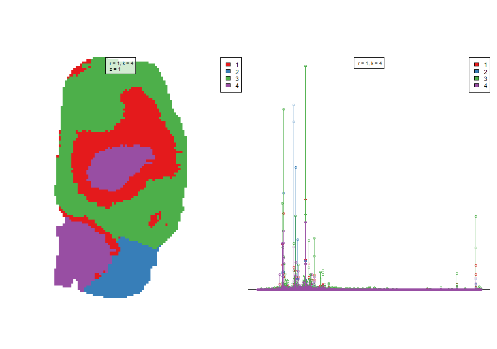
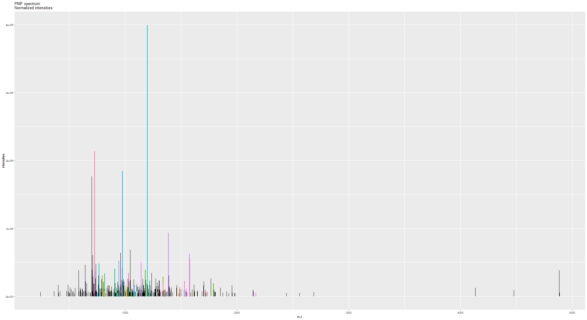

-- An R package of High-resolution Informatics Toolbox for Maldi-imaging Proteomics


## Package installation
This is an tutorial for use of HiTMaP (An R package of High-resolution Informatics Toolbox for Maldi-imaging Proteomics). To access the software use the installation codes as below: 


```r
#install the git package
install.packages("devtools")
Sys.setenv(R_REMOTES_NO_ERRORS_FROM_WARNINGS=T)
library(devtools)
install_github("guoguodigit/HiTMaP",auth_token ="a124a067ed1c84f8fd577c972845573922f1bb0f",force=T)
#Update all dependencies
1
library(HiTMaP)
```


## Proteomics identification on Maldi imaging data file 

Now the HiTMaP is upon running. You could build the candidate list of your target proteome and perform image identification by using the function as below:


```r
#creat candidate list
library(HiTMaP)
#set project folder that contains imzML, .ibd and fasta files
wd=paste0(file.path(path.package(package="HiTMaP")),"/data/")
#set a series of imzML files to be processed
datafile=c("Bovin_lens")


imaging_identification(
#==============Choose the imzml raw data file(s) to process  make sure the fasta file in the same folder
               datafile=paste0(wd,datafile),
               threshold=0.005, 
               ppm=5,
#==============specify the digestion enzyme specificity
               Digestion_site="([KR](?=[^P]))|((?<=W)K(?=P))|((?<=M)R(?=P))",
#==============specify the range of missed Cleavages
               missedCleavages=0:1,
#==============Set the target fasta file
               Fastadatabase="uniprot-bovin.fasta",
#==============Set the possible adducts and fixed modifications
               adducts=c("M+H"),
               Modifications=list(fixed=NULL),
#==============The decoy mode: could be one of the "adducts", "elements" or "isotope"
               Decoy_mode = "isotope",
               use_previous_candidates=F,
               output_candidatelist=T,
#==============Set the parameters for image segmentation
               spectra_segments_per_file=5,
               spatialKMeans=TRUE,
               Smooth_range=1,
               Virtual_segmentation=FALSE,
               Virtual_segmentation_rankfile=NULL,
#==============Set the Score method for hi-resolution isotopic pattern matching
               score_method="SQRTP",
#==============Summarise the protein and peptide features across the project the result can be found at the summary folder
               Protein_feature_summary=TRUE,
               Peptide_feature_summary=TRUE,
               Region_feature_summary=TRUE,
#==============The parameters for Cluster imaging. Specify the annotations of interest, the program will perform a case-insensitive search on the result file, extract the protein(s) of interest and plot them in the cluster imaging mode
               plot_cluster_image_grid=FALSE,
               ClusterID_colname="Protein",
               componentID_colname="Peptide",
               Protein_desc_of_interest=c("Crystallin","Actin"),
               Rotate_IMG=NULL,
               )
```


## Project folder and result structure 

In the above function, You have performed proteomics analysis of the sample data file. It is a tryptic Bovin lens MALDI-imaging file which is acquired on an FT-ICR MS.
The function will take the selected data files' root directory as the project folder.
In this example, the project folder will be:


```r
library(HiTMaP)
wd=paste0("Y:\\MALDI\\George\\brain trypsin\\")
#set a series of imzML files to be processed
datafile=c("brain_trypsin")
wd
```

```
## [1] "Y:\\MALDI\\George\\brain trypsin\\"
```


After the whole identification process, we will get two types of sub-folders in the project folder:


```r
list.dirs(wd, recursive=FALSE)
```

```
## [1] "Y:\\MALDI\\George\\brain trypsin\\/1025"                                 
## [2] "Y:\\MALDI\\George\\brain trypsin\\/brain_trypsin ID"                     
## [3] "Y:\\MALDI\\George\\brain trypsin\\/Brain_Trypsin_1198_CID_0_D12_000001.d"
## [4] "Y:\\MALDI\\George\\brain trypsin\\/Brain_Trypsin_1339_CID_0_D12_000001.d"
## [5] "Y:\\MALDI\\George\\brain trypsin\\/Brain_Trypsin_699_CID_0_D12_000001.d" 
## [6] "Y:\\MALDI\\George\\brain trypsin\\/Brain_Trypsin_726_CID_0_D12_000001.d" 
## [7] "Y:\\MALDI\\George\\brain trypsin\\/Brain_Trypsin_944_CID_0_D12_000001.d" 
## [8] "Y:\\MALDI\\George\\brain trypsin\\/Summary folder"
```

1. The one which has an identical name to an input data file contains the identification result of that input:
   + the protein and peptides list of each segmentation region
   + the PMF matching plot of each segmentation
   + the image that indicates segmentations' boundary (applies to either K-mean segmentation (powered by Cardinal) or manually defined segmentation)
   + folders of each region contains the detailed identification process, FDR plots and isotopic pattern matching plots

2. "Summary folder" contains: 
   + the identification summary of protein and peptides across all the data
   + the candidate list of all possible proteins and peptides (if *use_previous_candidates* is set as **TRUE**)
   + the Cluster imaging files of the protein of interest
   
   
## Identification result visulasation and interpretation

Now we could visualize the result by the following functions:

To check the segmentation result over the sample, you need got to each data file ID folder and find the "spatialKMeans_image_plot.png" (if you are using the spatial K-means method for segmentation.)


```r
library(magick)
```

```
## Linking to ImageMagick 6.9.9.14
## Enabled features: cairo, freetype, fftw, ghostscript, lcms, pango, rsvg, webp
## Disabled features: fontconfig, x11
```

```r
p<-image_read(paste0(wd,datafile," ID/spatialKMeans_image_plot.png"))
print(p)
```

```
## # A tibble: 1 x 7
##   format width height colorspace matte filesize density
##   <chr>  <int>  <int> <chr>      <lgl>    <int> <chr>  
## 1 PNG     1024    720 sRGB       FALSE     8375 72x72
```



The pixels in image data now has been categorized into five regions according to the initial setting of segmentation (*spectra_segments_per_file=5*). The rainbow shaped bovine lens segmentation image (on the left panel) shows a unique statistical classification based on the mz features of each region (on the right panel).

The identification will take place on the **mean spectra** of each region. To check the peptide mass fingerprint (PMF) matching quality, 
you could locate the PMF spectrum matching plot of each individual region.


```r
library(magick)
p_pmf<-image_read(paste0(wd,datafile," ID/",datafile," 3PMF spectrum match.png"))
print(p_pmf)
```

```
## # A tibble: 1 x 7
##   format width height colorspace matte filesize density
##   <chr>  <int>  <int> <chr>      <lgl>    <int> <chr>  
## 1 PNG     1980   1080 sRGB       FALSE    23569 72x72
```



list of Peptides and proteins of each region has also been created so that you may check each individual region's result.


```r
peptide_pmf_result<-read.csv(paste0(wd,datafile," ID/Peptide_segment_PMF_RESULT_3.csv"))
head(peptide_pmf_result)
```

```
## # A tibble: 6 x 15
##   Protein    mz Peptide adduct formula isdecoy pepmz charge Intensity
##     <int> <dbl> <fct>   <fct>  <fct>     <int> <dbl>  <int>     <dbl>
## 1     505  907. QAGLSY~ M+H    C40H67~       0  906.      1    99621.
## 2     505 1033. TSGNSV~ M+H    C44H82~       0 1032.      1   341015.
## 3    1345 1355. TDAEAT~ M+H    C52H84~       0 1354.      1    90519.
## 4    1345 1144. AYRGGH~ M+H    C50H83~       0 1143.      1   503911.
## 5   13635 1033. TSGSNV~ M+H    C44H82~       0 1032.      1   341015.
## 6   13635  907. QAGLSY~ M+H    C40H67~       0  906.      1    99621.
## # ... with 6 more variables: moleculeNames <fct>, Region <int>,
## #   Score <dbl>, mz_align <dbl>, Rank <int>, desc <fct>
```


```r
protein_pmf_result<-read.csv(paste0(wd,datafile," ID/Protein_segment_PMF_RESULT_3.csv"))
head(protein_pmf_result)
```

```
## # A tibble: 6 x 9
##   Protein Proscore isdecoy Intensity Score peptide_count Protein_coverage
##     <int>    <dbl>   <int>     <dbl> <dbl>         <int>            <dbl>
## 1    1345    0.574       0   297215. 3.10              2            0.168
## 2   13635    0.507       0   220318. 1.33              2            0.353
## 3   20540    0.583       0   160273. 0.662             3            0.84 
## 4   22529    0.490       0   239442. 1.24              2            0.365
## 5   22921    0.519       0   301660. 1.12              2            0.420
## 6   23816    0.465       0   540255. 1.36              2            0.296
## # ... with 2 more variables: Intensity_norm <dbl>, desc <fct>
```

## Scoring system for protein and peptide
**Score** in peptide result table shows the isotopic pattern matching score of the peptide. In Protein result table, it shows the intensity weighted peptide spectrum matching score.

$Score=\log(Observed\_Peak/Theoritical\_peak)-\log(\sqrt{\frac{\sum_{x = 1}^{n} (Theoritical\_intensity_x-Observed\_intensity_x)^2}{\sum_{x = 1}^{n} (Theoritical\_intensity_x)^2(Observed\_intensity_x)^2}}$


**Proscore** in the protein result table shows the overall estimation of the protein identification Accuracy

$Proscore=\frac{\sum_{x = 1}^{n}(Score_x*log(Intensity_x))}{mean(log(Intensity))}*Protein\_coverage*Normalized\_intensity$

A *Peptide_region_file.csv* has also been created to summarise all the IDs in this data file:


```r
Identification_summary_table<-read.csv(paste0(wd,datafile," ID/Peptide_region_file.csv"))
head(Identification_summary_table)
```

```
## # A tibble: 6 x 15
##   Protein    mz Peptide adduct formula isdecoy pepmz charge Intensity
##     <int> <dbl> <fct>   <fct>  <fct>     <int> <dbl>  <int>     <dbl>
## 1     505  907. QAGLSY~ M+H    C40H67~       0  906.      1    99621.
## 2     505 1033. TSGNSV~ M+H    C44H82~       0 1032.      1   341015.
## 3    1345 1355. TDAEAT~ M+H    C52H84~       0 1354.      1    90519.
## 4    1345 1144. AYRGGH~ M+H    C50H83~       0 1143.      1   503911.
## 5   13635 1033. TSGSNV~ M+H    C44H82~       0 1032.      1   341015.
## 6   13635  907. QAGLSY~ M+H    C40H67~       0  906.      1    99621.
## # ... with 6 more variables: moleculeNames <fct>, Region <int>,
## #   Score <dbl>, mz_align <dbl>, Rank <int>, desc <fct>
```

The details of protein/peptide identification process has been save to the folder named by the segmentation:


```r
list.dirs(paste0(wd,datafile," ID/"), recursive=FALSE)
```

```
## [1] "Y:\\MALDI\\George\\brain trypsin\\brain_trypsin ID//1"
## [2] "Y:\\MALDI\\George\\brain trypsin\\brain_trypsin ID//2"
## [3] "Y:\\MALDI\\George\\brain trypsin\\brain_trypsin ID//3"
## [4] "Y:\\MALDI\\George\\brain trypsin\\brain_trypsin ID//4"
```
In the identification details folder, you will find a series of FDR file and plots to demonstrate the FDR model and score cutoff threshold:


```r
dir(paste0(wd,datafile," ID/1/"), recursive=T)
```

```
##  [1] "FDR.CSV"                                        
##  [2] "FDR.png"                                        
##  [3] "Matching_Score_vs_mz_target-decoy.png"          
##  [4] "Peptide_1st_ID.csv"                             
##  [5] "Peptide_1st_ID_score_rank_SQRTP.csv"            
##  [6] "Peptide_2nd_ID_score_rankSQRTP_Rank_above_3.csv"
##  [7] "Peptide_Score_histogram_target-decoy.png"       
##  [8] "PROTEIN_FDR.CSV"                                
##  [9] "protein_FDR.png"                                
## [10] "Protein_ID_score_rank_SQRTP.csv"                
## [11] "PROTEIN_Score_histogram.png"                    
## [12] "Spectrum.csv"                                   
## [13] "unique_peptide_ranking_vs_mz_feature.png"
```

In this folder, you will find the FDR plots for protein and peptide. The software will take the proscore and its FDR model to trim the final identification result. The *unique_peptide_ranking_vs_mz_feature.png* is a plot that could tell you the number of peptide candidates have been matched to the mz features in the first round run.You can also access the peptide spectrum match (first MS dimension) data via the "/ppm" subfolder.


```r
library(magick)
p_peptide_vs_mz_feature<-image_read(paste0(wd,datafile," ID/3/unique_peptide_ranking_vs_mz_feature.png"))
print(p_peptide_vs_mz_feature)
```

```
## # A tibble: 1 x 7
##   format width height colorspace matte filesize density
##   <chr>  <int>  <int> <chr>      <lgl>    <int> <chr>  
## 1 PNG      960    480 sRGB       FALSE    18161 72x72
```


```r
p_FDR_peptide<-image_read(paste0(wd,datafile," ID/3/FDR.png"))
p_FDR_protein<-image_read(paste0(wd,datafile," ID/3/protein_FDR.png"))
p_FDR_peptide_his<-image_read(paste0(wd,datafile," ID/3/Peptide_Score_histogram_target-decoy.png"))
p_FDR_protein_his<-image_read(paste0(wd,datafile," ID/3/PROTEIN_Score_histogram.png"))
p_combined<-image_append(c(p_FDR_peptide,p_FDR_peptide_his,p_FDR_protein,p_FDR_protein_his))
print(p_combined)
```

```
## # A tibble: 1 x 7
##   format width height colorspace matte filesize density
##   <chr>  <int>  <int> <chr>      <lgl>    <int> <chr>  
## 1 PNG     1920    480 sRGB       FALSE        0 72x72
```


you will also find a *Matching_Score_vs_mz* plots for further investigation on peptide matching quality. 


```r
library(magick)
p_Matching_Score_vs_mz<-image_read(paste0(wd,datafile," ID/3/Matching_Score_vs_mz_target-decoy.png"))
print(p_Matching_Score_vs_mz)
```

```
## # A tibble: 1 x 7
##   format width height colorspace matte filesize density
##   <chr>  <int>  <int> <chr>      <lgl>    <int> <chr>  
## 1 PNG      480    480 sRGB       FALSE    50139 72x72
```


## Identification summary and cluster imaging

In the project summary folder, you will find four files and a sub-folder:

```r
wd_sum=paste(file.path(path.package(package="HiTMaP")),"/data/Summary folder", sep="")
dir(wd_sum)
```

```
## [1] "candidatelist.csv"    "cluster Ion images"   "Peptide_Summary.csv" 
## [4] "protein_index.csv"    "Protein_Summary.csv"  "Protein_Summary.xlsx"
```

"candidatelist.csv" and "protein_index.csv" contains the candidates used for this project. They are output after the candidate processing while *output_candidatelist* set as TRUE, and can be used repeatedly while *use_previous_candidates* set as TRUE.

"Peptide_Summary.csv" and "Protein_Summary.csv" contains the table of the project identification summary. You could set the *plot_cluster_image_grid* as TRUE to enable the cluster imaging function. Please be noted that you could indicate *Rotate_IMG* with a CSV file path that indicates the rotation degree of image files. 

**Note**: 90$^\circ$, 180$^\circ$ and 270$^\circ$ are recommended for image rotation. You may find an example CSV file in the library/HiTMaP/data folder.

Now you could visualized the interest proteins and their associated peptides' distribution via cluster imaging function.


```r
p_cluster1<-image_read(paste0(wd,"/Summary folder/cluster Ion images/41573_cluster_imaging.png"))
print(p_cluster1)
```

```
## # A tibble: 1 x 7
##   format width height colorspace matte filesize density
##   <chr>  <int>  <int> <chr>      <lgl>    <int> <chr>  
## 1 PNG     1980   1561 sRGB       TRUE    706298 118x118
```


```r
p_cluster2<-image_read(paste0(wd,"/Summary folder/cluster Ion images/40277_cluster_imaging.png"))
print(p_cluster2)
```

```
## # A tibble: 1 x 7
##   format width height colorspace matte filesize density
##   <chr>  <int>  <int> <chr>      <lgl>    <int> <chr>  
## 1 PNG     1980    988 sRGB       TRUE    522990 118x118
```


```r
p_cluster3<-image_read(paste0(wd,"/Summary folder/cluster Ion images/25877_cluster_imaging.png"))
print(p_cluster3)
```

```
## # A tibble: 1 x 7
##   format width height colorspace matte filesize density
##   <chr>  <int>  <int> <chr>      <lgl>    <int> <chr>  
## 1 PNG     1980    981 sRGB       TRUE    579183 118x118
```


```r
p_cluster3<-image_read(paste0(wd,"/Summary folder/cluster Ion images/72913_cluster_imaging.png"))
print(p_cluster3)
```

```
## # A tibble: 1 x 7
##   format width height colorspace matte filesize density
##   <chr>  <int>  <int> <chr>      <lgl>    <int> <chr>  
## 1 PNG     1980   1210 sRGB       TRUE    712695 118x118
```


## Session information


```r
sessionInfo()
```

```
## R version 3.6.1 (2019-07-05)
## Platform: x86_64-w64-mingw32/x64 (64-bit)
## Running under: Windows 10 x64 (build 17134)
## 
## Matrix products: default
## 
## locale:
## [1] LC_COLLATE=English_United States.1252 
## [2] LC_CTYPE=English_United States.1252   
## [3] LC_MONETARY=English_United States.1252
## [4] LC_NUMERIC=C                          
## [5] LC_TIME=English_United States.1252    
## 
## attached base packages:
## [1] stats     graphics  grDevices utils     datasets  methods   base     
## 
## other attached packages:
## [1] magick_2.2        HiTMaP_1.6.0      data.table_1.12.4 pls_2.7-2        
## [5] lattice_0.20-38  
## 
## loaded via a namespace (and not attached):
##  [1] Rcpp_1.0.2          pillar_1.4.2        compiler_3.6.1     
##  [4] BiocManager_1.30.9  iterators_1.0.12    tools_3.6.1        
##  [7] zeallot_0.1.0       digest_0.6.21       evaluate_0.14      
## [10] tibble_2.1.3        png_0.1-7           pkgconfig_2.0.3    
## [13] rlang_0.4.0         Matrix_1.2-17       foreach_1.4.7      
## [16] cli_1.1.0           rstudioapi_0.10     yaml_2.2.0         
## [19] parallel_3.6.1      xfun_0.10           stringr_1.4.0      
## [22] knitr_1.25          vctrs_0.2.0         S4Vectors_0.22.1   
## [25] stats4_3.6.1        multtest_2.40.0     grid_3.6.1         
## [28] Biobase_2.44.0      fansi_0.4.0         tcltk_3.6.1        
## [31] XML_3.98-1.20       survival_2.44-1.1   BiocParallel_1.18.1
## [34] pacman_0.5.1        rmarkdown_1.16      magrittr_1.5       
## [37] backports_1.1.5     MASS_7.3-51.4       codetools_0.2-16   
## [40] htmltools_0.4.0     BiocGenerics_0.30.0 splines_3.6.1      
## [43] assertthat_0.2.1    utf8_1.1.4          stringi_1.4.3      
## [46] doParallel_1.0.15   crayon_1.3.4
```


End of the tutorial, Enjoy~
